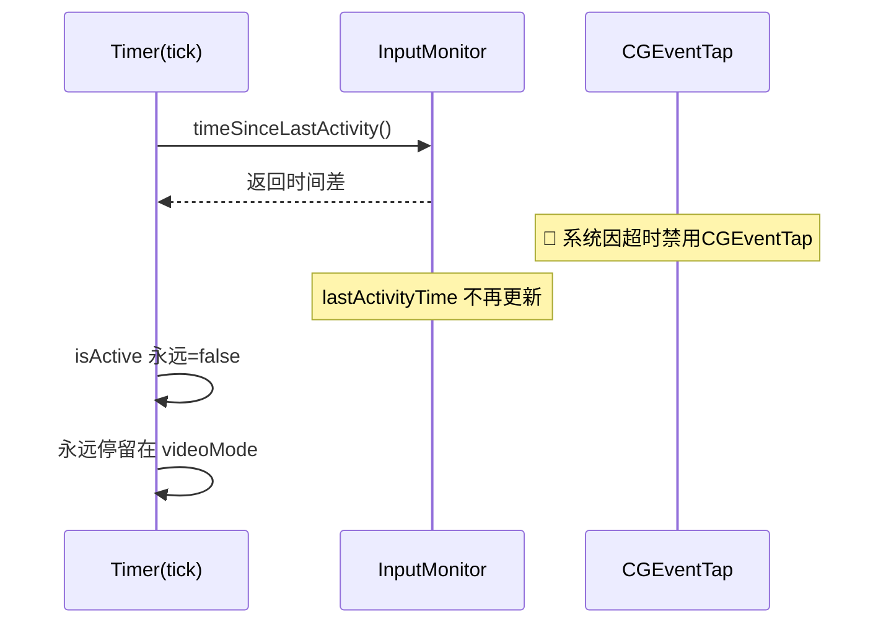

# 修复视频模式退出失败

## 概述
进入视频模式后，即使键鼠恢复活动，也无法退出视频模式，工作计时永久暂停。

## 当前实现

## 方案

### 🚀推荐方案：处理 CGEventTap 超时禁用事件
在事件回调中检测 `.tapDisabledByTimeout`，自动重新启用 event tap。

[InputMonitor.swift](vscode://file/Volumes/Cache/X/Sources/Model/InputMonitor.swift:210)

## 测试用例
进入视频模式后，键鼠操作应能自动退出视频模式。

## 任务总结与结论
CGEventTap 被系统超时禁用后未重新启用，导致 lastActivityTime 不再更新。在事件回调中增加 `.tapDisabledByTimeout` 处理。

## 任务耗时
- 任务开始时间：13:07
- 任务结束时间：13:23
- 任务总耗时：16 分钟
