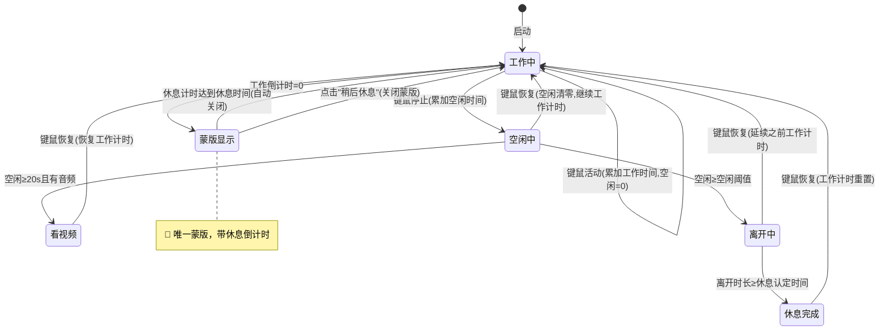
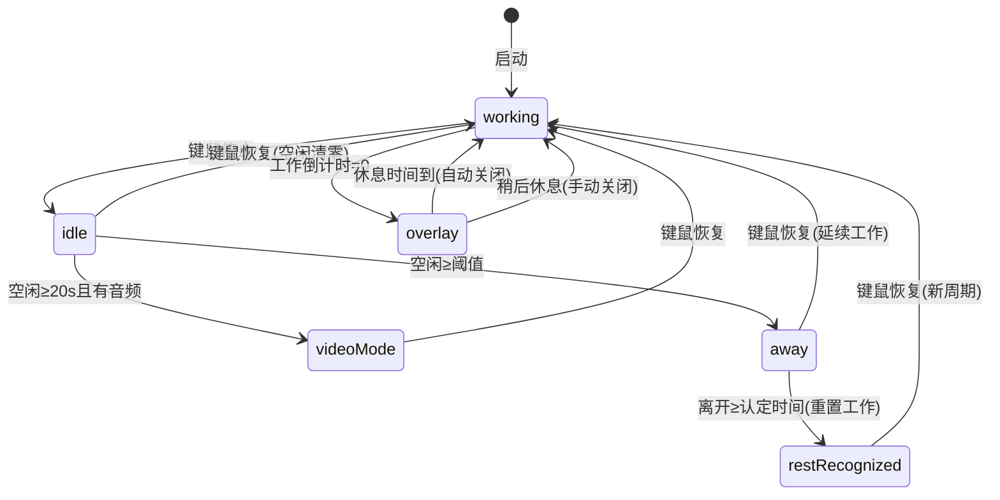

# 简化智能提醒蒙版显示

## 概述
完全重构智能工作休息提醒逻辑，简化状态机和蒙版显示。只有工作倒计时归零时才弹蒙版，蒙版在休息计时到达休息时长后自动关闭，或用户点"稍后休息"关闭。保留时间统计逻辑，确保代码清晰。

## 当前实现
```mermaid
stateDiagram-v2
    [*] --> 工作中: 启动
    工作中 --> workComplete蒙版: activeDuration >= workDuration
    
    workComplete蒙版 --> 工作中: 点击"稍后休息"
    workComplete蒙版 --> restCounting蒙版: 用户空闲超过阈值
    
    工作中 --> restCounting蒙版: 空闲检测触发
    
    restCounting蒙版 --> restComplete蒙版: 倒计时结束
    restCounting蒙版 --> 工作中: 点击"我回来了"(休息不足)
    restCounting蒙版 --> 工作中: 点击"我回来了"(休息充足)
    
    restComplete蒙版 --> 工作中: 点击"开始工作"
    
    note right of workComplete蒙版: 🔴 状态1: 全屏蒙版
    note right of restCounting蒙版: 🔴 状态2: 全屏蒙版+倒计时
    note right of restComplete蒙版: 🔴 状态3: 全屏蒙版
```

当前三种蒙版状态，代码1100+行过度复杂。

## 方案

### 🚀推荐方案：完全重构状态机



**新逻辑说明**：
1. 键鼠活动=工作中，停止=空闲累加
2. 空闲≥20s 检测音频→有音频=看视频（暂停工作计时）
3. 空闲≥阈值=离开→达到休息认定时间=休息完成→工作重置
4. 工作倒计时归零→弹蒙版+开启休息计时
5. 休息计时到=自动关闭蒙版+重置 / 用户点按钮=关闭蒙版+重置

**优点**：
- 状态机极简，只有一个蒙版状态
- 蒙版会自动关闭，无需用户操作
- 保留所有时间统计逻辑
- 代码大幅精简

**修改位置**：
[SmartReminderManager.swift](vscode://file/Volumes/Cache/X/Sources/Model/SmartReminderManager.swift:1) — 完全重写
[ReminderOverlayWindow.swift](vscode://file/Volumes/Cache/X/Sources/View/ReminderOverlayWindow.swift:1) — 简化蒙版（去掉3状态，只保留一种）
[StatusBarTimerView.swift](vscode://file/Volumes/Cache/X/Sources/View/StatusBarTimerView.swift:1) — 适配新通知格式

## 测试用例
1. 设置短工作时长（如1分钟），验证键鼠活动时工作计时正常递减
2. 停止键鼠，验证空闲时间正常累加
3. 恢复键鼠，验证空闲清零、工作计时继续
4. 工作倒计时归零，验证蒙版弹出且带休息倒计时
5. 等待休息时间到达，验证蒙版自动关闭
6. 蒙版显示时点"稍后休息"，验证关闭蒙版并重置
7. 长时间不操作（超过休息认定时间），返回后验证工作计时已重置

## 任务总结与结论
完全重构智能提醒系统，从复杂的3状态蒙版简化为1种蒙版。



修改文件：
- SmartReminderManager.swift: 1102行 → 495行（完全重写）
- ReminderOverlayWindow.swift: 358行 → 194行（去掉3种状态，只保留1种）
- StatusBarTimerView.swift: 无需修改（通知格式兼容）

## 任务耗时
- 任务开始时间：23:18
- 任务结束时间：08:16
- 任务总耗时：538 分钟
