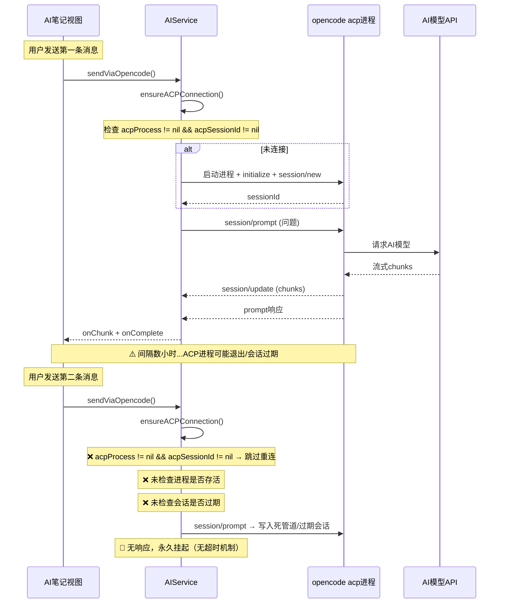
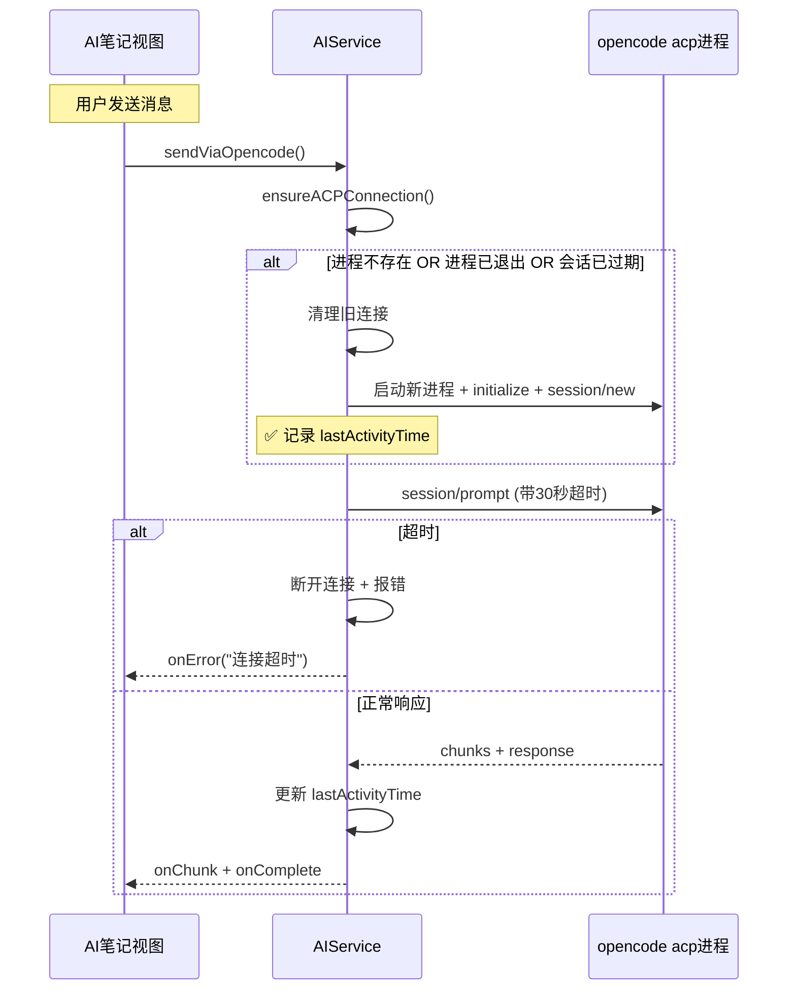
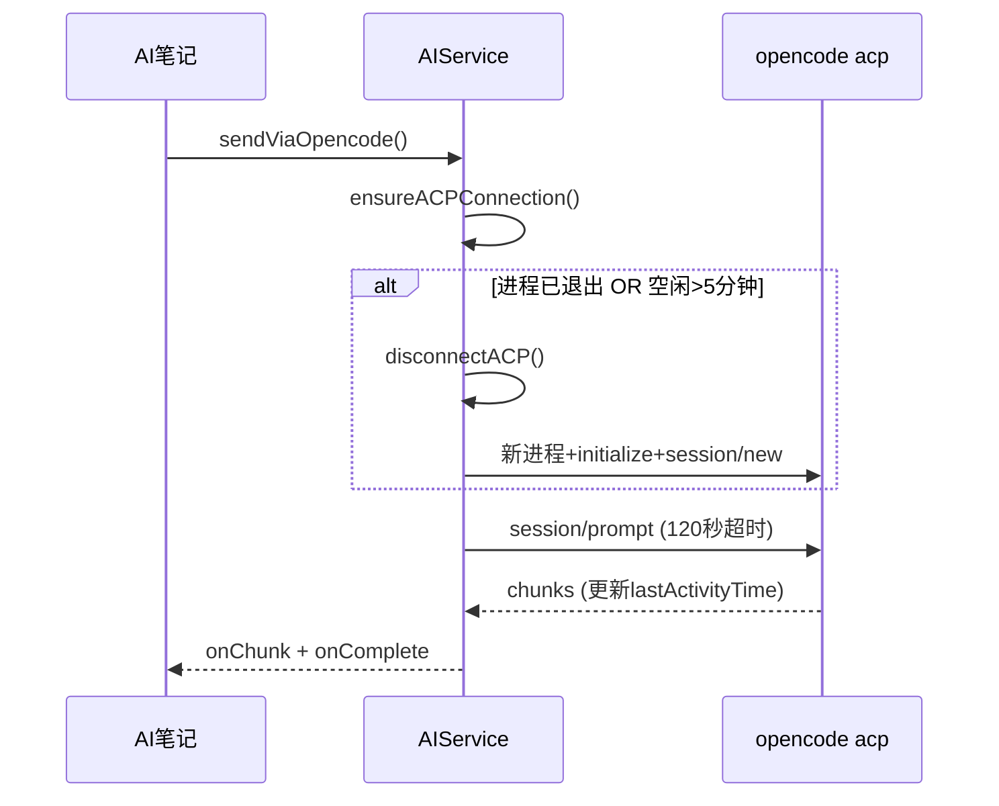

# Opencode第二次发送卡顿

## 概述
使用 Opencode ACP 协议发送消息时，第二次发送会卡很久才输出。根因是 ACP 会话/进程管理存在多个缺陷，导致使用过期连接发送请求后无响应。

## 当前实现

## 问题根因

1. **进程存活检查缺失**：`ensureACPConnection` 不检查 `acpProcess.isRunning`，进程退出后仍尝试复用
2. **无请求超时**：`sendACPRequest` 使用 `withCheckedThrowingContinuation` 无超时，响应不到永久挂起
3. **会话健康检查缺失**：ACP 会话可能在服务端过期，客户端无感知
4. **写死管道无保护**：`pipe.fileHandleForWriting.write(data)` 写入死管道会崩溃
5. **所有AI笔记共享一个ACP会话**：不同笔记对话混在同一会话中
6. **缺少关键日志**：prompt 响应和 chunk 接收无日志，无法追踪问题

## 方案

### 🚀推荐方案 A：完善 ACP 连接生命周期管理

**优点**：
- 彻底解决连接过期/进程退出问题
- 超时机制防止永久挂起
- 日志完善便于调试

**缺点**：
- 会话过期后需重新建立，首次响应有几秒延迟

**修改位置**：
[AIService.swift](vscode://file/Volumes/Cache/X/Sources/Model/AIService.swift:279) — ensureACPConnection 方法
[AIService.swift](vscode://file/Volumes/Cache/X/Sources/Model/AIService.swift:519) — sendACPRequest 方法
[AIService.swift](vscode://file/Volumes/Cache/X/Sources/Model/AIService.swift:467) — handleParsedACPMessage 方法

### 方案 B：每次发送都重建会话

**优点**：完全避免会话过期问题
**缺点**：每次发送都有几秒初始化延迟，丢失对话上下文

## 测试用例
1. 打开 AI 笔记，发送第一条消息 → 应正常流式输出
2. 等待 1 分钟后发送第二条消息 → 应正常流式输出（无卡顿）
3. 关闭应用重新打开，发送消息 → 应自动重建连接并正常输出
4. 断网后发送消息 → 应在 30 秒内报错而非永久挂起

## 任务总结与结论
完善了 ACP 连接生命周期管理：
- 进程存活检查 + 5分钟空闲超时自动重建
- 请求超时机制（prompt 120秒 / 其他 30秒）
- 管道写入异常保护
- 关键日志补全

## 任务耗时
- 任务开始时间：08:36
- 任务结束时间：09:28
- 任务总耗时：52 分钟
