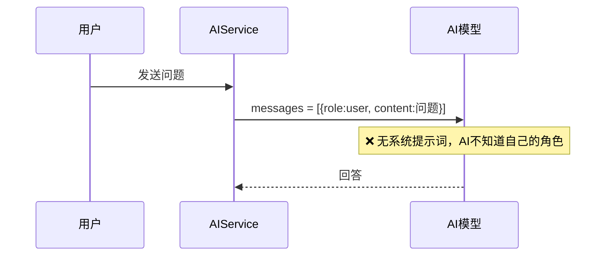
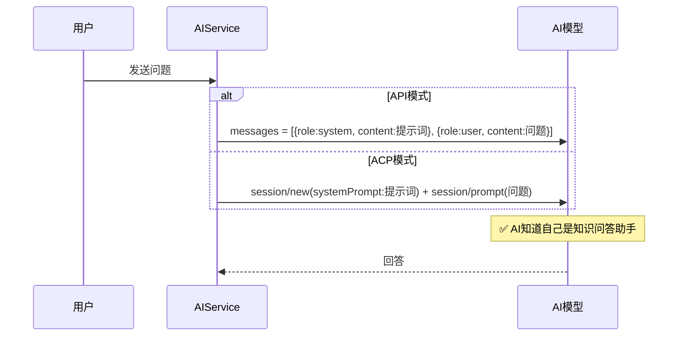
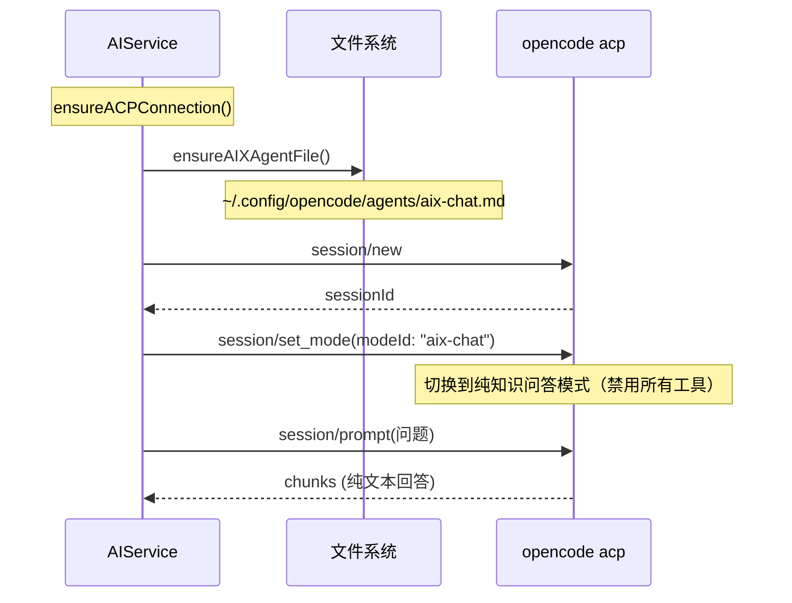

# AI系统提示词配置

## 概述
通过系统提示词告知 AI（API 模式和 opencode ACP 模式）它是一个知识问答助手。

## 当前实现

## 方案

### 🚀推荐方案：添加 aiSystemPrompt 配置项

**修改位置**：
[FloatingButtonConfig.swift](vscode://file/Volumes/Cache/X/Sources/Model/FloatingButtonConfig.swift:40) — 添加 aiSystemPrompt 属性
[AIService.swift](vscode://file/Volumes/Cache/X/Sources/Model/AIService.swift:133) — API模式插入system message
[AIService.swift](vscode://file/Volumes/Cache/X/Sources/Model/AIService.swift:370) — ACP模式session/new传systemPrompt
[SettingsView.swift](vscode://file/Volumes/Cache/X/Sources/View/SettingsView.swift:2211) — 设置界面添加编辑项

## 测试用例
1. 设置页面 → 系统提示词输入框可见，默认值为"你是一个知识问答助手..."
2. 发送AI问题 → 回答风格符合系统提示词描述
3. 修改系统提示词 → 后续会话使用新提示词

## 任务总结与结论
完善了 AI 系统提示词和 opencode Agent 模式集成：

- 自动生成 `aix-chat.md` agent 文件（禁用所有工具，纯文本聊天）
- 通过 `session/set_mode` ACP 协议切换到 aix-chat 模式
- API 模式在 messages 前插入 system role
- 设置界面可编辑系统提示词

## 任务耗时
- 任务开始时间：09:42
- 任务结束时间：11:35
- 任务总耗时：113 分钟
