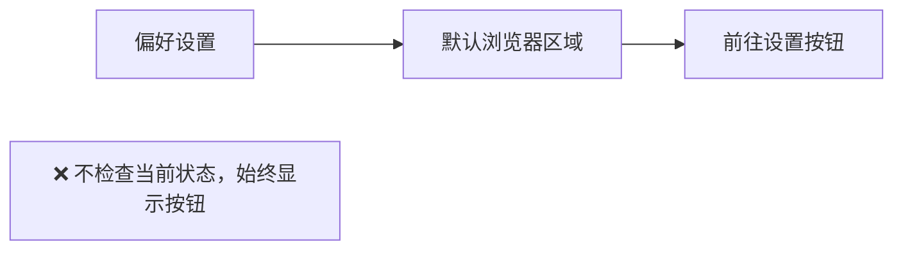
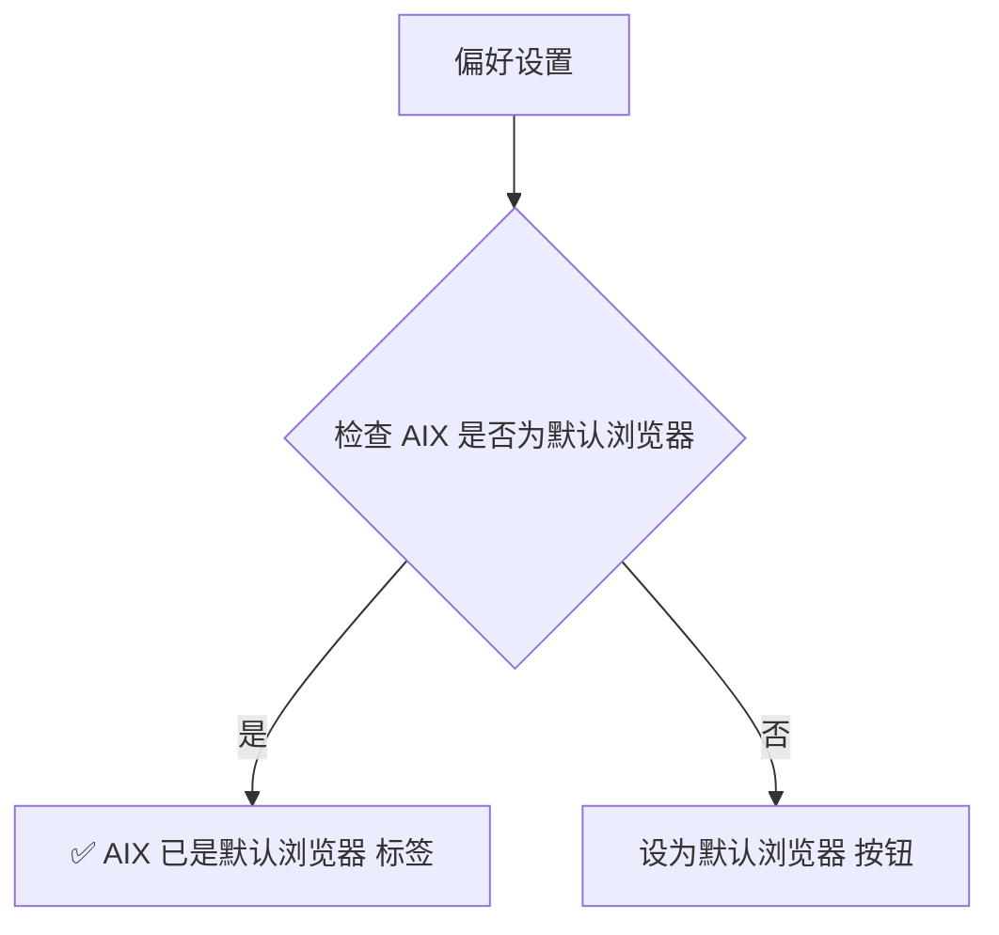

# 默认浏览器状态显示优化

## 概述
当 AIX 已被设为系统默认浏览器时，偏好设置中"默认浏览器"区域仍显示"前往设置"按钮，应改为显示已是默认浏览器的状态。

## 当前实现

## 方案

### 🚀推荐方案：检测默认浏览器状态并动态显示

- 使用 `NSWorkspace.shared.urlForApplication(toOpen: https://...)` 检测默认 HTTPS handler
- 比对 bundleIdentifier 判断是否为 AIX
- 定时监听（视图出现时检测一次即可）

**优点**：用户直观看到当前状态
**缺点**：无

**修改位置**：
[BrowserDetector.swift](vscode://file/Volumes/Cache/X/Sources/Model/BrowserDetector.swift:12) — 添加 isDefaultBrowser() 方法
[SettingsView.swift](vscode://file/Volumes/Cache/X/Sources/View/SettingsView.swift:288) — 默认浏览器区域动态显示

## 测试用例
1. AIX 不是默认浏览器 → 显示"设为默认浏览器"按钮
2. 点击按钮 → 打开系统默认浏览器设置
3. 在系统设置中将 AIX 设为默认 → 返回 AIX 偏好设置应显示"✅ AIX 已是默认浏览器"

## 任务总结与结论
在 BrowserDetector 中添加 `isDefaultBrowser()` 方法，通过 `NSWorkspace.shared.urlForApplication(toOpen:)` 检测默认 HTTPS handler，与自身 bundleIdentifier 比对。偏好设置根据状态显示：已是默认用绿色标签，未设默认显示"前往设置"按钮。

## 任务耗时
- 任务开始时间：11:53
- 任务结束时间：12:01
- 任务总耗时：8 分钟
