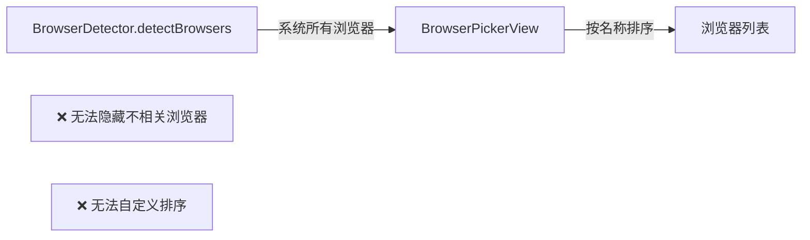
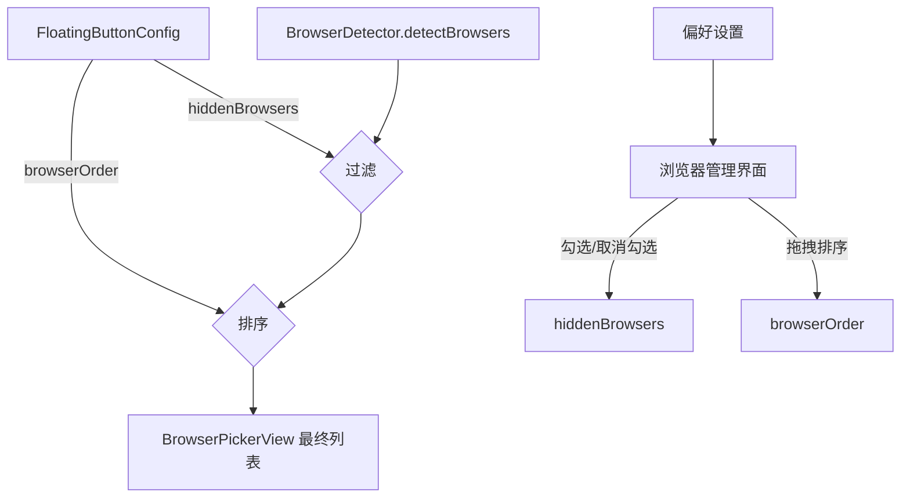

# 浏览器列表忽略和排序

## 概述
用户点击URL时弹出的浏览器选择列表，需要支持在偏好设置中隐藏不需要的浏览器、自定义浏览器显示顺序。

## 当前实现

## 方案

### 🚀推荐方案：配置项 + 偏好设置管理界面

**修改位置**：
[FloatingButtonConfig.swift](vscode://file/Volumes/Cache/X/Sources/Model/FloatingButtonConfig.swift:43) — 添加 hiddenBrowsers、browserOrder 配置项
[BrowserDetector.swift](vscode://file/Volumes/Cache/X/Sources/Model/BrowserDetector.swift:28) — detectBrowsers 应用过滤和排序
[SettingsView.swift](vscode://file/Volumes/Cache/X/Sources/View/SettingsView.swift:288) — 默认浏览器区域添加管理界面
[BrowserPickerWindow.swift](vscode://file/Volumes/Cache/X/Sources/View/BrowserPickerWindow.swift:22) — 使用过滤后的浏览器列表

**优点**：
- 用户完全控制显示哪些浏览器
- 拖拽排序直观

**缺点**：
- 需要较多 UI 代码

## 测试用例
1. 偏好设置 → 默认浏览器 → 显示已安装浏览器列表，可勾选/取消
2. 取消勾选某浏览器 → 点击 URL 时不再显示该浏览器
3. 拖拽调整顺序 → 点击 URL 时按新顺序显示
4. 安装新浏览器后 → 自动出现在列表末尾

## 任务总结与结论
添加 `hiddenBrowsers` 和 `browserOrder` 配置项，BrowserDetector 的 `detectBrowsers()` 自动应用过滤和排序。偏好设置中新增浏览器列表管理界面，支持勾选显示/隐藏、拖拽调整排序。

## 任务耗时
- 任务开始时间：12:06
- 任务结束时间：12:54
- 任务总耗时：48 分钟
