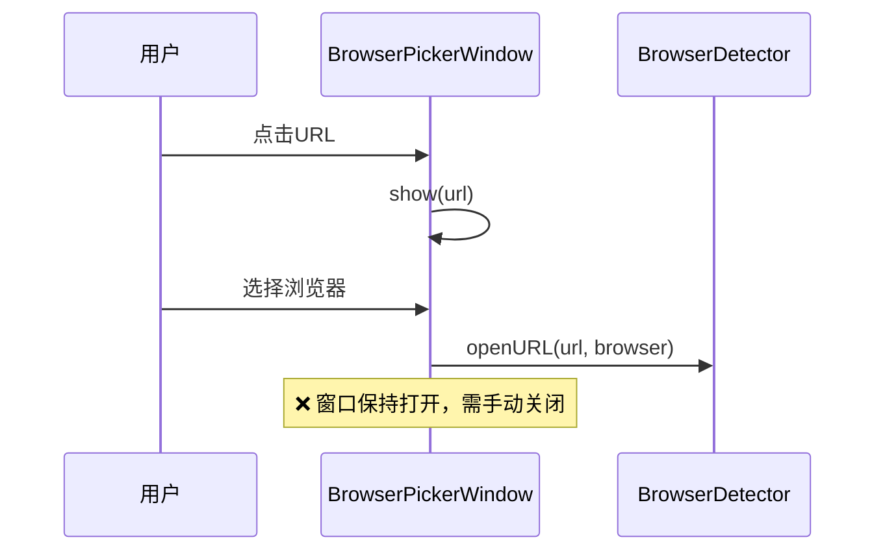
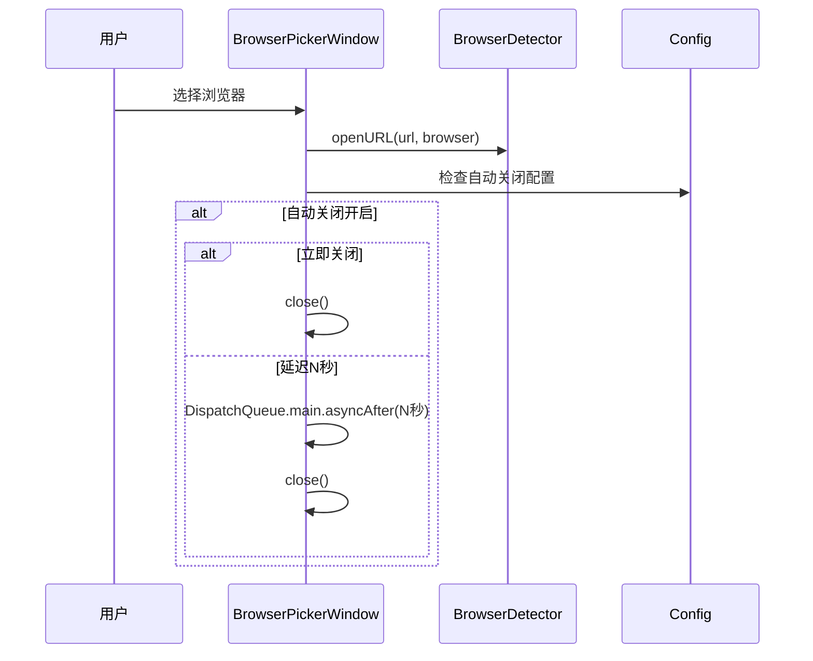

# 浏览器选择列表自动关闭

## 概述
用户选择浏览器后，浏览器选择窗口自动关闭。可在偏好设置中开启/关闭该功能，并设置延迟时间。

## 当前实现

## 方案

### 🚀推荐方案：配置项 + 选择后自动关闭

**配置项**：
- `browserAutoClose: Bool` — 是否自动关闭（默认 true）
- `browserAutoCloseDelay: Double` — 延迟秒数（0=立即, 3, 5, 8）

**修改位置**：
[FloatingButtonConfig.swift](vscode://file/Volumes/Cache/X/Sources/Model/FloatingButtonConfig.swift:43) — 添加配置项
[BrowserPickerWindow.swift](vscode://file/Volumes/Cache/X/Sources/View/BrowserPickerWindow.swift:27) — onSelect 回调中加入自动关闭逻辑
[SettingsView.swift](vscode://file/Volumes/Cache/X/Sources/View/SettingsView.swift:288) — 默认浏览器区域添加设置项

## 测试用例
1. 开启自动关闭，设为"立即关闭" → 选择浏览器后窗口立即关闭
2. 设为"3秒" → 选择后等3秒窗口自动关闭
3. 关闭自动关闭 → 选择后窗口保持
4. 自动关闭倒计时中再次选择其他浏览器 → 重置计时器

## 任务总结与结论
添加 `browserAutoClose` 和 `browserAutoCloseDelay` 配置项。BrowserPickerWindow 在用户选择浏览器后根据配置延迟关闭窗口，支持立即/3秒/5秒/8秒。偏好设置添加对应的开关和下拉选择。

## 任务耗时
- 任务开始时间：13:00
- 任务结束时间：13:15
- 任务总耗时：15 分钟
