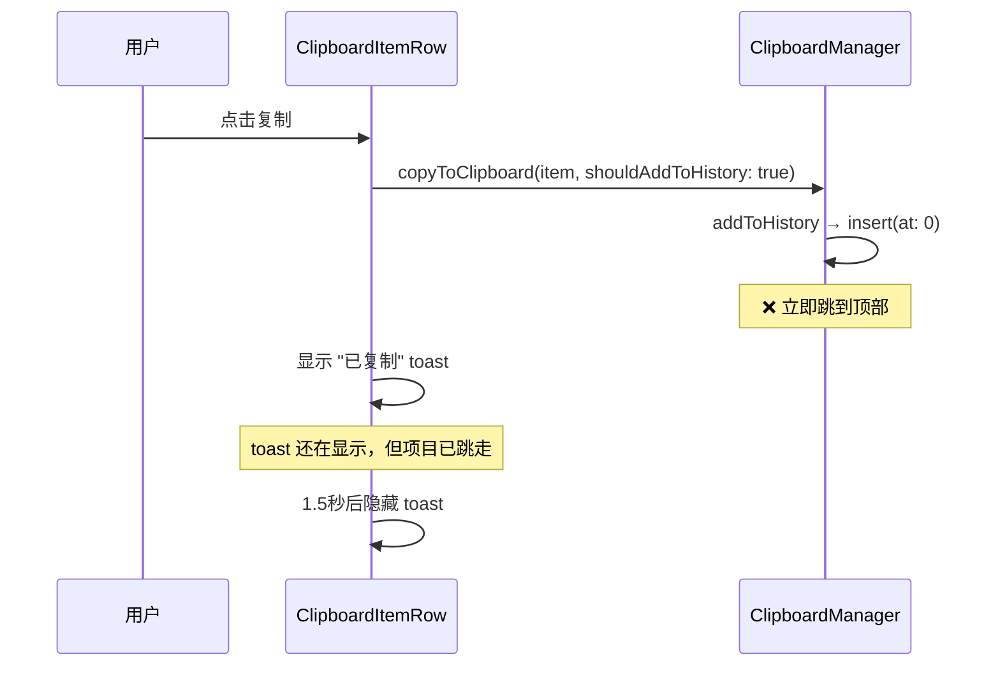
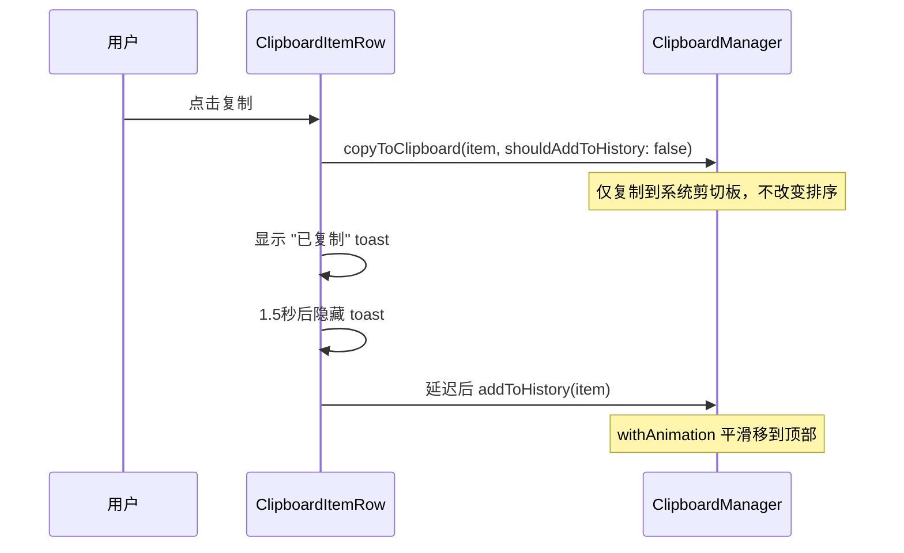
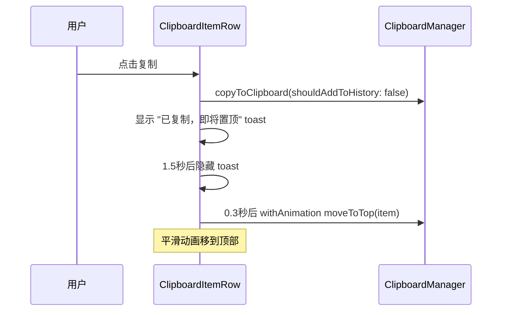

# 剪切板列表复制后排序跳动优化

## 概述
用户在剪切板列表中点击复制后，该项立即跳到顶部，给用户"消失了"的感觉。需要延迟移动并添加动画让体验更平滑。

## 当前实现

## 方案

### 🚀推荐方案：延迟排序 + 动画移动

**修改位置**：
[NoteListView.swift](vscode://file/Volumes/Cache/X/Sources/View/NoteListView.swift:1670) — 复制按钮回调：先复制不排序，延迟后带动画排序
[NoteListView.swift](vscode://file/Volumes/Cache/X/Sources/View/NoteListView.swift:1596) — ForEach 添加 .animation 修饰符

**优点**：toast 完整显示后再平滑移动，用户不会困惑
**缺点**：无

## 测试用例
1. 点击列表中间某项的复制 → 显示 "已复制" toast → 1.5秒后 toast 消失 → 该项平滑移到顶部
2. 快速连续复制不同项 → 每次都有 toast，最终按正确顺序排列

## 任务总结与结论
将复制操作拆分为两步：先复制到系统剪切板并显示 toast（"已复制，即将置顶"），1.8秒后带动画将该项平滑移到顶部。新增 `ClipboardManager.moveToTop()` 方法实现不触发提示音的置顶操作。

## 任务耗时
- 任务开始时间：13:18
- 任务结束时间：13:59
- 任务总耗时：41 分钟
