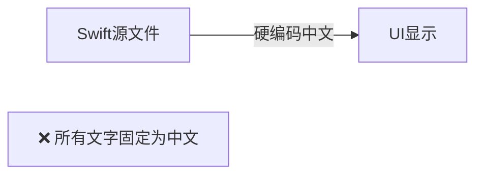
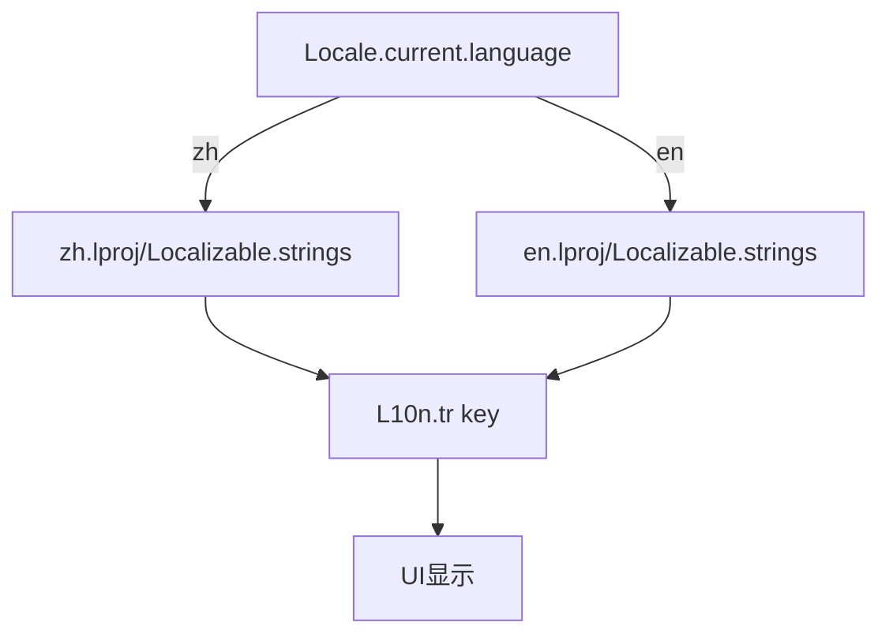
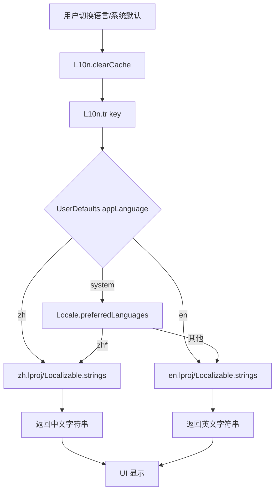

# 中英文国际化适配

## 概述
将项目中所有面向用户的硬编码中文字符串适配为中英文双语。项目共约 1110 处中文字符串，分布在 28+ 个 Swift 文件中。

## 当前实现

## 方案

### 🚀推荐方案：集中式 L10n 枚举 + Localizable.strings

1. Package.swift 添加 `defaultLocalization: "zh"`
2. 创建 `Resources/zh.lproj/Localizable.strings` 和 `Resources/en.lproj/Localizable.strings`
3. 创建 `L10n.swift` 工具类，提供 `L10n.tr()` 方法
4. 逐文件将 UI 文本替换为 `L10n.xxx`

**分类处理**（不需要国际化的内容）：
- Logger.shared.log() 中的日志文本
- print() 调试输出
- 代码注释
- 技术标识符

**需要国际化的内容**：
- 所有 `Text("中文")` SwiftUI 文本
- `NSMenuItem(title: "中文")` 菜单项
- alert/dialog 标题和消息
- toast 提示
- 配置描述文字
- 按钮文字

**修改文件**：所有含面向用户中文文本的 Sources 文件

**优点**：
- 标准 Apple 本地化方式，支持 SPM
- 集中管理，便于后续维护

**缺点**：
- 首次工作量大（需逐一替换 500+ 处 UI 字符串）

## 测试用例
1. 系统语言为中文 → 显示中文
2. 系统语言为英文 → 显示英文
3. 所有菜单、按钮、提示、设置项都正确翻译

## 任务总结与结论

已完成中英文国际化适配，共涉及 23 个源文件、约 350+ 处 UI 字符串替换。

**完成内容**：
1. 搭建本地化基础设施（Package.swift + L10n.swift + lproj 文件）
2. 创建中文 Localizable.strings（280+ 条），英文 Localizable.strings（280+ 条）
3. 替换 23 个文件中约 350 处硬编码中文 → L10n.tr() 调用
4. 为含中文 rawValue 的枚举添加 localizedName 计算属性
5. 在偏好设置中新增语言选择器（跟随系统/中文/English）
6. 使用线程安全的 NSLock 缓存机制

## 任务耗时
- 任务开始时间：14:03
- 任务结束时间：15:15
- 任务总耗时：72 分钟
