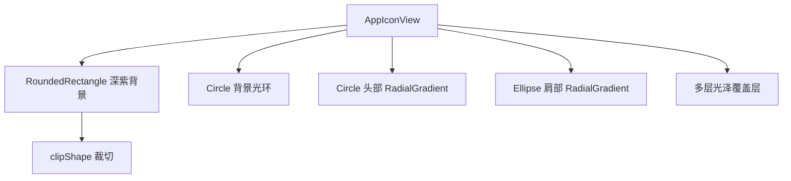
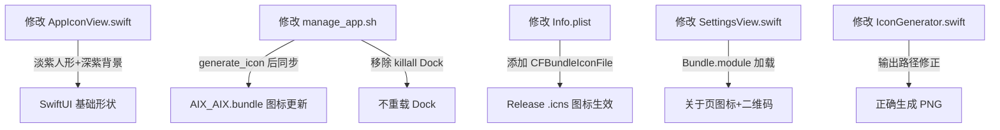

# 修改软件图标

## 概述
将 AIX 应用图标从当前的三环嵌套+XavierChen 文字设计，修改为淡紫色人形剪影+深紫色背景的现代风格图标。同时修复 release 模式下图标不显示、关于页面图标/二维码不加载等问题。

## 当前实现

```mermaid
flowchart LR
    A[AppIconView.swift] -->|SwiftUI 渲染| B[generate_icon 函数]
    B -->|NSHostingView| C[AppIcon.png 1024x1024]
    C -->|sips + iconutil| D[AppIcon.icns]
    D --> E[/Applications/AIX.app]
    C -->|同步| F[AIX_AIX.bundle]
```

## 测试用例
1. 重新编译运行应用，检查 Dock 栏图标是否显示新的人形图标
2. 打开设置 → 关于页面，检查应用图标是否正确显示
3. 关于页面的二维码图片是否正常加载
4. Release 模式下以上功能均正常

## 方案

### 🚀推荐方案：SwiftUI 基础形状组合



使用 Circle + Ellipse 基础形状组合绘制人形剪影，RadialGradient 模拟 3D 球体光照：
- 深紫色渐变背景（圆角矩形 cornerRadius 180）
- 头部圆形（径向渐变，光源左上方）
- 肩部椭圆（径向渐变，保持立体感一致）
- 多层光泽覆盖（顶部弧光、头部高光、肩部柔光、底部微光）

**优点**：
- 基础形状在独立 Swift 脚本中也能正确渲染（不依赖 Canvas API）
- 径向渐变模拟 3D 效果，视觉质感好
- 颜色协调统一的紫色系

**缺点**：
- 人形较抽象（头+肩，无法表现手势）

**修改文件**：
[AppIconView.swift](vscode://file/Volumes/Cache/X/Sources/View/AppIconView.swift:1)
[IconGenerator.swift](vscode://file/Volumes/Cache/X/Sources/Utility/IconGenerator.swift:1)
[manage_app.sh](vscode://file/Volumes/Cache/X/manage_app.sh:68)
[Info.plist](vscode://file/Volumes/Cache/X/Info.plist:5)
[SettingsView.swift](vscode://file/Volumes/Cache/X/Sources/View/SettingsView.swift:878)

## 任务总结与结论



本次修改涵盖：
1. **图标设计**：用 Circle + Ellipse + RadialGradient 组合绘制淡紫色人形剪影，深紫色背景，多层光泽质感
2. **Release 图标修复**：Info.plist 添加 CFBundleIconFile 键，确保 .icns 图标被系统识别
3. **关于页面修复**：图片加载改为 Bundle.module 方式，generate_icon 后同步更新 AIX_AIX.bundle 中的 PNG
4. **资源包复制**：release/package 模式均复制 SPM resource bundle 到应用包

## 任务耗时
- 任务开始时间：15:22
- 任务结束时间：17:12
- 任务总耗时：110 分钟
