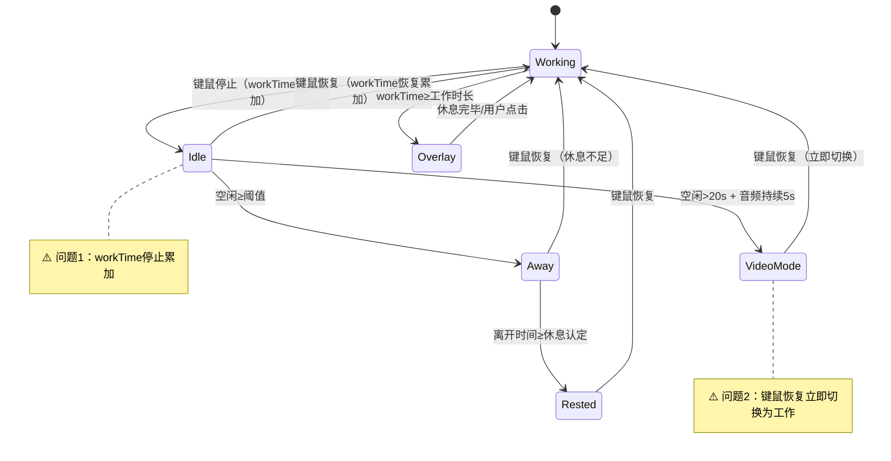
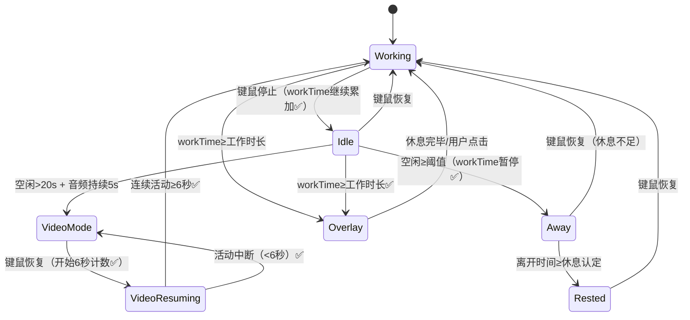
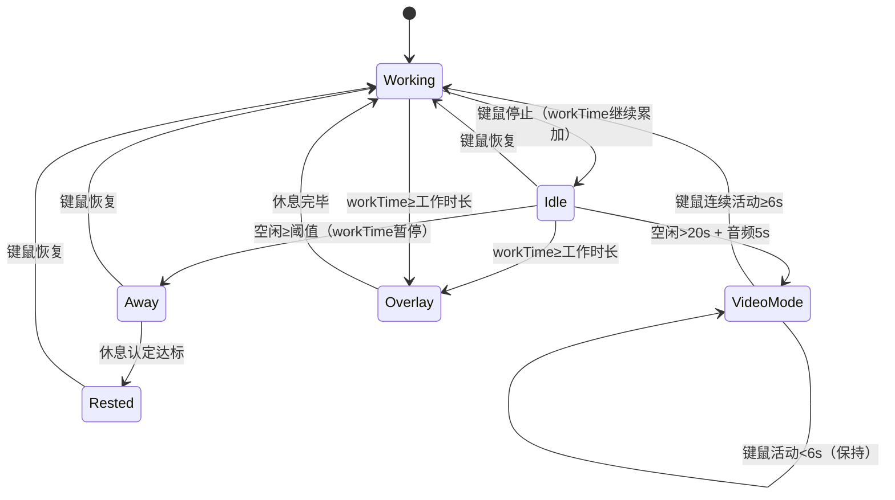

# 智能提醒算法优化

## 概述
优化智能提醒的两个状态转换逻辑：
1. 看视频状态恢复键鼠后，需连续活动 6 秒以上才认定为工作，避免快进等短暂操作误触发工作计时
2. 键鼠停止后（idle 状态），工作倒计时应继续累加，只有空闲超过阈值进入离开状态后才暂停工作倒计时

## 当前实现

**问题1**：用户从 Working 进入 Idle 后，workTime 立即停止累加。短暂停顿（如思考、看屏幕）不应暂停工作计时。
**问题2**：VideoMode 下键鼠恢复（如快进视频）立即切换为 Working，导致工作倒计时误启动。

## 测试用例
### 优化1：看视频恢复键鼠缓冲 6 秒
1. 让应用进入视频模式（停止键鼠 20s + 持续播放音频 5s）
2. 短暂移动鼠标（<6秒），观察状态是否保持 videoMode
3. 连续移动鼠标 6 秒以上，观察状态是否切换为 working

### 优化2：idle 状态工作计时继续
1. 正常工作一段时间后停止键鼠
2. 观察 idle 状态下 workTime 是否继续累加
3. 空闲超过阈值进入 away 状态后，观察 workTime 是否停止累加
4. 验证 idle 状态下 workTime 达到工作时长时是否正常弹出蒙版

## 方案

### 🚀推荐方案：最小改动方案

**修改点**：

**优化1 - 视频恢复缓冲**：
- 新增 `videoActivityDuration` 计数器，记录视频模式下连续键鼠活动秒数
- videoMode + 键鼠活动：`videoActivityDuration += 1`
- `videoActivityDuration >= 6` 时才切换为 working
- 键鼠再次停止或活动中断：`videoActivityDuration = 0`，保持 videoMode

**优化2 - idle 继续工作计时**：
- idle 状态下继续 `workTime += 1`
- idle 状态下检查 `workTime >= config.workDuration` 并弹蒙版
- 仅 away/rested/videoMode/overlay 状态下工作计时暂停

**优点**：
- 改动最小，仅修改 SmartReminderManager.swift 中的 tick() 方法
- 逻辑清晰，无副作用
- 不需要新增状态枚举

**缺点**：
- 无

**修改文件**：
[SmartReminderManager.swift - tick() 方法](vscode://file/Volumes/Cache/X/Sources/Model/SmartReminderManager.swift:147)

## 任务总结与结论

修改 SmartReminderManager.swift 的 tick() 方法：
1. 新增 `videoActivityDuration` 计数器，视频模式下连续键鼠活动≥6秒才切换为工作
2. idle 状态下 `workTime += 1` 继续累加，仅 away 后暂停
3. idle 期间 workTime 达标也触发蒙版
4. `resetWork()` 中重置 `videoActivityDuration`

## 任务耗时
- 任务开始时间：20:24
- 任务结束时间：20:51
- 任务总耗时：27 分钟
