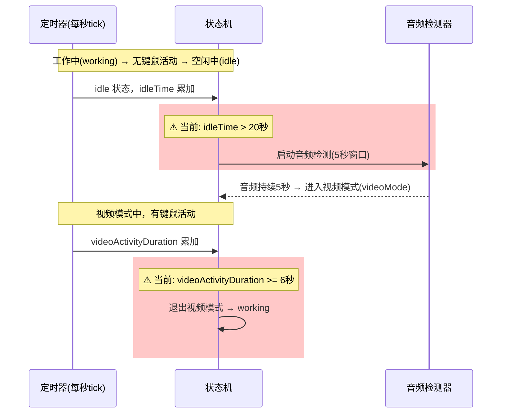
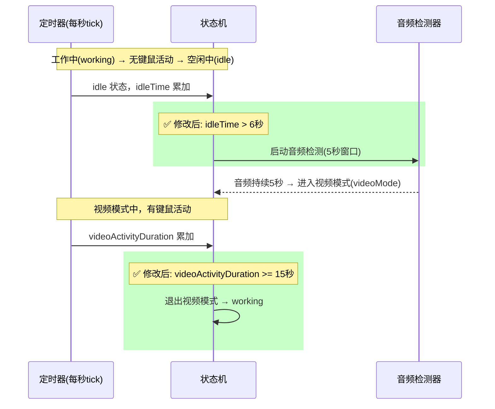
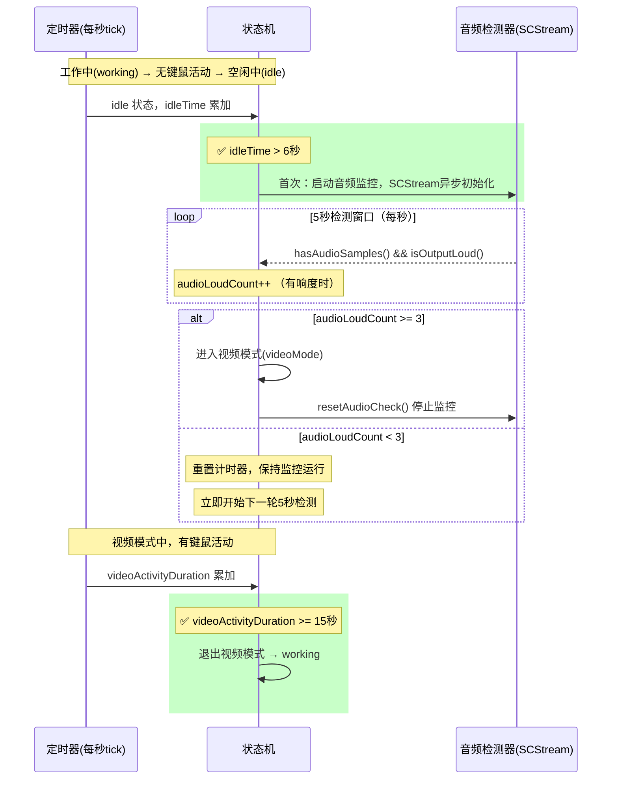

# 优化智能提醒算法参数

## 概述
优化 X 项目（AIX 桌面应用）的智能提醒算法中两个关键时间参数：
1. 将"判断是否有音频"的空闲触发时间从 **20 秒** 缩短到 **6 秒**，使音频检测更灵敏
2. 将"视频模式恢复键鼠缓冲"从 **6 秒** 延长到 **15 秒**，减少看视频时误判为工作

## 当前实现

## 测试用例

### 测试1：音频检测触发时间（20s → 6s）
1. 启动应用，开启智能提醒功能
2. 正常操作键鼠约10秒
3. 停止键鼠操作，打开一个有声音的视频
4. 观察日志：应在键鼠停止 **约6秒** 后开始音频检测（日志出现"启动音频捕获"）
5. 再等约5秒，若音频持续存在，应进入视频模式（日志出现"进入视频模式"）
6. **预期**：从键鼠停止到进入视频模式总共约 **11秒**（6秒空闲 + 5秒音频窗口），而非之前的 **25秒**（20秒 + 5秒）

### 测试2：视频模式键鼠缓冲（6s → 15s）
1. 在视频模式状态下（正在看视频）
2. 短暂移动鼠标或敲击键盘（模拟看视频时的偶尔操作），持续约10秒后停止
3. **预期**：不应退出视频模式（因为未达到15秒连续键鼠活动阈值）
4. 持续键鼠操作超过15秒
5. **预期**：退出视频模式，恢复工作计时（日志出现"键鼠持续活动≥15秒，退出视频模式"）

## 方案

### 🚀 推荐方案一：直接修改硬编码常量

**优点**：
- 改动最少，仅修改2处数值
- 风险极低，逻辑不变
- 注释同步更新，保持一致性

**缺点**：
- 仍为硬编码，未来调参需再改代码

**修改位置**：
[SmartReminderManager.swift](vscode://file/Volumes/Cache/X/Sources/Model/SmartReminderManager.swift:23) — 注释第4条，`空闲>20s` 改为 `空闲>6s`
[SmartReminderManager.swift](vscode://file/Volumes/Cache/X/Sources/Model/SmartReminderManager.swift:25) — 注释第5条，`键鼠连续活动≥6s` 改为 `键鼠连续活动≥15s`
[SmartReminderManager.swift](vscode://file/Volumes/Cache/X/Sources/Model/SmartReminderManager.swift:180) — `if idleTime > 20` 改为 `if idleTime > 6`
[SmartReminderManager.swift](vscode://file/Volumes/Cache/X/Sources/Model/SmartReminderManager.swift:203) — `if videoActivityDuration >= 6` 改为 `if videoActivityDuration >= 15`
[SmartReminderManager.swift](vscode://file/Volumes/Cache/X/Sources/Model/SmartReminderManager.swift:209) — 日志文本 `≥6秒` 改为 `≥15秒`

### 方案二：提取为可配置常量

将两个参数提取到 `SmartReminderConfig` 配置中，通过设置界面调整。

**优点**：
- 未来调参无需改代码
- 用户可自定义

**缺点**：
- 改动较多，需额外修改配置结构体和设置界面
- 过度设计风险，这类参数用户一般不需要调

## 任务总结与结论

最终修改了 3 个文件共 4 处核心逻辑：

**SmartReminderManager.swift**：
- 空闲触发音频检测时间：`idleTime > 20` → `idleTime > 6`（更快响应）
- 视频模式键鼠恢复缓冲：`videoActivityDuration >= 6` → `videoActivityDuration >= 15`（减少误判）

**SmartReminderManager+Extensions.swift**：
- 重写 `checkAudioAndEnterVideoMode()` 音频检测逻辑：
  - 用计数器 `audioLoudCount` 替代布尔标记 `audioWindowAllActive`（5秒内至少3秒有响度即通过）
  - 检测失败后保持 SCStream 运行，避免反复启动的延迟
  - `resetAudioCheck()` 对应调整

## 任务耗时
- 任务开始时间：08:31
- 任务结束时间：08:57
- 任务总耗时：26 分钟
