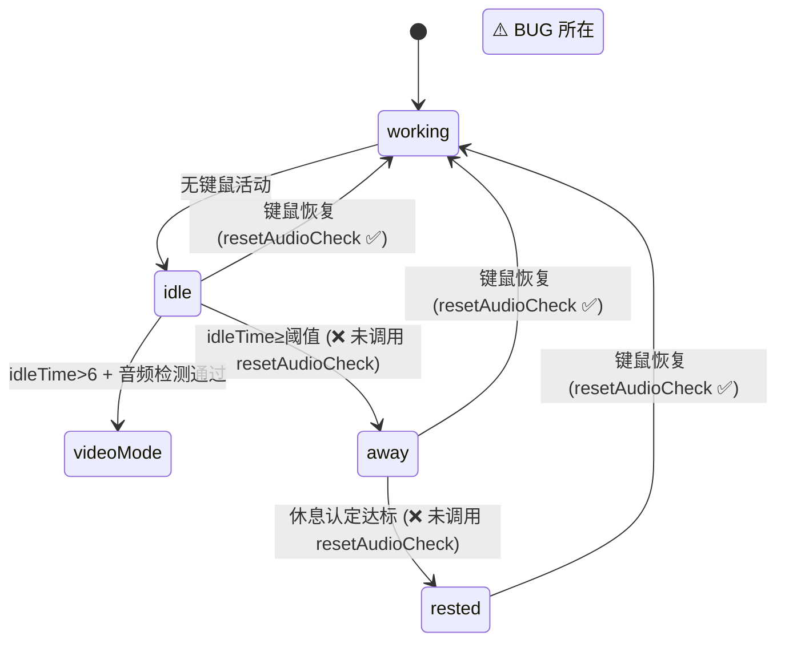
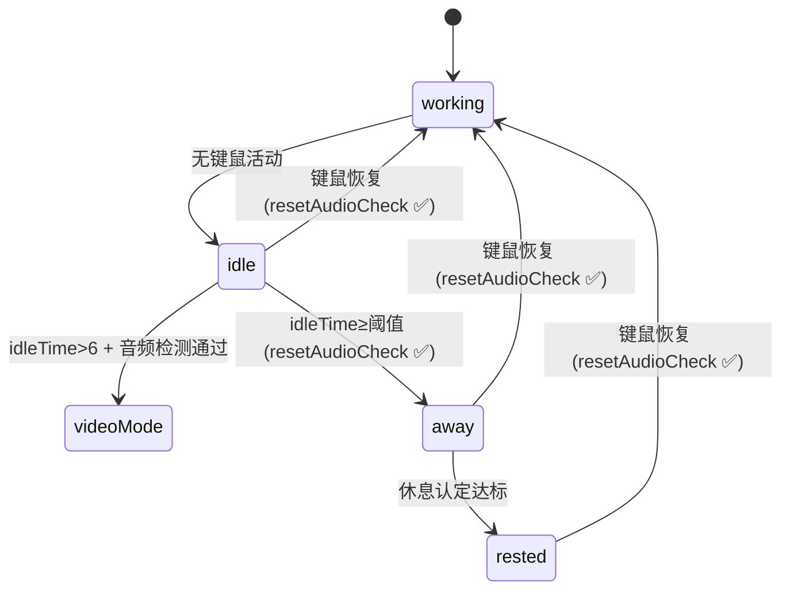
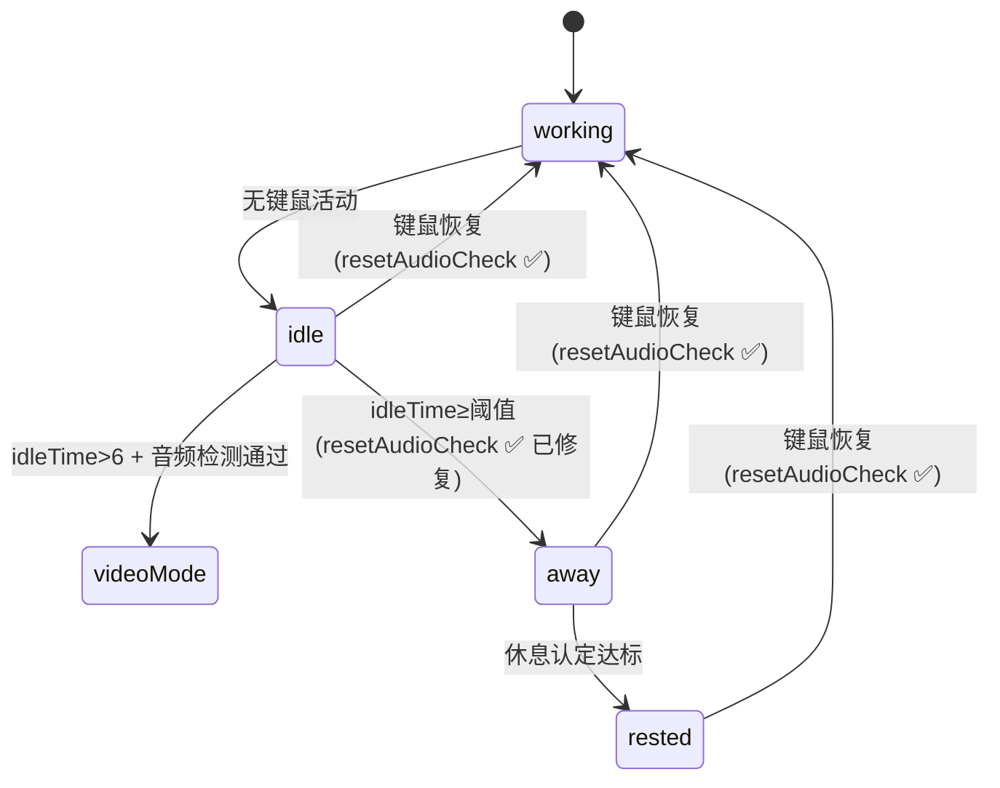

# 修复休息认定后音频监控未停止

## 概述
从 idle 状态进入 away 状态时，未调用 `resetAudioCheck()` 停止音频监控（SCStream），导致音频捕获在 away → rested 全程持续运行，浪费系统资源。

## 当前实现

idle 状态在 `idleTime > 6` 时启动了音频监控（SCStream），但进入 away 状态时没有停止它。SCStream 一直保持运行直到用户键鼠恢复活动。

## 测试用例
1. 启动应用，开启智能提醒
2. 停止键鼠操作，等待进入离开状态（空闲超过阈值）
3. 继续保持不操作，等待休息认定达标
4. 检查日志：进入 away 状态时，应看到"音频捕获停止"的日志
5. **预期**：进入 away 状态时立即停止音频监控

## 方案

### 🚀 推荐方案：进入 away 状态时停止音频监控

**优点**：改动极小（1行代码），逻辑明确
**缺点**：无

**修改位置**：
[SmartReminderManager.swift](vscode://file/Volumes/Cache/X/Sources/Model/SmartReminderManager.swift:189) — idle → away 转换处，添加 `resetAudioCheck()` 调用

## 任务总结与结论

在 SmartReminderManager.swift 的 idle → away 状态转换处添加了 `resetAudioCheck()` 调用，修复了 SCStream 音频监控在离开/休息状态下持续运行的资源泄漏问题。

## 任务耗时
- 任务开始时间：07:17
- 任务结束时间：07:22
- 任务总耗时：5 分钟
