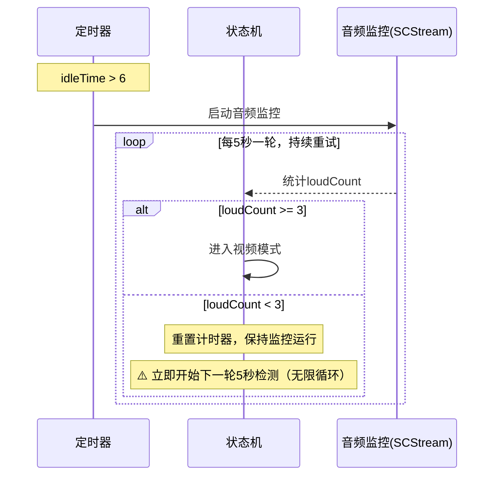
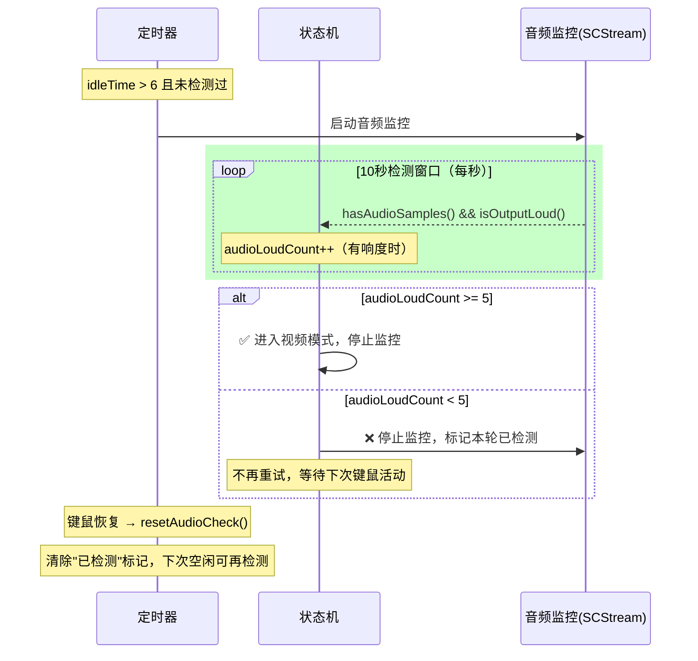
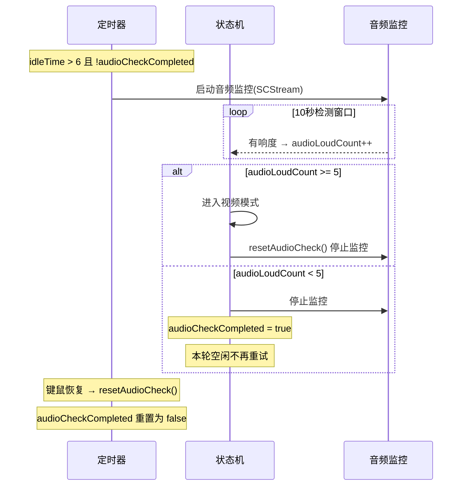

# 音频检测改为一次性10秒窗口

## 概述
将音频检测从"持续循环检测"改为"一次性10秒窗口"：空闲6秒后监听10秒，10秒内有5秒以上有响度则认定看视频，否则停止监听，本轮空闲不再重试，直到下次键鼠活动后再次空闲达6秒才重新监听。

## 当前实现

## 测试用例
1. 停止键鼠6秒，应开始音频监听（日志出现"音频捕获启动"）
2. 若有视频音频：10秒内应进入视频模式（日志出现"进入视频模式"）
3. 若无视频音频：10秒后应看到"音频捕获停止"，此后不再监听
4. 恢复键鼠活动再次停止6秒后，应重新开始监听

## 方案

### 🚀 推荐方案：一次性10秒检测窗口

**优点**：
- 精确控制监听时长，避免无限循环浪费资源
- 10秒窗口更充裕，SCStream启动延迟不再是问题
- 5/10秒阈值比3/5秒更宽容，减少误判

**缺点**：
- 需新增 `audioCheckCompleted` 标记属性

**修改位置**：
[SmartReminderManager.swift](vscode://file/Volumes/Cache/X/Sources/Model/SmartReminderManager.swift:51) — 新增 `audioCheckCompleted` 属性
[SmartReminderManager.swift](vscode://file/Volumes/Cache/X/Sources/Model/SmartReminderManager.swift:23) — 更新注释（5s→10s窗口）
[SmartReminderManager.swift](vscode://file/Volumes/Cache/X/Sources/Model/SmartReminderManager.swift:183) — idle 分支增加 `!audioCheckCompleted` 条件
[SmartReminderManager+Extensions.swift](vscode://file/Volumes/Cache/X/Sources/Model/SmartReminderManager+Extensions.swift:9) — 重写检测函数（10秒窗口 + 5秒阈值 + 失败即停止）
[SmartReminderManager+Extensions.swift](vscode://file/Volumes/Cache/X/Sources/Model/SmartReminderManager+Extensions.swift:49) — resetAudioCheck 重置 `audioCheckCompleted`

## 任务总结与结论

将音频检测从"持续循环5秒窗口"改为"一次性10秒窗口"：

修改文件：
- SmartReminderManager.swift：注释更新、新增 `audioCheckCompleted` 属性、idle 分支增加检测条件
- SmartReminderManager+Extensions.swift：重写检测函数（10秒窗口 + 一次性 + 失败即停止）

## 任务耗时
- 任务开始时间：07:34
- 任务结束时间：07:51
- 任务总耗时：17 分钟
