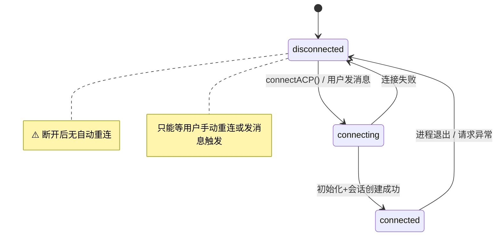
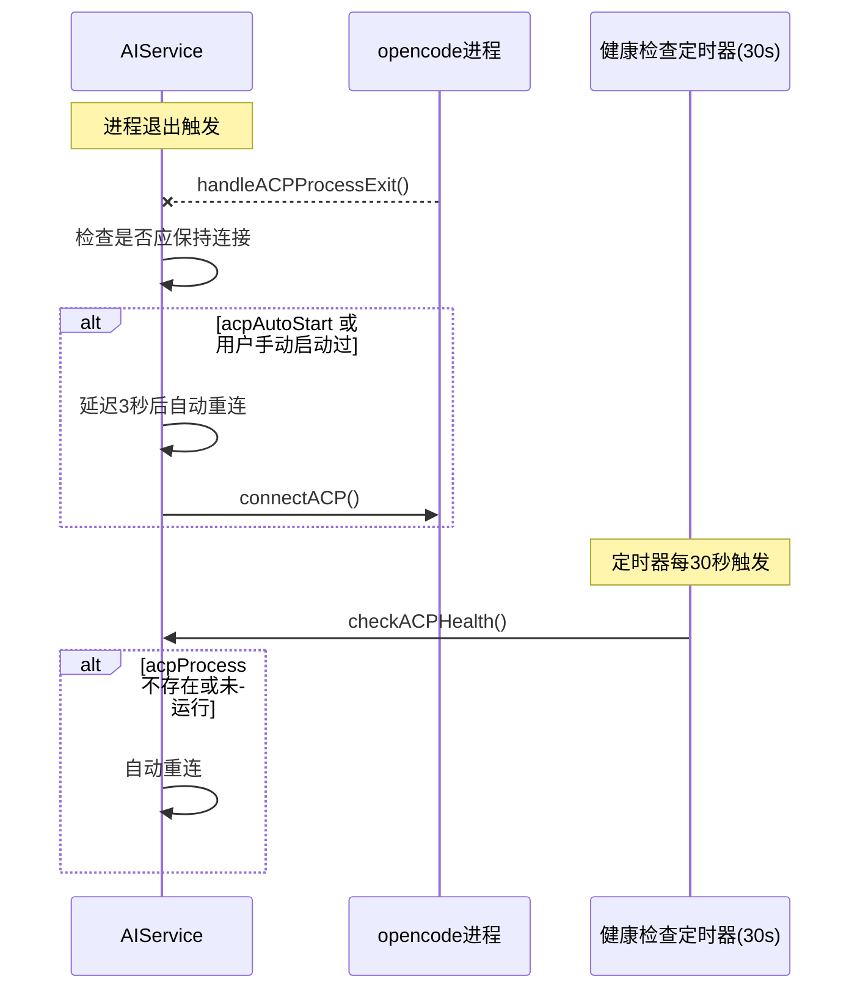
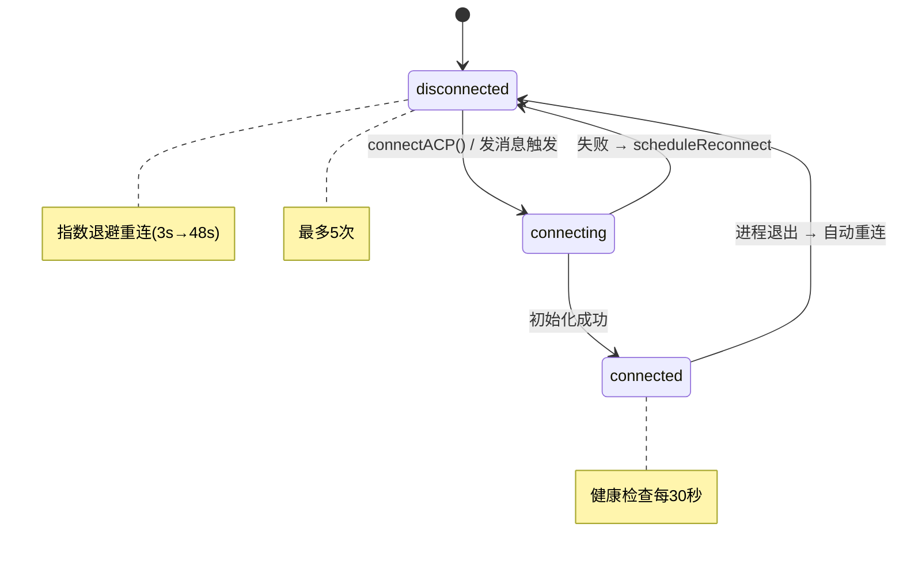

# 确保ACP服务始终保持连接

## 概述
ACP 服务（基于 opencode 子进程的 JSON-RPC 通信）有时会断开连接，但没有自动重连机制。需要确保在勾选了"自动启动"或手动启动后，只要应用在运行中，ACP 始终保持连接状态。

## 当前实现

当前问题：
- `handleACPProcessExit()` 只设置状态为 disconnected，不重连
- 请求失败时 `disconnectACP()` 后不重试
- 无心跳/定时检测机制
- 空闲5分钟超时断开，仅在下次请求时才懒重建

## 测试用例
1. 启动应用，开启 ACP 自动启动，确认连接成功
2. 手动终止 opencode 子进程（`pkill -f "opencode acp"`）
3. **预期**：应用在几秒内自动检测到断开并重新连接，日志出现"自动重连"
4. 观察长时间运行（>10分钟），确认连接不会莫名断开

## 方案

### 🚀 推荐方案：进程退出自动重连 + 定时健康检查

**优点**：
- 进程异常退出时立即检测并重连
- 定时健康检查兜底，防止遗漏
- 重连有延迟和次数限制，避免无限循环

**缺点**：
- 增加定时器开销（极小，30秒一次）

**修改位置**：
[AIService.swift](vscode://file/Volumes/Cache/X/Sources/Model/AIService.swift:32) — 新增 `shouldMaintainConnection` 标记和重连相关属性
[AIService.swift](vscode://file/Volumes/Cache/X/Sources/Model/AIService.swift:545) — `handleACPProcessExit()` 中触发自动重连
[AIService.swift](vscode://file/Volumes/Cache/X/Sources/Model/AIService.swift:616) — `connectACP()` 中标记 `shouldMaintainConnection = true`
[AIService.swift](vscode://file/Volumes/Cache/X/Sources/Model/AIService.swift:681) — `disconnectACP()` 中标记 `shouldMaintainConnection = false`
[AIService.swift](vscode://file/Volumes/Cache/X/Sources/Model/AIService.swift:55) — 新增 `startACPHealthCheck()` 和 `stopACPHealthCheck()` 方法

## 任务总结与结论

在 AIService.swift 中新增完整的 ACP 连接保活机制：

新增属性：`shouldMaintainConnection`、`acpReconnectCount`、`acpHealthTimer`、`acpReconnecting`

修改方法：
- `handleACPProcessExit()`：触发自动重连
- `connectACP()`：标记保活 + 启动健康检查
- `disconnectACP()`：清除保活标记 + 停止健康检查
- `ensureACPConnection()`：设置保活标记（被动重连入口）
- `sendViaOpencode()`：异常断开后保持保活标记并重连

新增方法：
- `scheduleReconnectIfNeeded()`：指数退避调度重连
- `startACPHealthCheck()` / `stopACPHealthCheck()`：30秒定时检测
- `checkACPHealth()`：健康状态检查

## 任务耗时
- 任务开始时间：08:02
- 任务结束时间：08:12
- 任务总耗时：10 分钟
