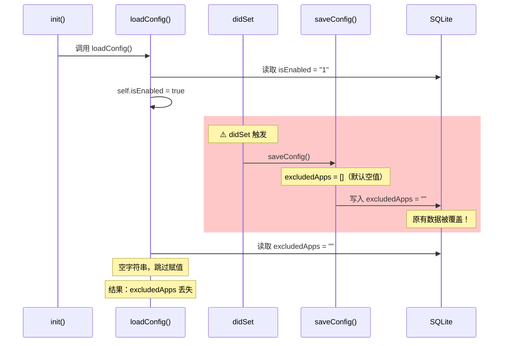
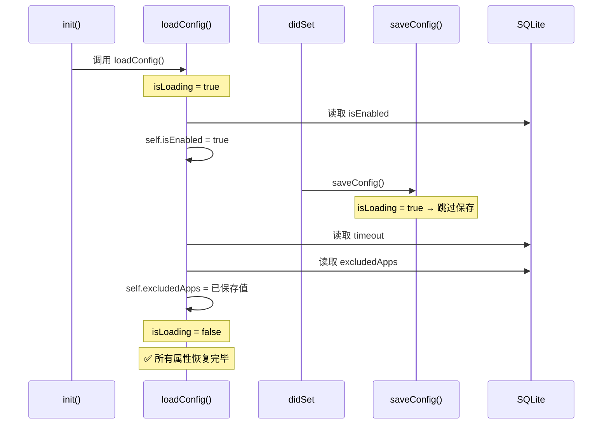
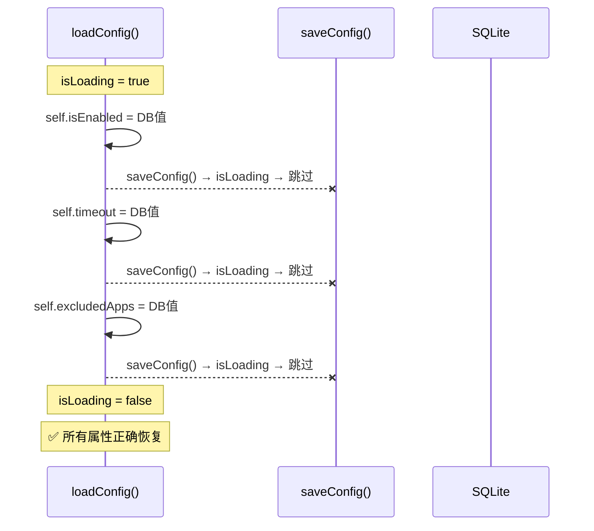

# 修复忽略程序列表未持久化

## 概述
自动隐藏功能的忽略程序列表（excludedApps）配置后无法持久化。重启应用后列表为空。

## 当前实现

## 测试用例
1. 打开偏好设置 → 自动隐藏 → 添加忽略程序
2. 退出并重启应用
3. **预期**：忽略程序列表保持不变

## 方案

### 🚀 推荐方案：加载期间抑制 saveConfig

**优点**：改动最小（3行），不改变 didSet 逻辑
**缺点**：无

**修改位置**：
[AutoHideManager.swift](vscode://file/Volumes/Cache/X/Sources/Model/AutoHideManager.swift:35) — 新增 `isLoading` 属性
[AutoHideManager.swift](vscode://file/Volumes/Cache/X/Sources/Model/AutoHideManager.swift:186) — saveConfig 检查 isLoading
[AutoHideManager.swift](vscode://file/Volumes/Cache/X/Sources/Model/AutoHideManager.swift:194) — loadConfig 设置 isLoading

## 任务总结与结论

在 AutoHideManager.swift 中添加 `isLoading` 标志，`loadConfig()` 期间设为 true 抑制 `saveConfig()` 调用，修复了加载时 didSet 提前触发导致已存数据被空值覆盖的问题。

## 任务耗时
- 任务开始时间：08:41
- 任务结束时间：08:54
- 任务总耗时：13 分钟
