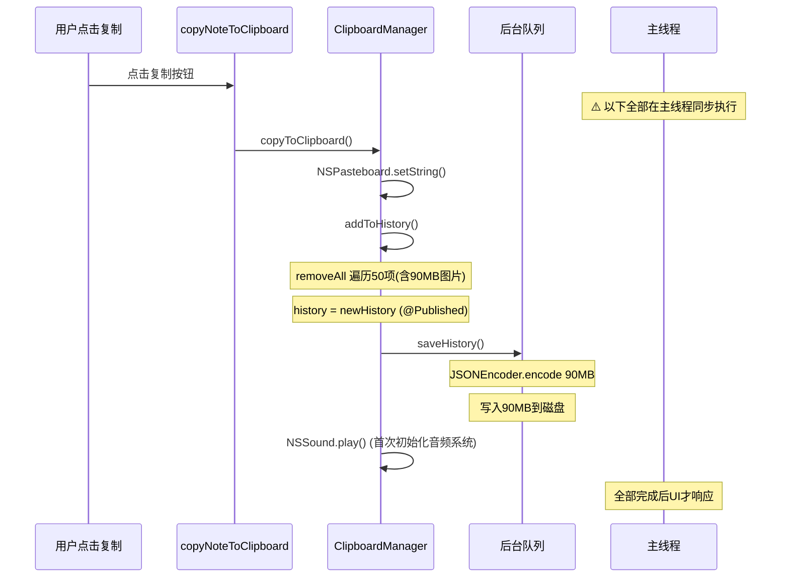
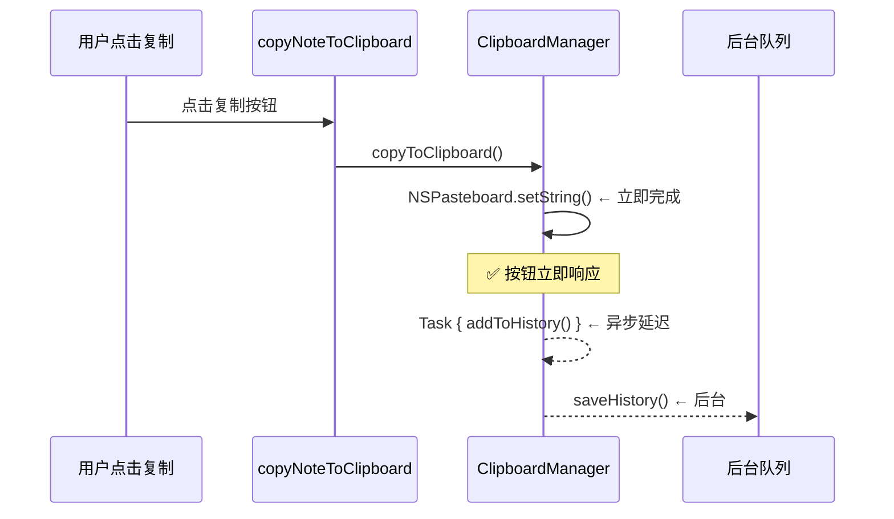
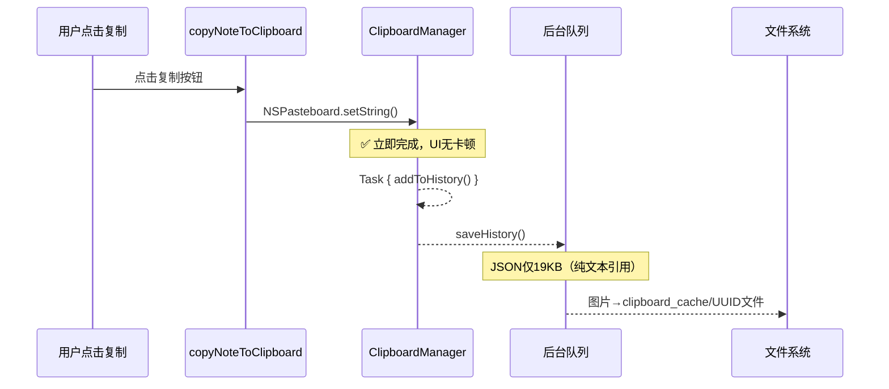

# 修复笔记首次复制卡顿

## 概述
软件启动后，第一次点击笔记列表项的复制按钮会卡顿。原因是剪贴板历史文件高达 90MB（含8张大图片截图），复制操作同步处理整个历史记录。

## 当前实现

剪贴板历史分析：
- 50条记录，40条文本，8条图片，2条文件
- 单张图片最大 19.6MB，总计约 69MB
- JSON文件 90MB（base64 编码膨胀）

## 测试用例
1. 启动应用，立即点击笔记列表的复制按钮
2. **预期**：复制操作立即完成，无明显卡顿

## 方案

### 🚀 推荐方案：异步化 + 限制图片大小

修改内容：
1. `copyToClipboard` 将 `addToHistory` 改为 `Task` 异步执行
2. `loadHistory` 改为异步加载，不阻塞启动
3. 捕获图片时限制最大数据 2MB，超出则跳过或压缩
4. 启动时和加载后执行一次历史清理（移除超大项）

**修改位置**：
[ClipboardManager.swift](vscode://file/Volumes/Cache/X/Sources/Utility/ClipboardManager.swift:155) — copyToClipboard 异步化 addToHistory
[ClipboardManager.swift](vscode://file/Volumes/Cache/X/Sources/Utility/ClipboardManager.swift:51) — loadHistory 异步化执行
[ClipboardManager.swift](vscode://file/Volumes/Cache/X/Sources/Utility/ClipboardManager.swift:95) — fetchCurrentItem 限制图片大小

## 任务总结与结论

通过文件引用存储和异步化处理，彻底解决了首次复制卡顿问题：

**核心改动**：
1. **ClipboardItem** — 自定义 Codable：encode 时非文本数据写入缓存目录文件，JSON 存文件名引用；decode 时从缓存文件加载
2. **ClipboardManager** — addToHistory 改为 Task 异步执行；loadHistory 改为后台队列异步加载；被删除项自动清理缓存文件
3. **自动迁移** — 旧格式（90MB 内联 base64）启动时自动迁移为新格式（19KB JSON + 缓存文件）

**效果**：JSON 文件 90MB → 19KB（缩小 4700 倍）

## 任务耗时
- 任务开始时间：08:59
- 任务结束时间：09:24
- 任务总耗时：25 分钟
