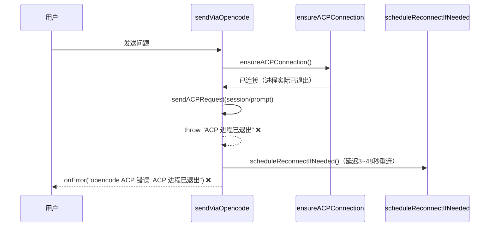
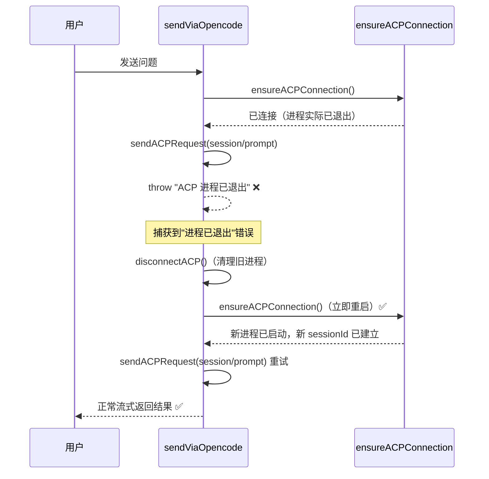
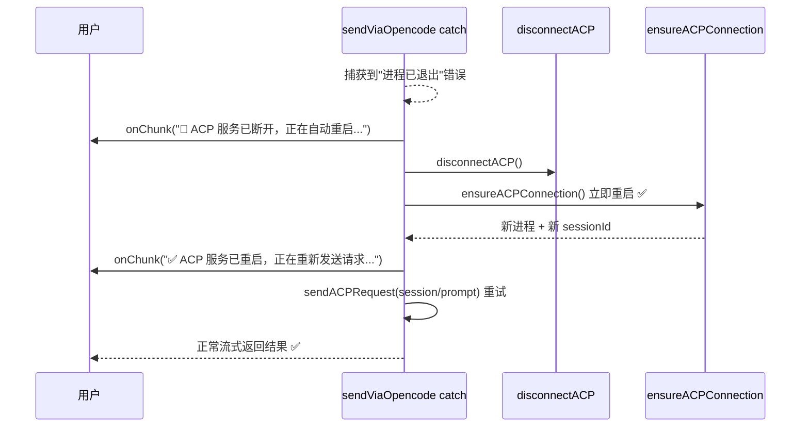

# ACP进程退出时立即自动重启并重试

## 概述

当 ACP 服务（opencode 子进程）意外退出后，用户发送问题时会立即收到错误 `[错误: opencode ACP 错误: ACP 进程已退出]`，体验较差。目标是：**捕获到"进程已退出"错误时，立即重启 ACP 服务并自动重试本次请求，用户几乎感知不到中断**。

## 当前实现

**问题环节**：`sendViaOpencode` 的 catch 块发现"进程已退出"后，触发的是**后台延迟重连**，但当前请求已直接报错返回用户，用户必须手动重发。

## 测试用例

1. 正常连接 ACP 服务后，在终端手动 kill opencode 进程：`pkill -f "opencode acp"`
2. 立即在 AIX 中发送一条问题
3. **期望**：界面上不出现错误提示，AIX 自动重启 ACP 并返回正常回答
4. **当前行为**：界面显示 `[错误: opencode ACP 错误: ACP 进程已退出]`

## 方案

### 🚀 推荐方案：在 sendViaOpencode 的 catch 中立即重连并重试一次

**优点**：
- 用户无感知，体验最佳
- 复用现有的 `ensureACPConnection` 逻辑，改动最小
- 重试仅执行一次，避免无限循环

**缺点**：
- 重启 ACP 需要 1~3 秒，用户会感受到轻微延迟

**改动位置**：
[AIService.swift](vscode://file/Volumes/Cache/X/Sources/Model/AIService.swift:272)（sendViaOpencode 的 catch 块，第272行）

---

### 备选方案：在 ensureACPConnection 中检测进程退出并重建

在 `ensureACPConnection` 入口处增加进程存活检测，若进程已退出则立即清理重建。

**优点**：更早发现问题，重建发生在发请求之前

**缺点**：进程可能在 `ensureACPConnection` 返回后、发送请求前才退出，仍需 catch 兜底；改动点多

**改动位置**：
[AIService.swift](vscode://file/Volumes/Cache/X/Sources/Model/AIService.swift:316)（ensureACPConnection 入口，第316行）

## 任务总结与结论

采用推荐方案，在 `sendViaOpencode` 的 catch 块中，将"进程已退出/管道断开"类错误与"超时"错误分开处理：

- **连接断开错误**：立即 `disconnectACP()` 清理旧进程 → `ensureACPConnection()` 重启 ACP → 重试本次 `session/prompt` 请求，全程通过 `onChunk` 推送提示文字让用户知晓进度。
- **超时错误**：维持原有行为，后台 `scheduleReconnectIfNeeded()` 延迟重连，并向用户报错。
- **其他错误**：直接 `onError` 报给用户。

## 任务耗时
- 任务开始时间：13:02
- 任务结束时间：13:08
- 任务总耗时：6 分钟
