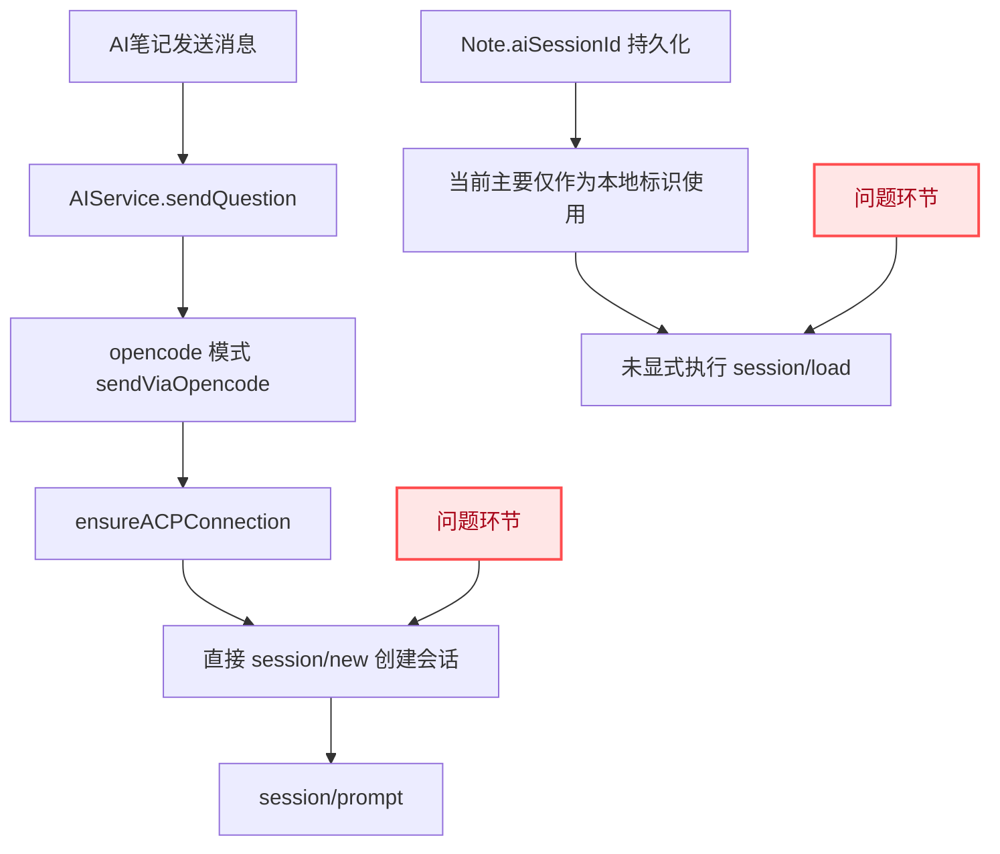
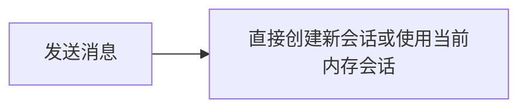
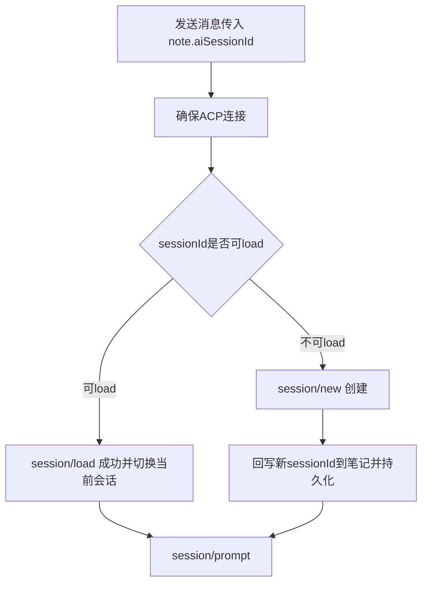
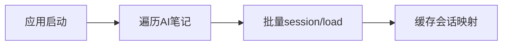
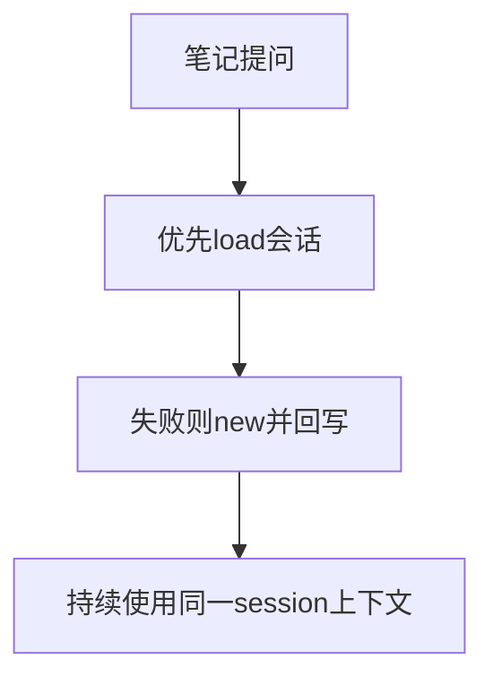

# AI笔记 LoadSession 恢复

## 概述
目标是让 X 项目的 AI 笔记列表在应用重启后继续基于原会话聊天，避免每次都创建新 session 导致上下文丢失。参考 coderx 的思路，改为优先 load 既有 session，失败时再创建新 session 并回写持久化。

## 当前实现

## 测试用例
1. 基础恢复测试
   - 新建 AI 笔记并进行两轮问答。
   - 退出应用并重新打开。
   - 在同一条 AI 笔记继续提问。
   - 期望：优先走 load session，回答能延续此前上下文。

2. 会话不存在降级测试
   - 人为让本地保存的 sessionId 在后端不可用。
   - 发起提问。
   - 期望：load 失败后自动创建新会话，并将新 sessionId 写回笔记。

3. 双入口一致性测试
   - 在笔记列表内提问，再在大窗口提问。
   - 期望：两处都走同一会话恢复策略，并保持 sessionId 一致。

## 方案
### 方案A：仅保留现有逻辑

优点
- 改动最小。

缺点
- 无法满足重启后恢复上下文需求。

代码修改位置
- 无

### 推荐🚀 方案B：按笔记会话ID优先 load，再降级创建并回写

优点
- 直接解决“退出后继续聊”核心问题。
- 与 coderx 的 load session 机制一致。
- 兼容旧数据：load 失败可自动降级创建。

缺点
- 需要在列表和大窗口两处统一回写 sessionId。
- 需要处理 load 失败日志与用户可观测行为。

代码修改位置
- [AIService.swift](vscode://file/Volumes/Cache/X/Sources/Model/AIService.swift:230)
- [AIService.swift](vscode://file/Volumes/Cache/X/Sources/Model/AIService.swift:346)
- [NoteListView.swift](vscode://file/Volumes/Cache/X/Sources/View/NoteListView.swift:431)
- [LargeNoteWindow.swift](vscode://file/Volumes/Cache/X/Sources/View/LargeNoteWindow.swift:343)
- [Note.swift](vscode://file/Volumes/Cache/X/Sources/Model/Note.swift:200)

### 方案C：应用启动时批量预加载所有 AI 笔记会话

优点
- 打开笔记即可无延迟继续。

缺点
- 启动成本高，失败处理复杂。
- 大量历史笔记时会产生无效加载。

代码修改位置
- [AppDelegate.swift](vscode://file/Volumes/Cache/X/Sources/App/AppDelegate.swift:50)
- [AIService.swift](vscode://file/Volumes/Cache/X/Sources/Model/AIService.swift:669)

## 任务总结与结论
建议采用方案B：在发送消息时按笔记维度恢复会话（load优先，new兜底），并把最终有效 sessionId 持久化到对应笔记。这样可以最小改动实现稳定恢复，且不会在应用启动阶段引入额外负担。

## 任务耗时
- 任务开始时间：13:46
- 任务结束时间：14:00
- 任务总耗时：14 分钟
