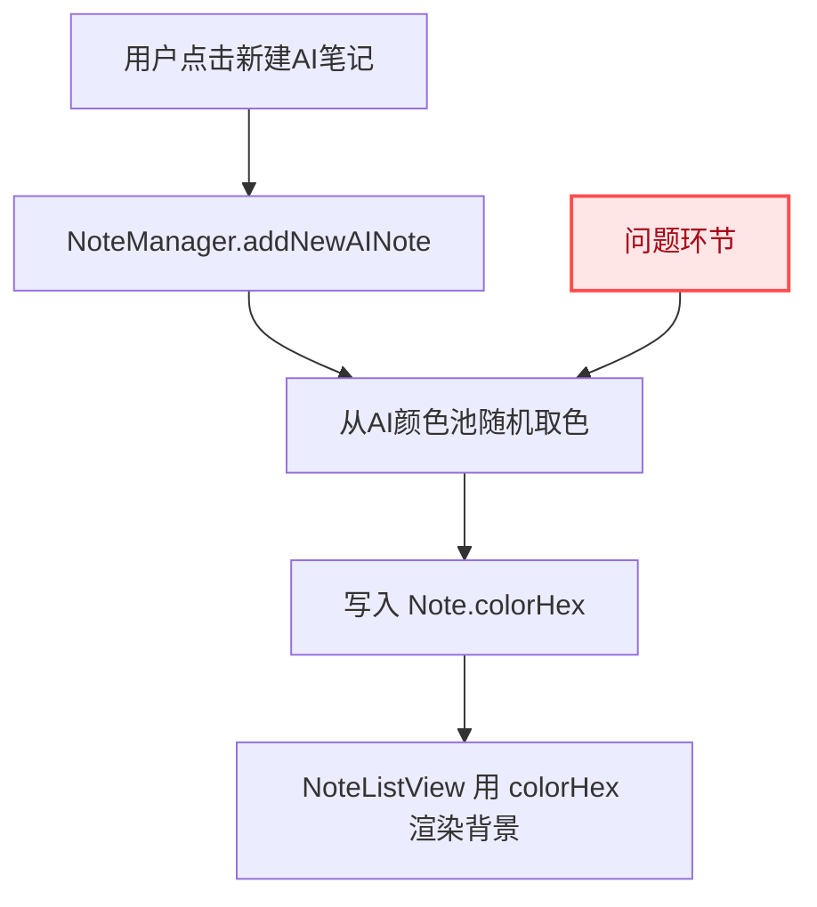
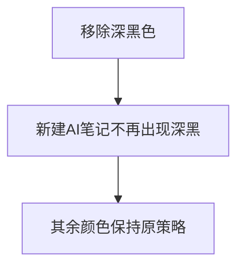

# 去除AI笔记深黑背景

## 概述
在 AI 笔记列表中新建 AI 笔记时，不再出现深黑色背景；其他已有颜色保持不变。

## 当前实现

## 测试用例
1. 连续新建 10 条 AI 笔记，观察背景色。
   - 期望：不再出现深黑色背景。
2. 验证其余 AI 颜色仍可出现。
   - 期望：原有非深黑颜色仍正常随机。
3. 验证普通笔记不受影响。
   - 期望：普通笔记颜色策略保持原样。

## 方案
### 推荐🚀 方案A：仅移除 AI 颜色池中的深黑色值

优点
- 改动最小，风险最低。
- 完全满足“仅去除深黑，其他保留”的目标。

缺点
- AI 颜色选择总数减少。

代码修改位置
- [Note.swift](vscode://file/Volumes/Cache/X/Sources/Model/Note.swift:201)

### 方案B：保留颜色池但增加渲染层过滤深黑

优点
- 可兼容历史数据中的深黑色显示替换。

缺点
- 逻辑分散到渲染层，复杂度更高。
- 本任务不要求处理历史数据替换。

代码修改位置
- [NoteListView.swift](vscode://file/Volumes/Cache/X/Sources/View/NoteListView.swift:390)
- [LargeNoteWindow.swift](vscode://file/Volumes/Cache/X/Sources/View/LargeNoteWindow.swift:148)

## 任务总结与结论
采用方案A：在 AI 新建笔记的取色集合中移除深黑色即可，既满足需求又不影响其他颜色逻辑。

## 任务耗时
- 任务开始时间：14:03
- 任务结束时间：14:05
- 任务总耗时：2 分钟
