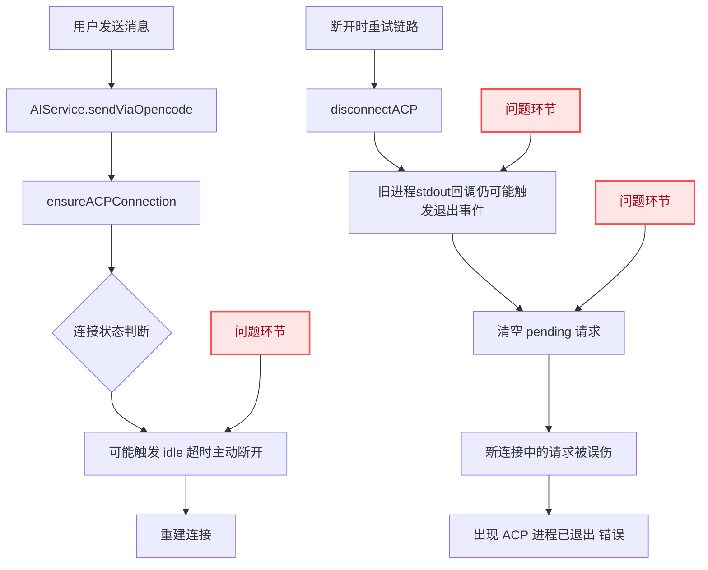
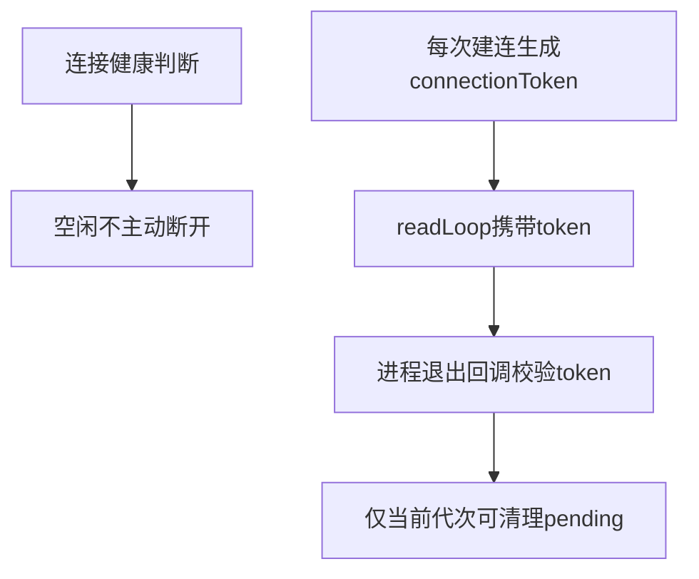
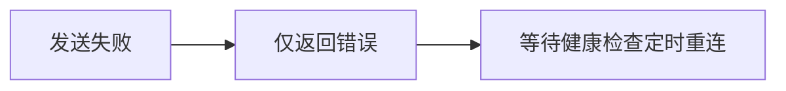
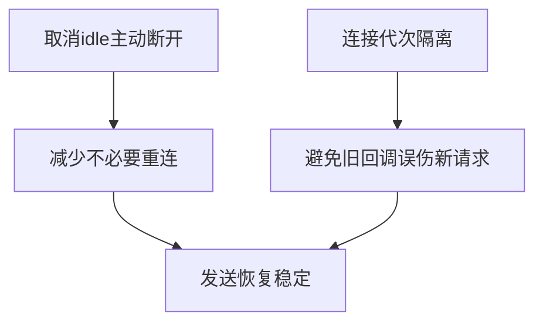

# opencode断开与重连卡住排查

## 概述
排查两个问题：
1) opencode 服务运行一段时间后自动断开；
2) 用户发送消息时若服务断开，提示“正在自动重启”后仍报错并卡住。

## 当前实现

## 测试用例
1. 长时间空闲后发送消息
   - 启动应用并保持 opencode 模式。
   - 空闲一段时间后发送提问。
   - 期望：不再因空闲被主动断开，可正常继续。

2. 断线重启恢复测试
   - 人为触发 opencode 进程退出。
   - 立即发送消息。
   - 期望：出现“重启中”提示后可成功恢复并继续回答，不再报“ACP 进程已退出”。

3. 连续两次断线恢复
   - 连续触发两次断开并提问。
   - 期望：都能恢复，不出现卡死或 pending 请求被错误清空。

## 方案
### 方案A：仅调大 idle 超时

优点
- 改动小。

缺点
- 仍保留“主动断开”机制。
- 不能解决旧连接回调误伤新请求的竞态问题。

代码修改位置
- [AIService.swift](vscode://file/Volumes/Cache/X/Sources/Model/AIService.swift:420)

### 推荐🚀 方案B：取消 idle 主动断开 + 引入连接代次隔离旧回调

优点
- 直接消除“运行一段时间自动断开”的根因。
- 消除旧进程退出回调误清理新请求的竞态。
- 对现有重连链路改动可控、收益高。

缺点
- 需要改动连接管理核心路径，需做回归验证。

代码修改位置
- [AIService.swift](vscode://file/Volumes/Cache/X/Sources/Model/AIService.swift:48)
- [AIService.swift](vscode://file/Volumes/Cache/X/Sources/Model/AIService.swift:420)
- [AIService.swift](vscode://file/Volumes/Cache/X/Sources/Model/AIService.swift:510)
- [AIService.swift](vscode://file/Volumes/Cache/X/Sources/Model/AIService.swift:639)
- [AIService.swift](vscode://file/Volumes/Cache/X/Sources/Model/AIService.swift:738)

### 方案C：失败后只依赖后台定时重连，不做发送时立即重试

优点
- 实现简单。

缺点
- 用户体验差，发送失败概率高。
- 与“发送时自动恢复”目标冲突。

代码修改位置
- [AIService.swift](vscode://file/Volumes/Cache/X/Sources/Model/AIService.swift:273)

## 任务总结与结论
采用方案B：同时处理“主动断开策略”与“旧回调竞态”两条主因，可在不改变业务交互的前提下稳定修复自动断开与重启卡住问题。

## 任务耗时
- 任务开始时间：18:03
- 任务结束时间：18:08
- 任务总耗时：5 分钟
