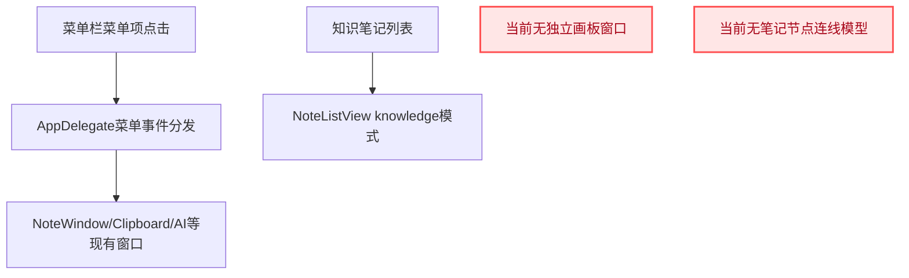
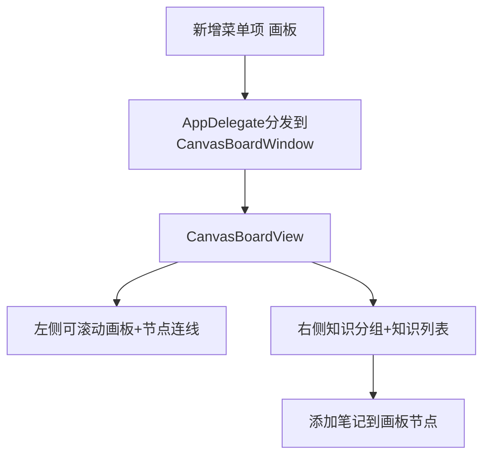
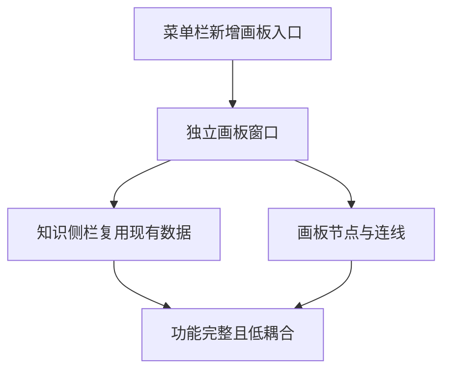

# 画板功能与知识侧栏集成

## 概述
在 X 项目新增画板功能：
- 左侧为可任意尺寸的画板区域；
- 右侧为知识笔记侧栏（上方分组、下方知识笔记列表），尽量复用现有知识笔记体系；
- 可将右侧知识笔记添加到画板；
- 可在画板中链接不同笔记节点。
- 画板窗口入口放到菜单栏菜单项中。

## 当前实现

## 测试用例
1. 入口与窗口
  - 在菜单栏点击“画板”菜单项。
  - 重复点击菜单项，验证打开/关闭或聚焦行为。
   - 期望：窗口可稳定开关并贴近悬浮球定位。

2. 右侧知识侧栏
   - 切换知识分组，观察列表变更。
   - 期望：只展示当前分组知识笔记，复用现有分组与数据源。

3. 添加节点
   - 从右侧点击“添加到画板”。
   - 期望：左侧画板出现对应笔记节点，节点可拖拽。

4. 链接节点
   - 先选择“开始连线”节点，再选择目标节点。
   - 期望：节点间出现连线，可重复建立多个连接。

5. 画板尺寸
   - 调整画板宽高（任意大小范围）。
   - 期望：画板可滚动查看并继续操作节点。

## 方案
### 方案A：在现有 NoteWindow 内新增画板模式

优点
- 入口改动小。

缺点
- `NoteListView` 职责膨胀，维护成本高。
- 画板交互与笔记列表交互耦合严重。

代码修改位置
- [NoteListView.swift](vscode://file/Volumes/Cache/X/Sources/View/NoteListView.swift:820)
- [NoteWindow.swift](vscode://file/Volumes/Cache/X/Sources/View/NoteWindow.swift:5)

### 推荐🚀 方案B：新增独立 CanvasBoardWindow + CanvasBoardView，入口挂到菜单栏

优点
- 画板与笔记列表解耦，结构清晰。
- 右侧可复用现有 `NoteManager` 数据与分组规则。
- 便于后续扩展（持久化、更多连线样式）。

缺点
- 需要新增窗口与视图文件。

代码修改位置
- [AppDelegate.swift](vscode://file/Volumes/Cache/X/Sources/App/AppDelegate.swift:11)
- [AppDelegate.swift](vscode://file/Volumes/Cache/X/Sources/App/AppDelegate.swift:1230)
- [CanvasBoardWindow.swift](vscode://file/Volumes/Cache/X/Sources/View/CanvasBoardWindow.swift:1)
- [CanvasBoardView.swift](vscode://file/Volumes/Cache/X/Sources/View/CanvasBoardView.swift:1)
- [Localizable.strings](vscode://file/Volumes/Cache/X/Sources/Resources/zh.lproj/Localizable.strings:32)
- [Localizable.strings](vscode://file/Volumes/Cache/X/Sources/Resources/en.lproj/Localizable.strings:32)

### 方案C：先做纯画板，无知识侧栏集成

优点
- 交付更快。

缺点
- 不满足“右侧知识列表并可添加”的核心需求。

代码修改位置
- [CanvasBoardView.swift](vscode://file/Volumes/Cache/X/Sources/View/CanvasBoardView.swift:1)

## 任务总结与结论
推荐方案B：独立画板窗口承载复杂交互，右侧侧栏直接复用现有知识数据模型与分组逻辑，保证功能完整且对现有笔记系统影响最小。

## 任务耗时
- 任务开始时间：08:15
- 任务结束时间：13:29
- 任务总耗时：314 分钟
