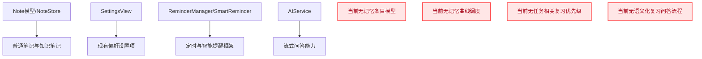
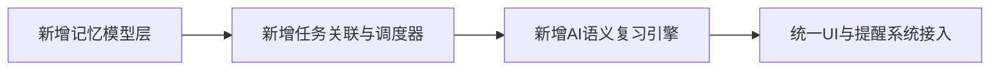
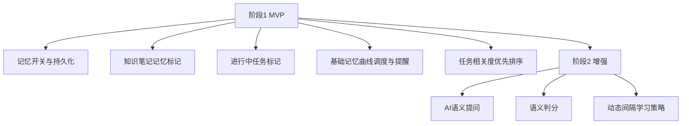
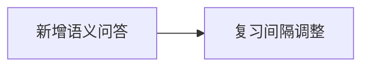
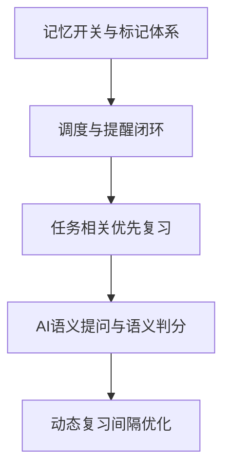

# 记忆功能系统设计与落地

## 概述
在 X 项目新增“记忆功能”，并支持在偏好设置中开关（默认关闭）。目标包括：
1. 知识笔记可标记为“记忆”，系统基于内容生成联想记忆条目（记忆宫殿风格）。
2. 普通笔记可标记为“进行中”，非侵入式提示相关知识；若知识接近记忆曲线复习点，视觉强调提醒复习。
3. 独立时间提醒复习，优先复习与近期任务相关度高的条目。
4. 复习时由大模型语义提问、语义判分，动态安排后续复习间隔。

## 产品原则（按你的定义固化）
1. 深度编码优先
  - AI 自动把抽象知识转为可视化、故事化、空间化记忆条目（记忆宫殿联想）。

2. 情景化触发优先
  - 不仅固定时间提醒，还要在“当前任务上下文”中主动推送高相关、临近遗忘临界点的知识。

3. 对话式评估优先
  - 复习不做固定模板题，改为语义提问 + 语义理解评分 + 动态间隔调整。

## 当前实现

## 测试用例
1. 功能开关
   - 偏好设置默认关闭“记忆功能”；开启后生效，重启后状态持久化。

2. 知识标记与条目生成
   - 将知识笔记标记为“记忆”，应生成记忆条目（可查看条目列表与下次复习时间）。

3. 进行中任务联动提示
   - 将普通笔记标记“进行中”，编辑任务内容后，应收到非侵入式相关知识提示。
   - 若条目接近复习窗口，应出现视觉强调。

4. 复习提醒优先级
   - 到达复习时间时，优先弹出与近期进行中任务相关度更高的条目。

5. 语义复习流程
   - 进入复习问答后，系统基于条目语义提问。
   - 用户回答后，系统语义判定记忆程度并调整下次间隔。

6. 记忆宫殿联想质量
  - 对同一知识内容多次触发生成，应输出结构化且稳定的联想条目（场景、角色、动作、位置）。

7. 情景化触发有效性
  - 在进行中任务文本变化时，系统应优先推荐与该任务语义相关的待复习知识。

## 方案
### 方案A：一次性全量实现（4项能力同批上线）

优点
- 目标完整，一次交付。

缺点
- 开发与验证面过大，风险高。
- 迭代周期长，难以快速拿到可用版本。

代码修改位置
- [Note.swift](vscode://file/Volumes/Cache/X/Sources/Model/Note.swift:44)
- [NoteStore.swift](vscode://file/Volumes/Cache/X/Sources/Model/NoteStore.swift:86)
- [SettingsView.swift](vscode://file/Volumes/Cache/X/Sources/View/SettingsView.swift:1)
- [ReminderConfig.swift](vscode://file/Volumes/Cache/X/Sources/Model/ReminderConfig.swift:70)
- [SmartReminderManager.swift](vscode://file/Volumes/Cache/X/Sources/Model/SmartReminderManager.swift:1)
- [AIService.swift](vscode://file/Volumes/Cache/X/Sources/Model/AIService.swift:1)

### 推荐🚀 方案B：两阶段落地（先MVP，再语义复习增强）

优点
- 先快速形成稳定可用闭环，风险可控。
- 第二阶段聚焦 AI 语义能力，便于单独调参与质量验收。
- 与你的产品定义一致：先打通“情景触发+复习闭环”，再做“高质量语义教练”。

缺点
- 需要两次迭代。

代码修改位置
- [SettingsView.swift](vscode://file/Volumes/Cache/X/Sources/View/SettingsView.swift:1)
- [Note.swift](vscode://file/Volumes/Cache/X/Sources/Model/Note.swift:44)
- [NoteStore.swift](vscode://file/Volumes/Cache/X/Sources/Model/NoteStore.swift:44)
- [CanvasBoardStore.swift](vscode://file/Volumes/Cache/X/Sources/Model/CanvasBoardStore.swift:1)
- [ReminderConfig.swift](vscode://file/Volumes/Cache/X/Sources/Model/ReminderConfig.swift:70)
- [SmartReminderManager.swift](vscode://file/Volumes/Cache/X/Sources/Model/SmartReminderManager.swift:1)
- [AIService.swift](vscode://file/Volumes/Cache/X/Sources/Model/AIService.swift:112)
- [Localizable.strings](vscode://file/Volumes/Cache/X/Sources/Resources/zh.lproj/Localizable.strings:1)
- [Localizable.strings](vscode://file/Volumes/Cache/X/Sources/Resources/en.lproj/Localizable.strings:1)

### 方案C：仅做AI语义复习，不做任务联动与优先级

优点
- AI体验突出。

缺点
- 缺少你强调的“任务关联提醒与优先复习”核心价值。

代码修改位置
- [AIService.swift](vscode://file/Volumes/Cache/X/Sources/Model/AIService.swift:112)
- [Note.swift](vscode://file/Volumes/Cache/X/Sources/Model/Note.swift:44)

## 任务总结与结论
建议采用方案B：先完成“可运行的情景化记忆闭环”再叠加“语义教练增强”，确保功能质量与节奏平衡。

## 任务耗时
- 任务开始时间：13:49
- 任务结束时间：14:27
- 任务总耗时：38 分钟
