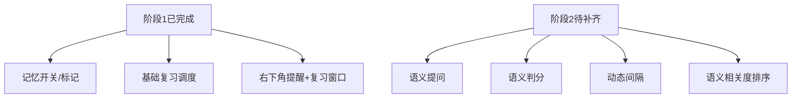
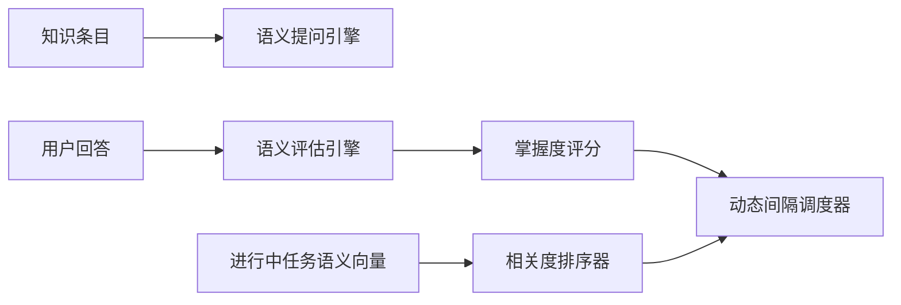
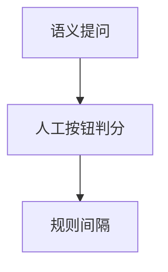
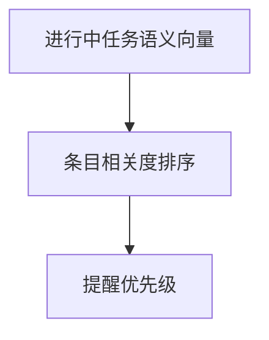
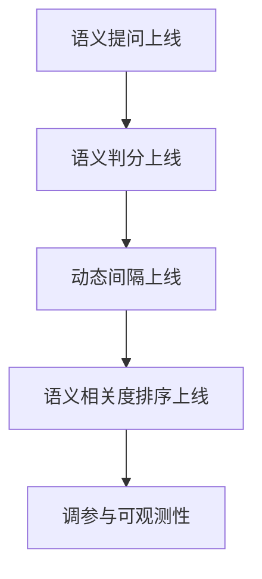

# 记忆功能阶段2设计细化

## 概述
阶段2目标：把阶段1的“规则驱动记忆系统”升级为“语义驱动记忆教练”，重点实现：
1. 语义化提问：围绕知识要点生成开放式复习问题。
2. 语义判分：基于用户回答语义理解记忆状态。
3. 动态间隔：按语义掌握度与任务相关度调整复习间隔。
4. 情景化增强：在进行中任务场景下更精准地触发复习建议。

## 当前实现

## 测试用例
1. 语义提问
   - 同一知识在不同复习轮次应生成不同角度问题（定义/应用/对比）。

2. 语义判分
   - 用户回答明显正确、部分正确、明显错误时，应分别得到“清晰/模糊/忘记”的稳定判定。

3. 动态间隔
   - 判定清晰：下次间隔显著拉长；判定模糊：适度增长；判定忘记：快速回顾。

4. 任务相关优先级
   - 当存在进行中任务时，语义相关度高的到期条目应优先出现在复习队列前列。

5. 情景化提醒质量
   - 对同一任务上下文，提醒内容应具有可解释性（说明“为什么此时推荐该知识”）。

## 方案
### 推荐🚀 方案A：两层语义引擎（问答层 + 调度层）

优点
- 模块边界清晰，便于逐步替换与调优。
- 与阶段1兼容，可平滑升级。

缺点
- 需要增加评估日志与可观测性，否则难以调参。

代码修改位置
- [AIService.swift](vscode://file/Volumes/Cache/X/Sources/Model/AIService.swift:112)
- [MemoryManager.swift](vscode://file/Volumes/Cache/X/Sources/Model/MemoryManager.swift:1)
- [MemoryReviewWindows.swift](vscode://file/Volumes/Cache/X/Sources/View/MemoryReviewWindows.swift:1)
- [Note.swift](vscode://file/Volumes/Cache/X/Sources/Model/Note.swift:44)
- [AppDelegate.swift](vscode://file/Volumes/Cache/X/Sources/App/AppDelegate.swift:1)

### 方案B：先替换提问，不做语义判分

优点
- 改造快，风险低。

缺点
- 仍依赖人工主观判断，不符合“理解式评估”目标。

代码修改位置
- [MemoryReviewWindows.swift](vscode://file/Volumes/Cache/X/Sources/View/MemoryReviewWindows.swift:1)
- [AIService.swift](vscode://file/Volumes/Cache/X/Sources/Model/AIService.swift:112)

### 方案C：先做语义相关度排序，不做语义问答

优点
- 对“情景触发”改善明显。

缺点
- 复习质量核心（提问与评估）仍未提升。

代码修改位置
- [MemoryManager.swift](vscode://file/Volumes/Cache/X/Sources/Model/MemoryManager.swift:1)
- [Note.swift](vscode://file/Volumes/Cache/X/Sources/Model/Note.swift:44)

## 任务总结与结论
建议按推荐方案A实施，采用“先可用后优化”的顺序：
1. 先接语义提问与语义判分，形成最小语义闭环；
2. 再接语义相关度排序，增强情景触发；
3. 最后做策略调参与可观测性完善。

## 任务耗时
- 任务开始时间：14:36
- 任务结束时间：15:12
- 任务总耗时：36 分钟
