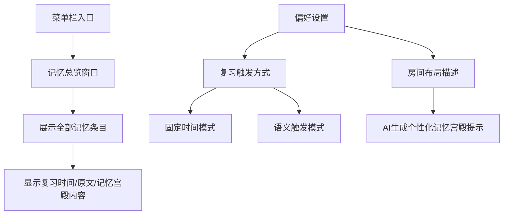
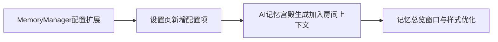
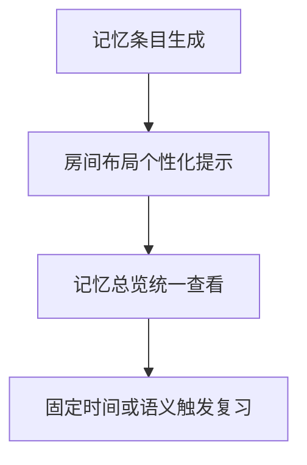

# 记忆总览与个性化记忆宫殿完善

## 概述
基于测试反馈完善记忆功能体验：
1. 新增记忆总览专用窗口，集中查看记忆条目。
2. 记忆总览样式调整为更易读布局（复习时间左上、原文置顶、原文容器化展示）。
3. 在偏好设置增加“固定复习时间”配置入口。
4. 增加“房间布局描述”输入，用于个性化记忆宫殿提示生成。

## 当前实现

## 测试用例
1. 菜单栏可打开“记忆总览”窗口。
2. 列表中可查看完整原文与记忆宫殿内容。
3. 原文区域为紫色容器，右上角“原文”标签仅在 hover 显示。
4. 设置中可切换“固定时间/语义触发”并保存。
5. 设置中填写房间布局后，新生成的记忆宫殿提示应体现房间锚点；为空则走通用方式。

## 方案
### 推荐🚀 方案A：在现有架构上做增量体验优化

优点
- 改动集中、风险低。
- 与现有阶段1/阶段2逻辑兼容。

缺点
- 总览窗口仍为单页列表，后续可继续增加筛选分组能力。

代码修改位置
- [MemoryOverviewWindow.swift](vscode://file/Volumes/Cache/X/Sources/View/MemoryOverviewWindow.swift:1)
- [MemoryManager.swift](vscode://file/Volumes/Cache/X/Sources/Model/MemoryManager.swift:1)
- [AIService+Memory.swift](vscode://file/Volumes/Cache/X/Sources/Model/AIService+Memory.swift:1)
- [SettingsView.swift](vscode://file/Volumes/Cache/X/Sources/View/SettingsView.swift:1)
- [AppDelegate.swift](vscode://file/Volumes/Cache/X/Sources/App/AppDelegate.swift:894)
- [Package.swift](vscode://file/Volumes/Cache/X/Package.swift:1)

## 任务总结与结论
本轮完成“可查看 + 可配置 + 可个性化生成”的关键闭环：
- 可查看：记忆总览窗口落地。
- 可配置：复习触发方式与固定时间可配置。
- 可个性化：房间布局上下文驱动记忆宫殿生成。

## 任务耗时
- 任务开始时间：15:13
- 任务结束时间：16:04
- 任务总耗时：51 分钟
