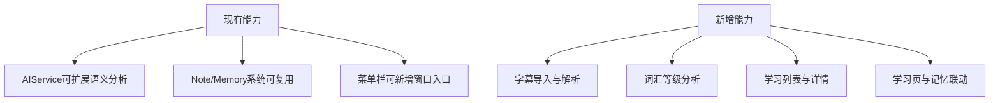
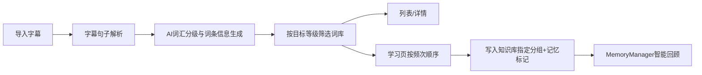
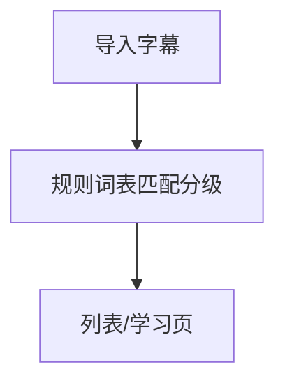

# 语言学习功能MVP实现

## 概述
目标：新增“语言学习窗口”，用户导入字幕文件后，系统基于AI抽取词汇并分级（初中/高中/大学/工作/出国），按用户选择的目标等级筛选“将学词汇”，并提供：
1. 列表与详情（词义、词根、句法解读、记忆宫殿助记）。
2. 学习页（按常用到少用顺序逐个学习）。
5. 学后自动进入现有记忆系统，参与智能回顾。
6. 学后词条进入知识库“单词”独立分组（默认分组名为“单词”），并允许用户在偏好设置中指定目标分组。

## 当前实现

## 测试用例
1. 导入SRT字幕成功，显示解析统计。
2. 选择“高中”时，展示高中及以上词汇（高中/大学/工作/出国）。
3. 列表项详情展示词义、词根、句法解读、记忆宫殿提示。
4. 学习页按常用到少用顺序展示并支持“下一个”。
5. 完成学习后自动写入知识库并标记为记忆条目，进入智能回顾队列。
6. 验证词条默认进入“单词”分组，且修改偏好设置后进入用户指定分组。

## 方案
### 推荐🚀 方案A：MVP一体化窗口 + AI分级分析 + 记忆系统直连

优点
- 功能闭环完整，直接可用。
- 最大化复用现有AI与记忆模块。

缺点
- 首轮AI分析耗时受字幕长度影响，需要进度提示。

代码修改位置
- [AIService+Memory.swift](vscode://file/Volumes/Cache/X/Sources/Model/AIService+Memory.swift:1)
- [AIService.swift](vscode://file/Volumes/Cache/X/Sources/Model/AIService.swift:1)
- [MemoryManager.swift](vscode://file/Volumes/Cache/X/Sources/Model/MemoryManager.swift:1)
- [Note.swift](vscode://file/Volumes/Cache/X/Sources/Model/Note.swift:1)
- [AppDelegate.swift](vscode://file/Volumes/Cache/X/Sources/App/AppDelegate.swift:894)
- [Package.swift](vscode://file/Volumes/Cache/X/Package.swift:1)
- [新增 LanguageLearning* 文件](vscode://file/Volumes/Cache/X/Sources/View:1)

### 方案B：先做规则分级（不接AI）

优点
- 开发快。

缺点
- 词根/句法/记忆宫殿质量不足，不满足目标体验。

## 任务总结与结论
采用推荐方案A，先完成MVP：
1. 单窗口完成导入、筛选、列表、详情、学习流。
2. 学完即写入知识库“单词分组（可配置）”并标记记忆。
3. 后续可再做多语种、词典缓存与离线分级优化。

## 任务耗时
- 任务开始时间：18:42
- 任务结束时间：20:49
- 任务总耗时：127 分钟
