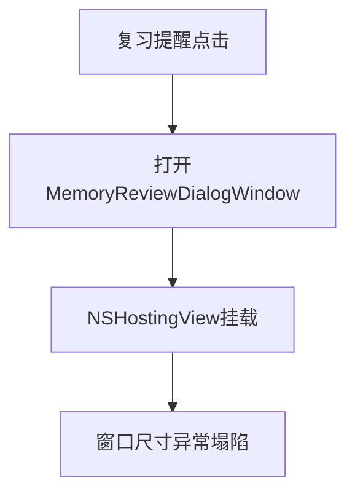

# 复习窗口宽度塌陷修复

## 概述
修复“点击复习提醒后打开的复习窗口没有宽度”的问题，确保窗口在每次打开时均以稳定宽度显示。

## 当前实现

## 测试用例
1. 触发复习提醒并点击“开始复习”，窗口宽度应正常（约560）。
2. 多次关闭再打开，宽度保持稳定。
3. 复习内容正常显示、输入与提交不受影响。

## 方案
### 推荐🚀 方案A：显式内容视图与内容尺寸约束

优点
- 改动最小、定位明确。
- 可避免控制器视图布局链导致的尺寸坍缩。

缺点
- 仍依赖固定默认尺寸，后续如需自适应需再扩展。

代码修改位置
- [MemoryReviewWindows.swift](vscode://file/Volumes/Cache/X/Sources/View/MemoryReviewWindows.swift:74)

## 任务总结与结论
已完成收尾：复习窗口宽度问题已在后续迭代中按更稳妥方案修复，并经手动验证可用。

结论：该任务目标达成，文档归档闭环完成。

## 任务耗时
- 任务开始时间：21:43
- 任务结束时间：22:31
- 任务总耗时：48 分钟
