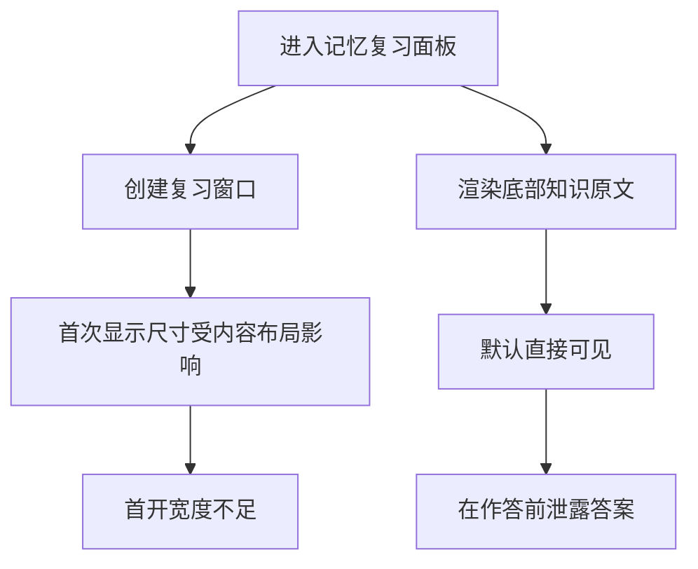
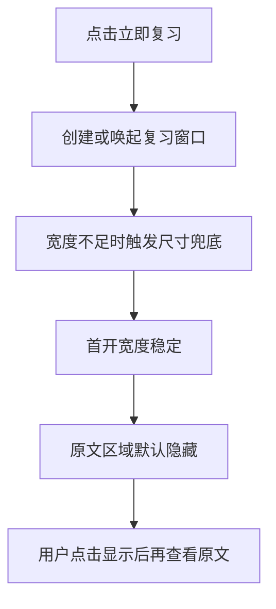

# 记忆复习窗口与答案防泄露

## 概述
本任务包含两个目标：
1. 修复“第一次打开记忆复习窗口时宽度不够”的显示问题，保证首帧可读性。
2. 将复习面板下方笔记原文默认隐藏，避免直接泄露答案；用户主动点击后再显示。

## 当前实现

## 测试用例
1. 首次打开复习窗口：首次打开时窗口宽度应满足完整阅读题干与输入区域，无压缩感。
2. 再次打开复习窗口：关闭后重新打开，宽度保持稳定，与首次一致。
3. 答案防泄露默认态：进入复习面板后，底部原文应默认隐藏，不出现原文正文。
4. 手动显示答案：点击“显示原文/查看答案”后，原文正文可见。
5. 隐藏回退：再次点击“隐藏原文”后，原文正文应再次隐藏。
6. 核心流程回归：提交回答、评估反馈、下一题加载流程不受影响。

## 方案
### 方案A：仅增大窗口初始尺寸

优点
- 改动小，定位明确。

缺点
- 仅解决尺寸问题，未覆盖答案泄露风险。

代码修改位置
- [MemoryReviewWindows.swift](vscode://file/Volumes/Cache/X/Sources/View/MemoryReviewWindows.swift:78)

### 推荐🚀 方案B：窗口尺寸稳定 + 原文显隐开关

优点
- 同时覆盖“首开宽度不足”和“答案泄露”两个目标。
- 交互直观，用户可控。
- 对现有评估流程影响最小。

缺点
- 增加一个显隐状态与按钮文案，需要保持状态切换一致性。

代码修改位置
- [MemoryReviewWindows.swift](vscode://file/Volumes/Cache/X/Sources/View/MemoryReviewWindows.swift:78)
- [MemoryReviewWindows.swift](vscode://file/Volumes/Cache/X/Sources/View/MemoryReviewWindows.swift:103)
- [MemoryReviewWindows.swift](vscode://file/Volumes/Cache/X/Sources/View/MemoryReviewWindows.swift:158)

## 任务总结与结论
已完成推荐方案B并通过手动测试。

结论：本次改动同时修复了“首开窗口过窄”和“答案默认泄露”两个问题，且不影响提交评估与下一题加载流程。

## 任务耗时
- 任务开始时间：22:15
- 任务结束时间：22:26
- 任务总耗时：11 分钟
