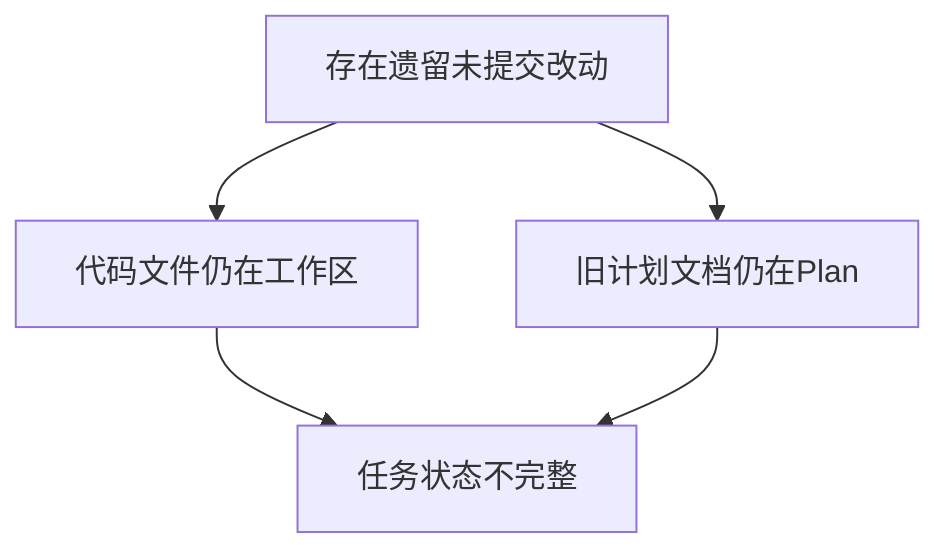
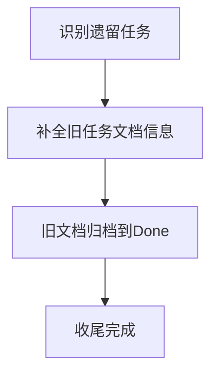

# 未收尾任务归档与提交

## 概述
本任务目标是对上一轮遗留改动进行收尾，确保工作区状态清晰、文档归档完整、提交范围可追溯。

## 当前实现

## 测试用例
1. 收尾后检查工作区：仅保留明确的后续开发改动，不再混杂“待归档文档”。
2. 收尾后检查文档目录：旧计划文档应从 Plan 移入 Done 对应日期目录。
3. 收尾后检查提交记录：提交只包含本次确认的遗留任务代码与对应文档。
4. 收尾后功能核验：记忆总览“立即复习”入口可打开复习窗口，流程可达。

## 方案
### 推荐🚀 方案A：补全旧任务元数据并一次性归档提交

优点
- 收尾路径最短，结果清晰。
- 文档与代码保持一一对应，便于追踪。

缺点
- 需要明确提交边界，避免带入无关改动。

代码修改位置
- [AppDelegate.swift](vscode://file/Volumes/Cache/X/Sources/App/AppDelegate.swift:168)
- [MemoryOverviewWindow.swift](vscode://file/Volumes/Cache/X/Sources/View/MemoryOverviewWindow.swift:53)
- [2143-复习窗口宽度塌陷修复-20260219.md](vscode://file/Volumes/Cache/X/.Xavier/Plan/2143-复习窗口宽度塌陷修复-20260219.md:1)

### 方案B：放弃旧改动并回滚

优点
- 工作区快速变干净。

缺点
- 已完成但未提交的功能会丢失，不符合“收尾”目标。

代码修改位置
- [AppDelegate.swift](vscode://file/Volumes/Cache/X/Sources/App/AppDelegate.swift:168)
- [MemoryOverviewWindow.swift](vscode://file/Volumes/Cache/X/Sources/View/MemoryOverviewWindow.swift:53)

## 任务总结与结论
已完成收尾动作并通过确认。

结论：本轮“未收尾任务”已闭环，遗留文档状态恢复为可追踪的已完成状态。

## 任务耗时
- 任务开始时间：22:29
- 任务结束时间：22:31
- 任务总耗时：2 分钟
