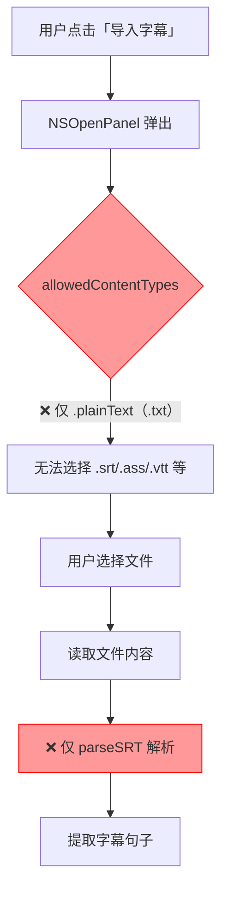
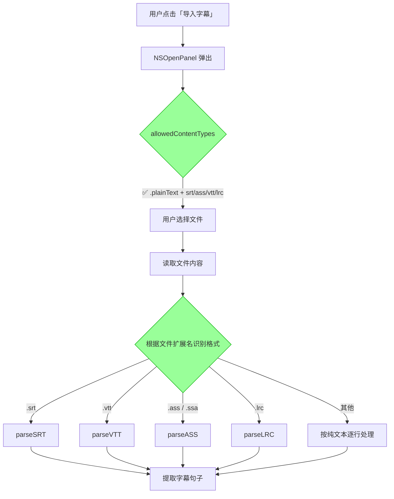
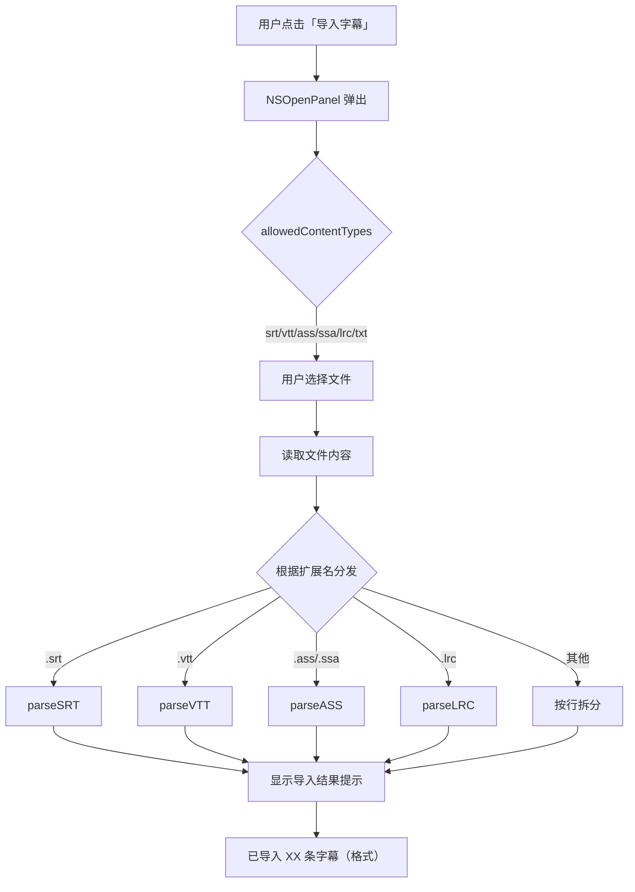

# 字幕导入支持SRT等常用格式

## 概述
语言学习功能的"导入字幕"存在两个问题：
1. **文件选择器**：`allowedContentTypes` 仅配置 `.plainText`，无法选择 `.srt`、`.ass`、`.vtt`、`.lrc` 等常用字幕格式文件
2. **解析器**：当前仅有 `parseSRT` 函数，只能解析 SRT 格式，不支持其他字幕格式

需要同时扩展文件类型支持与多格式解析能力。

## 当前实现

**问题环节**：
1. 第 79 行 `allowedContentTypes` 仅 `.plainText`，文件选择器无法显示字幕文件
2. 第 86 行固定调用 `parseSRT`，无法根据文件格式自动选择解析器

## 测试用例

1. 打开语言学习窗口，点击「导入字幕」按钮
2. 文件选择器中能看到并选择 `.srt` 文件 → 导入后确认解析正确
3. 文件选择器中能看到并选择 `.ass` 文件 → 导入后确认解析正确
4. 文件选择器中能看到并选择 `.vtt` 文件 → 导入后确认解析正确
5. 文件选择器中能看到并选择 `.lrc` 文件 → 导入后确认解析正确
6. 文件选择器中能看到并选择 `.txt` 文件 → 导入后确认解析正确
7. 选择一个 `.srt` 文件导入后点击「AI解析词汇」，确认词汇提取正常

## 方案

### 🚀 推荐方案：扩展文件类型 + 自动识别格式并分发解析

**各格式解析逻辑（提取纯文本）**：
- **SRT**：按双换行分块，跳过序号行和时间戳行，取剩余文字（当前已有）
- **VTT**：与 SRT 类似，额外跳过 `WEBVTT` 头部和 `NOTE` 注释块
- **ASS/SSA**：读取 `[Events]` 段中 `Dialogue:` 行，取最后一个逗号后的文字，并去除 `{\xxx}` 样式标签
- **LRC**：去除 `[mm:ss.xx]` 时间标签，保留纯歌词/文字

**优点**：
- 精确控制文件类型，用户体验好
- 各格式独立解析函数，逻辑清晰可维护
- 使用项目已有模式（`UTType(filenameExtension:)`）

**缺点**：
- 需新增多个解析函数，代码量略多

**代码修改位置**：
[LanguageLearningManager.swift](vscode://file/Volumes/Cache/X/Sources/Model/LanguageLearningManager.swift:1) — 第 1 行增加 `import UniformTypeIdentifiers`
[LanguageLearningManager.swift](vscode://file/Volumes/Cache/X/Sources/Model/LanguageLearningManager.swift:79) — 第 79 行修改 `allowedContentTypes`
[LanguageLearningManager.swift](vscode://file/Volumes/Cache/X/Sources/Model/LanguageLearningManager.swift:84) — 第 84-87 行修改导入逻辑，获取文件扩展名并分发到对应解析器
[LanguageLearningManager.swift](vscode://file/Volumes/Cache/X/Sources/Model/LanguageLearningManager.swift:172) — 第 172 行后新增 `parseVTT`、`parseASS`、`parseLRC` 函数，以及格式分发函数

## 任务总结与结论

修改了 `LanguageLearningManager.swift` 和 `LanguageLearningWindow.swift` 两个文件，完成以下改进：

1. 文件选择器通过 `UTType(filenameExtension:)` 注册 srt/vtt/ass/ssa/lrc 类型
2. 新增 `parseSubtitle` 分发函数，根据扩展名调用对应解析器
3. 新增 `parseVTT`、`parseASS`、`parseLRC` 三个解析函数
4. 添加 `importStatusMessage` 属性，导入后在 UI 中显示绿色/红色状态提示

## 任务耗时
- 任务开始时间：08:57
- 任务结束时间：09:18
- 任务总耗时：21 分钟
