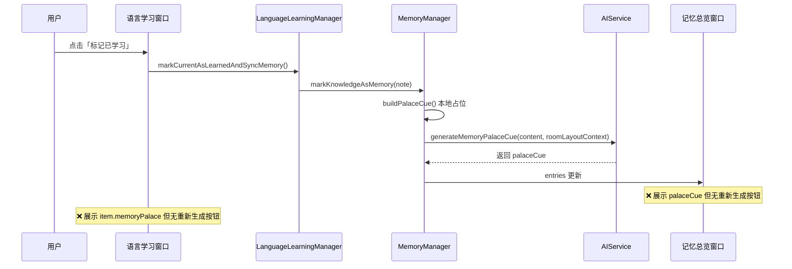
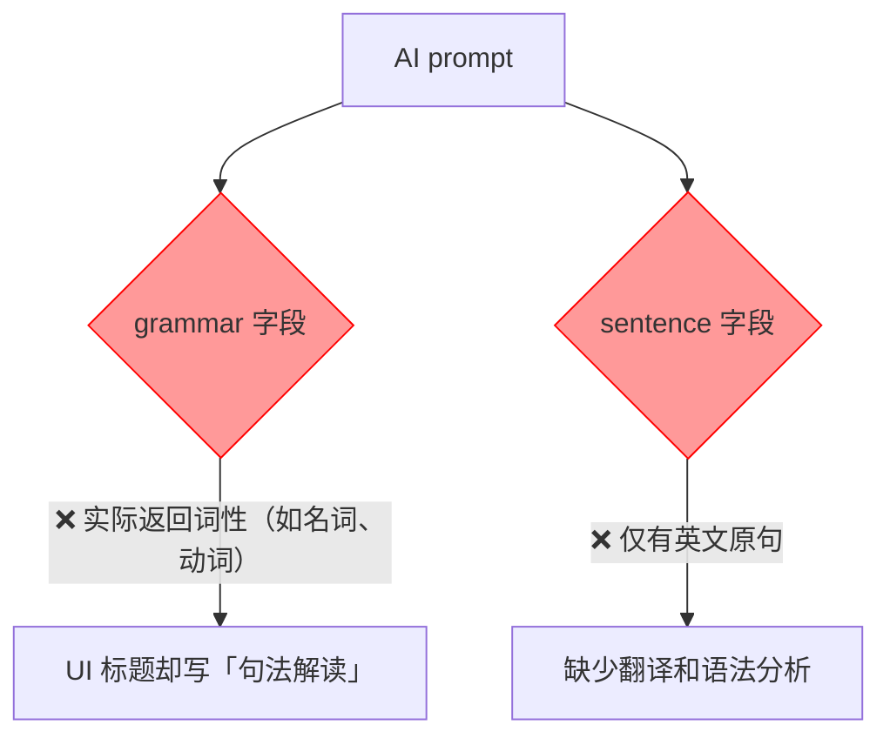
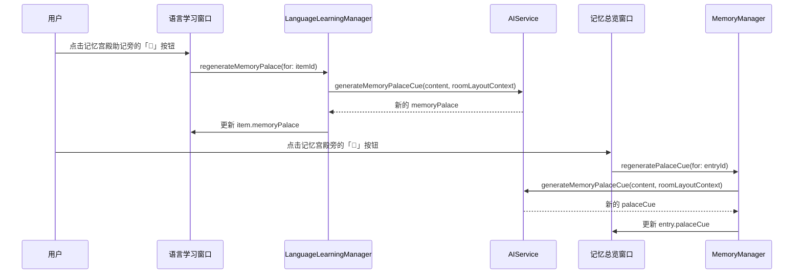
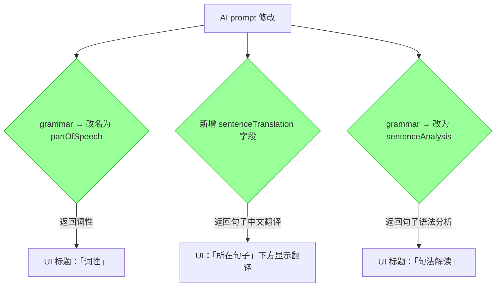
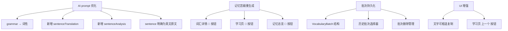

# 记忆宫殿重生成和词汇解析优化

## 概述
两个子任务：
1. **记忆宫殿助记重新生成**：用户修改偏好设置中的房间布局后，已有的记忆宫殿助记应该能够重新生成。所有展示记忆宫殿助记的地方都应有"重新生成"按钮
2. **词汇解析字段优化**：当前 `grammar` 字段实际返回的是词性而非句法解读；`sentence` 字段缺少中文翻译和句法分析

## 当前实现

### 子任务1：记忆宫殿助记

**问题**：
- 语言学习窗口词汇详情和学习页展示 `memoryPalace` 但无重新生成按钮
- 记忆总览窗口展示 `palaceCue` 但无重新生成按钮
- 用户修改房间布局后，已有助记不会自动更新

### 子任务2：词汇解析字段

## 测试用例

### 子任务1测试
1. 导入字幕并 AI 解析词汇 → 在词汇详情的「记忆宫殿助记」区域看到重新生成按钮
2. 点击重新生成按钮 → 显示加载状态 → 助记内容更新
3. 在偏好设置中修改房间布局描述 → 回到词汇详情 → 点击重新生成 → 新助记基于房间布局
4. 将词汇标记为已学习 → 在记忆总览窗口看到重新生成按钮
5. 在记忆总览窗口点击重新生成 → palaceCue 更新

### 子任务2测试
1. 导入字幕并 AI 解析词汇
2. 查看词汇详情 → 「词性」显示词的词性（如名词、动词等）
3. 「所在句子」下方显示中文翻译
4. 「句法解读」显示句子的语法结构分析（而非词性）

## 方案

### 🚀 推荐方案

#### 子任务1：添加重新生成按钮

**优点**：
- 用户可随时在需要的地方主动刷新助记
- 复用已有的 `generateMemoryPalaceCue` AI 接口
- 自动读取最新的 `palaceLayoutContext` 房间布局

**缺点**：
- 每次重新生成需调用一次 AI

**代码修改位置**：
[LanguageLearningManager.swift](vscode://file/Volumes/Cache/X/Sources/Model/LanguageLearningManager.swift:50) — 新增 `regenerateMemoryPalace(for:)` 方法
[LanguageLearningWindow.swift](vscode://file/Volumes/Cache/X/Sources/View/LanguageLearningWindow.swift:149) — 记忆宫殿助记 detailSection 旁添加重新生成按钮（词汇详情）
[LanguageLearningWindow.swift](vscode://file/Volumes/Cache/X/Sources/View/LanguageLearningWindow.swift:177) — 记忆宫殿助记 detailSection 旁添加重新生成按钮（学习页）
[MemoryManager.swift](vscode://file/Volumes/Cache/X/Sources/Model/MemoryManager.swift:80) — 新增 `regeneratePalaceCue(for:)` 方法
[MemoryOverviewWindow.swift](vscode://file/Volumes/Cache/X/Sources/View/MemoryOverviewWindow.swift:143) — 记忆宫殿展示旁添加重新生成按钮

#### 子任务2：优化词汇字段

**修改要点**：
- `LearningVocabularyItem` 新增 `sentenceTranslation` 和 `sentenceAnalysis` 字段
- 原 `grammar` 字段语义改为「词性」
- AI prompt 中增加 `sentenceTranslation`、`sentenceAnalysis` 字段要求
- `LearningWordPayload` 同步增加字段
- UI 展示顺序调整：词义 → 词根 → 词性 → 所在句子 → 句子翻译 → 句法解读 → 记忆宫殿助记

**优点**：
- 字段语义清晰准确
- 学习信息更完整

**缺点**：
- prompt 返回字段增多，可能影响 AI 响应速度

**代码修改位置**：
[LanguageLearningManager.swift](vscode://file/Volumes/Cache/X/Sources/Model/LanguageLearningManager.swift:4) — 修改 `LearningVocabularyItem` 结构体，新增字段
[AIService+Memory.swift](vscode://file/Volumes/Cache/X/Sources/Model/AIService+Memory.swift:8) — 修改 `LearningWordPayload`，新增字段
[AIService+Memory.swift](vscode://file/Volumes/Cache/X/Sources/Model/AIService+Memory.swift:24) — 修改 AI prompt
[AIService+Memory.swift](vscode://file/Volumes/Cache/X/Sources/Model/AIService+Memory.swift:30) — 修改 map 逻辑，传递新字段
[AIService+Memory.swift](vscode://file/Volumes/Cache/X/Sources/Model/AIService+Memory.swift:196) — 修改 fallbackVocabulary
[LanguageLearningManager.swift](vscode://file/Volumes/Cache/X/Sources/Model/LanguageLearningManager.swift:161) — 修改 buildKnowledgeNoteContent
[LanguageLearningWindow.swift](vscode://file/Volumes/Cache/X/Sources/View/LanguageLearningWindow.swift:145) — 修改 UI 展示字段和标题

## 任务总结与结论

完成了以下改进，修改了 6 个文件：

1. **字段优化**：grammar→词性，新增句子翻译和句法解读，AI prompt 逐字段说明
2. **记忆宫殿重生成**：三处展示位置均添加重新生成按钮，读取最新房间布局
3. **批次持久化**：解析记录以时间批次形式保存，支持切换和删除
4. **UI 增强**：所有文字支持框选复制，学习页增加上一个按钮

## 任务耗时
- 任务开始时间：09:28
- 任务结束时间：15:06
- 任务总耗时：338 分钟
