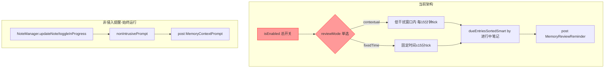
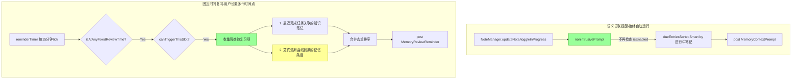
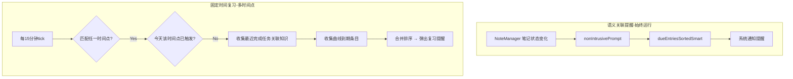

# 复习触发方式重构

## 概述
将原有的两种互斥复习触发模式（语义触发 / 固定时间）重构为两种独立并行的机制：
1. **语义关联提醒**：始终自动运行，当用户笔记状态变化时（标记进行中），自动检测与记忆知识笔记的关联度并提醒
2. **固定时间复习**：用户设定固定复习时间，到时提醒复习与最近完成任务关联度高的知识笔记

## 当前实现

**问题**：
- 语义触发和固定时间是互斥的，用户只能选一个
- `isEnabled` 总开关控制所有功能，但语义关联提醒应始终运行
- `nonIntrusivePrompt` 已有语义触发逻辑但也受 `isEnabled` 限制
- 固定时间复习目前使用进行中笔记排序，但用户期望用最近完成的任务排序

## 测试用例

1. **语义关联提醒（始终运行）**：将一个普通笔记标记为"进行中" → 系统自动检测关联的记忆知识笔记 → 弹出系统通知提醒
2. **固定时间复习**：设置固定复习时间 → 到达该时间后 → 系统根据最近完成的任务找出关联知识笔记 → 弹出复习提醒
3. **偏好设置验证**：打开偏好设置 → 记忆功能区域只显示"固定复习时间"时间选择器和房间布局描述，无模式单选

## 方案

### 🚀 推荐方案：拆分为两个独立机制

**修改要点**：
1. 删除 `ReviewMode` 枚举和 `reviewMode` 属性
2. 删除 `isEnabled` 总开关（语义提醒始终运行，固定时间复习有时间就运行）
3. `nonIntrusivePrompt` 去掉 `guard isEnabled` 检查
4. `fixedReviewTime` 从单个字符串改为字符串数组 `fixedReviewTimes: [String]`（如 ["09:00", "18:00"]）
5. `tickReminder` 重写：对比当前时间是否匹配任一固定时间点 → 收集最近完成任务关联知识笔记 + 艾宾浩斯到期条目 → 合并提醒
6. `reminderTimer` 始终启动（init 中直接启动）
7. 偏好设置 UI：去掉总开关和模式选择器，改为多时间点输入

**补充：艾宾浩斯曲线调度逻辑**
现有 `nextReviewAt` 已按曲线计算下次复习时间。固定时间触发时，将 `nextReviewAt <= 下一个固定时间点` 的所有条目纳入本次复习，实现"提前到最近复习时间点"的效果。

**优点**：
- 语义提醒始终生效，用户编辑进行中任务时自动得到关联知识提醒
- 多个固定时间点更灵活，适应不同作息
- 固定时间复习同时覆盖任务关联和曲线到期两类
- 设置更简洁

**缺点**：
- 无总开关，若用户完全不想要记忆功能需手动清除

**代码修改位置**：
[MemoryManager.swift](vscode://file/Volumes/Cache/X/Sources/Model/MemoryManager.swift:17) — 删除 ReviewMode 枚举
[MemoryManager.swift](vscode://file/Volumes/Cache/X/Sources/Model/MemoryManager.swift:34) — 删除 isEnabled，改 fixedReviewTime 为数组
[MemoryManager.swift](vscode://file/Volumes/Cache/X/Sources/Model/MemoryManager.swift:216) — nonIntrusivePrompt 去掉 guard isEnabled
[MemoryManager.swift](vscode://file/Volumes/Cache/X/Sources/Model/MemoryManager.swift:249) — tickReminder 重写
[MemoryManager.swift](vscode://file/Volumes/Cache/X/Sources/Model/MemoryManager.swift:287) — isAtFixedReviewTime 改为多时间点判断
[SettingsView.swift](vscode://file/Volumes/Cache/X/Sources/View/SettingsView.swift:202) — 删除启用开关和模式选择器，改为多时间点管理

## 任务总结与结论

完成了复习触发方式的全面重构，修改了 2 个文件：

1. **删除** ReviewMode 枚举、isEnabled 总开关 → 架构简化
2. **语义提醒始终运行** → nonIntrusivePrompt 去掉 guard isEnabled
3. **多时间点** → fixedReviewTimes 数组，每个时间点独立去重触发控制
4. **双源复习内容** → 最近7天完成任务关联 + 艾宾浩斯曲线到期
5. **持久化修复** → palaceLayoutContext 拆分为独立保存方法

## 任务耗时
- 任务开始时间：15:15
- 任务结束时间：15:41
- 任务总耗时：26 分钟
