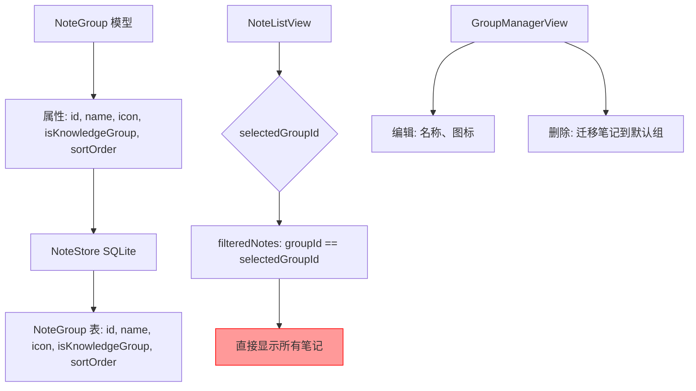
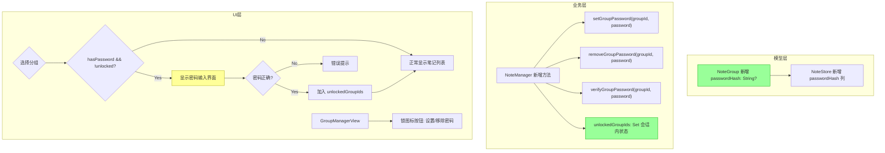

# 笔记分组加密功能

## 概述
为笔记分组添加密码保护功能。用户可对任意分组设置密码，设置密码后该分组的笔记被隐藏，只有输入正确密码后才能查看。

## 当前实现

**现状**：分组没有任何密码/加密保护，选择分组后直接显示所有笔记。

## 测试用例

1. **设置密码**：在分组管理中点击某分组的锁图标 → 弹出输入框设置密码 → 保存后分组图标显示锁标记
2. **锁定状态切换**：选择已设密码的分组 → 显示密码输入界面 → 输入正确密码 → 显示笔记; 输入错误 → 提示错误
3. **会话内记忆**：解锁后在当前应用会话内保持解锁状态，重启应用后重新锁定
4. **移除密码**：在分组管理中点击已设密码分组的锁图标 → 弹出确认框（需输入旧密码）→ 移除密码
5. **默认分组**：默认分组（闪念、智库、颜色列表）不能设置密码

## 方案

### 🚀 推荐方案：分组级密码 + 会话解锁状态

**修改要点**：
1. NoteGroup 新增 `passwordHash: String?` 属性
2. NoteStore 新增 `passwordHash` 列（ALTER TABLE 迁移）
3. NoteManager 新增密码设置/验证方法 + `unlockedGroupIds` 会话状态
4. NoteListView 的 filteredNotes 中过滤锁定分组的笔记
5. NoteListView 选择锁定分组时显示密码输入界面替代笔记列表
6. GroupManagerView 分组行添加锁图标按钮
7. 密码使用 SHA256 哈希存储（不存明文）

**优点**：
- 密码哈希存储，安全性好
- 会话内解锁，体验流畅
- 重启后自动锁定，保护隐私
- 兼容现有 Codable 和 SQLite 结构

**缺点**：
- 密码不可找回（SHA256 单向哈希）
- 仅应用层保护，不加密数据库文件本身

**代码修改位置**：
[Note.swift](vscode://file/Volumes/Cache/X/Sources/Model/Note.swift:3) — NoteGroup 新增 passwordHash 属性
[NoteStore.swift](vscode://file/Volumes/Cache/X/Sources/Model/NoteStore.swift:105) — 数据库表新增 passwordHash 列
[Note.swift](vscode://file/Volumes/Cache/X/Sources/Model/Note.swift:107) — NoteManager 新增密码管理方法
[NoteListView.swift](vscode://file/Volumes/Cache/X/Sources/View/NoteListView.swift:880) — filteredNotes 加锁定过滤
[NoteListView.swift](vscode://file/Volumes/Cache/X/Sources/View/NoteListView.swift:1110) — groupSelectorView 锁定分组标记
[NoteListView.swift](vscode://file/Volumes/Cache/X/Sources/View/NoteListView.swift:1373) — GroupRow 添加锁按钮

## 任务总结与结论
实现了笔记分组全局密码加密功能：
- 在 Settings 中新增「安全设置」区域，支持设置全局密码和安全问题
- NoteGroup 新增 `isLocked` 字段，通过数据库迁移支持
- NoteManager 新增全局密码管理（设置/验证/重置/移除）和会话解锁机制
- NoteListView 在选择锁定分组时展示密码验证界面，验证后本次会话解锁
- GroupRow 新增锁定开关按钮
- 支持通过安全问题找回/重置密码

## 任务耗时
- 任务开始时间：15:48
- 任务结束时间：16:21
- 任务总耗时：33 分钟
