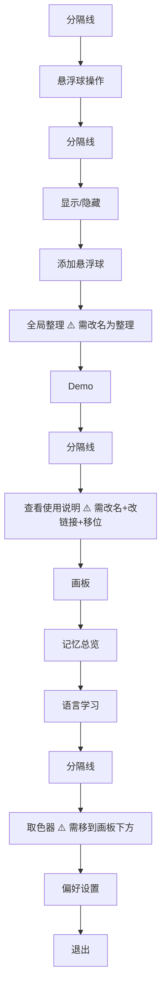
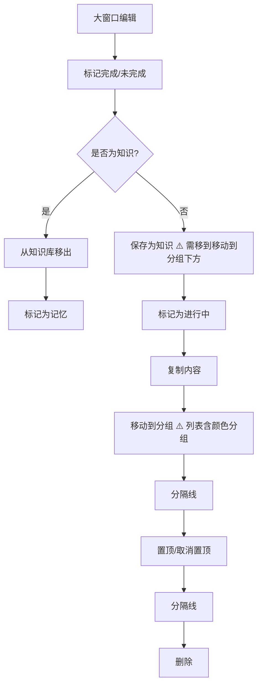
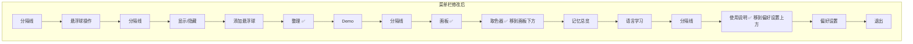
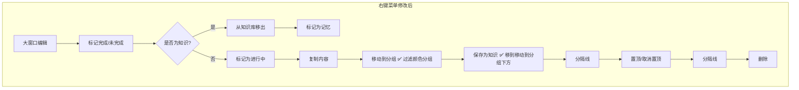
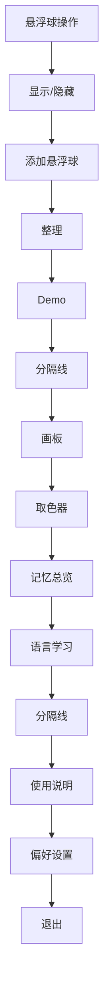

# 菜单栏和右键菜单优化

## 概述
优化菜单栏（状态栏菜单）项的名称、顺序和行为，以及笔记列表右键菜单的项序和分组列表的内容过滤。

## 当前实现

### 菜单栏当前顺序

### 右键菜单当前顺序（笔记列表项）

## 测试用例
1. **菜单栏名称验证**：点击状态栏图标，确认"整理"（非"全局整理"）、"使用说明"（非"查看使用说明"）
2. **菜单栏顺序验证**：确认顺序为 `...画板 → 取色器 → 记忆总览 → 语言学习 → 分隔线 → 使用说明 → 偏好设置 → 退出`
3. **使用说明链接验证**：点击"使用说明"，确认浏览器打开 `https://space.bilibili.com/25132187`
4. **右键菜单验证（普通笔记）**：右键笔记项，确认"移动到分组"在"保存为知识"之前，且移动到分组的列表中不含"颜色列表"
5. **右键菜单验证（知识笔记）**：右键知识库笔记项，确认"移动到分组"列表中不含"颜色列表"
6. **悬浮列表分组菜单验证**：hover 笔记时右侧出现的分组菜单，也不应包含"颜色列表"

## 方案

### 🚀推荐 方案一：直接修改菜单项属性和顺序

**优点**：
- 改动最小，只涉及 3 个文件
- 不引入新的结构或模式

**缺点**：
- 无

**修改位置**：
[Localizable.strings (中文)](vscode://file/Volumes/Cache/X/Sources/Resources/zh.lproj/Localizable.strings:41)
[Localizable.strings (英文)](vscode://file/Volumes/Cache/X/Sources/Resources/en.lproj/Localizable.strings:41)
[AppDelegate.swift - setupStatusBarMenu](vscode://file/Volumes/Cache/X/Sources/App/AppDelegate.swift:914)
[AppDelegate.swift - openUserGuide](vscode://file/Volumes/Cache/X/Sources/App/AppDelegate.swift:460)
[NoteListView.swift - contextMenu](vscode://file/Volumes/Cache/X/Sources/View/NoteListView.swift:590)
[Note.swift - getSortedGroups](vscode://file/Volumes/Cache/X/Sources/Model/Note.swift:394)

## 任务总结与结论

### 修改文件汇总
- **Localizable.strings (中/英)**：“全局整理”→“整理”，“查看使用说明”→“使用说明”
- **AppDelegate.swift**：菜单栏项重排（画板→取色器→记忆总览→语言学习→分隔线→使用说明→偏好设置），使用说明链接改为 bilibili 主页
- **Note.swift**：`getSortedGroups` 过滤颜色分组（`colorGroupId`）
- **NoteListView.swift**：右键菜单“保存为知识”移到“移动到分组”下方
- **manage_app.sh**：修复资源包复制逻辑，先删除旧 bundle 再复制新 bundle，避免嵌套导致字符串不生效

### 修改后菜单栏顺序

## 任务耗时
- 任务开始时间：16:53
- 任务结束时间：17:06
- 任务总耗时：13 分钟
