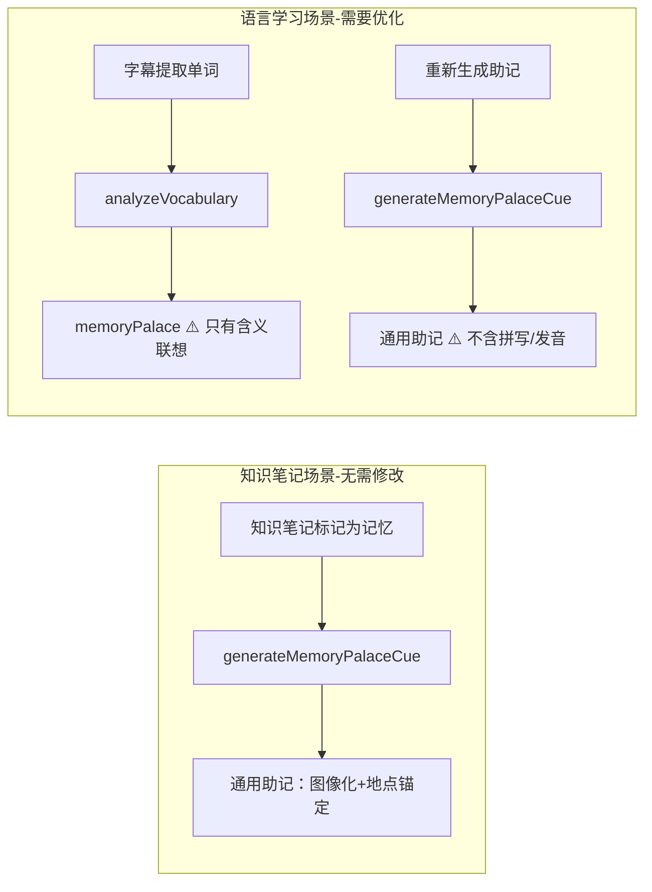
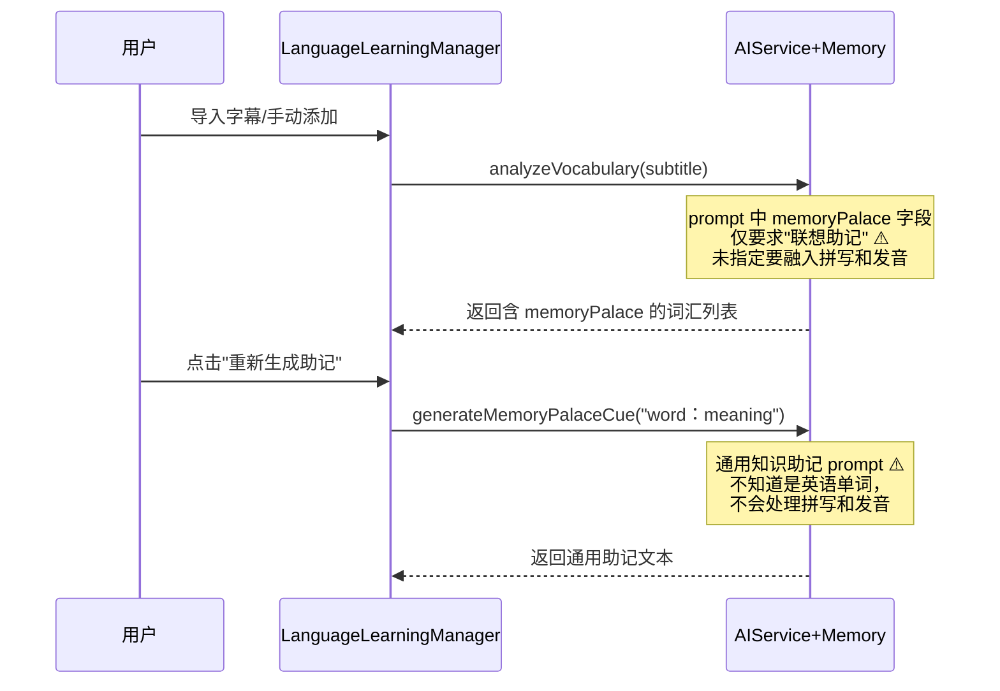
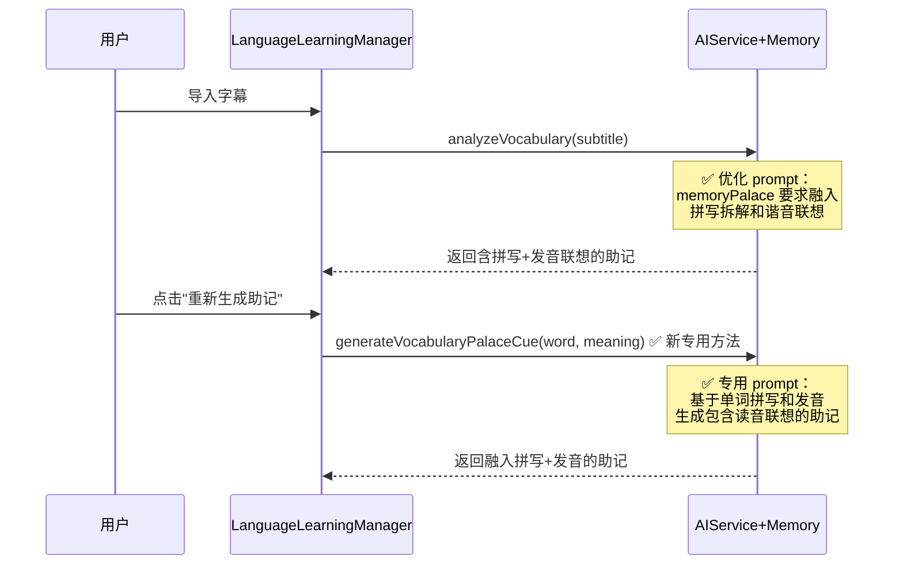
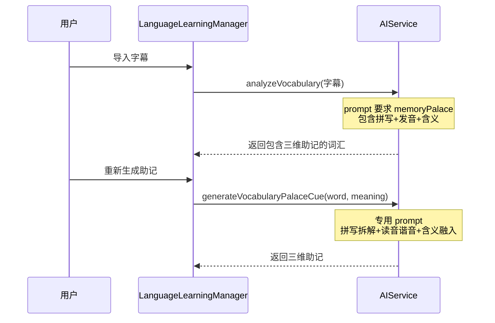

# 记忆宫殿助记优化-融入英文拼写和发音

## 概述
记忆宫殿助记在两个场景下使用：
1. **知识笔记场景**：对被标记为「记忆」的知识笔记生成助记，使用通用 `generateMemoryPalaceCue` 方法，**当前方式没有问题**，无需修改
2. **语言学习场景**：对从字幕中提取的英文单词生成助记，当前只帮助记住中文含义，**缺少英文拼写和发音联想**，需要优化

本次只修改语言学习场景下的助记生成逻辑，不影响知识笔记场景。

## 当前实现

### 两个场景的区别

### 助记生成流程（语言学习场景）

### 问题定位
1. **analyzeVocabulary prompt**（批量生成）：`memoryPalace: 记忆宫殿联想助记` — 描述过于笼统，AI 默认只生成中文含义的联想画面
2. **regenerateMemoryPalace**（单词重新生成）：直接调用通用的 `generateMemoryPalaceCue`，传入 `word + "：" + meaning`，该函数是为知识笔记设计的，不了解英语单词的拼写/发音维度

## 测试用例
1. **批量导入字幕**：导入含英文单词的字幕，检查生成的记忆宫殿助记是否包含对拼写字母/发音的联想描述
2. **重新生成助记**：点击某个单词的"重新生成助记"按钮，检查新生成的助记是否融入了拼写和发音元素
3. **助记质量**：助记应该让用户能从画面中回忆出：(a) 单词怎么拼 (b) 单词怎么读 (c) 单词什么意思

## 方案

### 🚀推荐 方案一：优化两处 prompt，增加拼写和发音联想要求

**优点**：
- 同时优化批量生成和重新生成两条路径
- 新增专用方法，不影响通用知识助记
- 对现有数据向后兼容

**缺点**：
- 无

**修改位置**：
[AIService+Memory.swift - analyzeVocabulary prompt](vscode://file/Volumes/Cache/X/Sources/Model/AIService+Memory.swift:28)
[AIService+Memory.swift - 新增 generateVocabularyPalaceCue 方法](vscode://file/Volumes/Cache/X/Sources/Model/AIService+Memory.swift:52)
[LanguageLearningManager.swift - regenerateMemoryPalace](vscode://file/Volumes/Cache/X/Sources/Model/LanguageLearningManager.swift:149)

## 任务总结与结论

### 修改文件汇总
- **AIService+Memory.swift**：
  - `analyzeVocabulary` prompt 中 `memoryPalace` 字段要求从简单的“联想助记”优化为必须包含拼写拆解、发音谐音、含义融入三个维度
  - 新增 `generateVocabularyPalaceCue(word:meaning:roomLayoutContext:)` 专用方法，用于语言学习场景的助记重新生成
  - 保持 `generateMemoryPalaceCue` 不变，知识笔记场景不受影响
- **LanguageLearningManager.swift**：`regenerateMemoryPalace` 改为调用新的 `generateVocabularyPalaceCue`

### 助记生成流程（修改后）

## 任务耗时
- 任务开始时间：17:10
- 任务结束时间：17:20
- 任务总耗时：10 分钟
