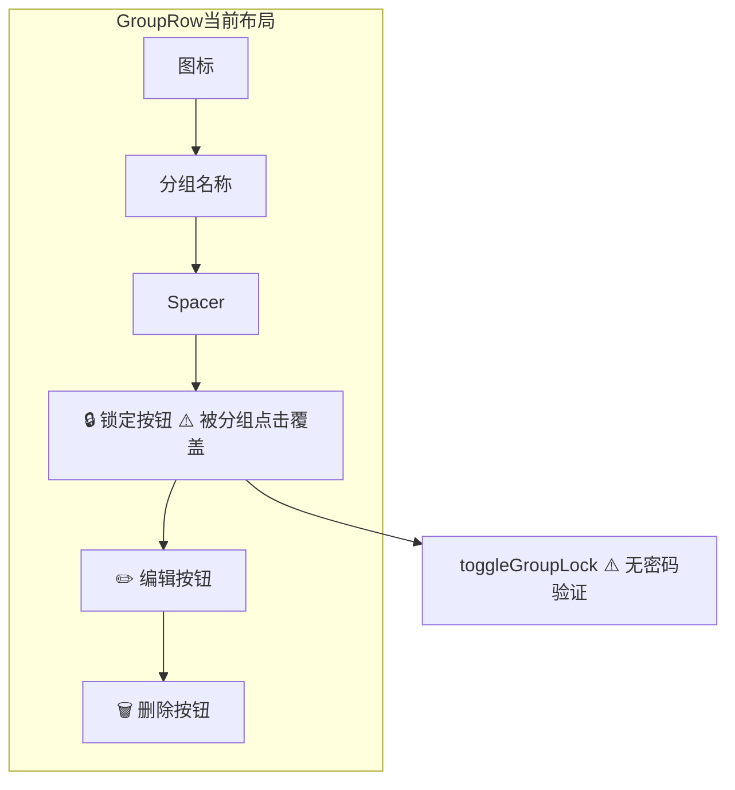
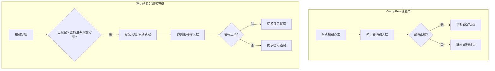
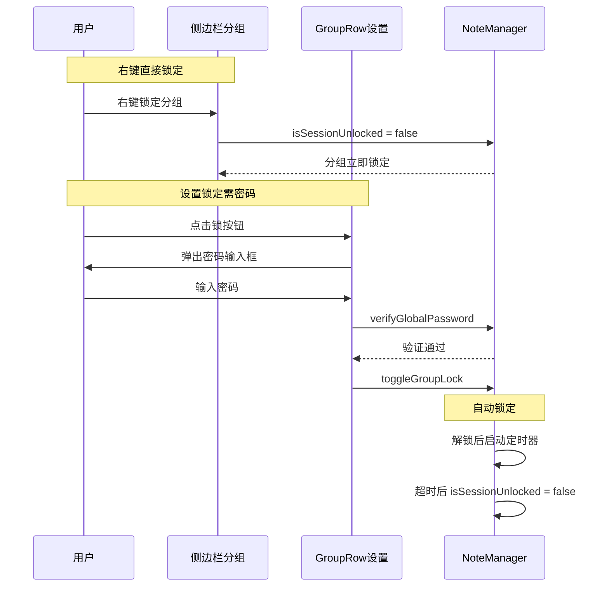

# 分组锁定交互优化

## 概述
分组锁定功能需要两处优化：
1. **GroupRow 设置**中的锁按钮切换锁定/解锁时，需要验证全局密码
2. **笔记列表中的分组项**，右键菜单增加"锁定"/"取消锁定"选项（也需要验证密码），解决锁按钮被分组选择覆盖的问题
3. 分组项上的锁图标保留，锁定时红色🔒，解锁时绿色🔓

## 当前实现

### 问题
1. **锁按钮切换无密码验证**：`toggleGroupLock` 直接切换 `isLocked`，无密码验证流程
2. **笔记列表分组项锁操作不便**：锁按钮被分组点击覆盖，需要右键菜单提供快捷锁定/解锁入口

## 测试用例
1. **右键锁定分组**：右键点击某个非预设分组，菜单中出现"锁定分组"选项，点击后弹出密码输入框，输入正确密码后分组锁定
2. **右键解锁分组**：右键点击已锁定分组，菜单中出现"取消锁定"选项，点击后弹出密码输入框，输入正确密码后分组解锁
3. **密码错误**：输入错误密码，提示错误，分组状态不变
4. **未设置全局密码**：右键菜单中锁定选项不显示或禁用
5. **锁定按钮移除**：确认 GroupRow 中不再有锁图标按钮

## 方案

### 🚀推荐 方案一：两处都增加密码验证弹窗

**优点**：
- 解决点击覆盖问题
- 增加安全性
- 锁定状态用图标在分组名旁静态展示

**缺点**：
- 无

**修改位置**：
[NoteListView.swift - 侧边栏分组胶囊按钮处添加 contextMenu](vscode://file/Volumes/Cache/X/Sources/View/NoteListView.swift:1134)
[NoteListView.swift - GroupRow 锁按钮添加密码验证](vscode://file/Volumes/Cache/X/Sources/View/NoteListView.swift:1476)

## 任务总结与结论

### 修改文件汇总
- **Note.swift**：NoteManager 新增自动锁定定时器（`autoLockTimer`）、配置存取（`autoLockMinutes`）、`isSessionUnlocked` 的 `didSet` 触发定时器
- **NoteListView.swift**：
  - 侧边栏分组按钮添加 `GroupRightClickOverlay`（NSViewRepresentable），右键直接锁定
  - `GroupRow` 锁按钮改为弹出密码验证 sheet
  - 密码输入界面改白色背景 + 黑色文字
- **SettingsView.swift**：`GlobalPasswordSettingsView` 新增自动锁定时间 Picker

### 锁定交互流程（修改后）

## 任务耗时
- 任务开始时间：20:28
- 任务结束时间：21:13
- 任务总耗时：45 分钟
