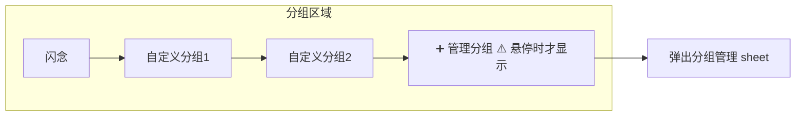
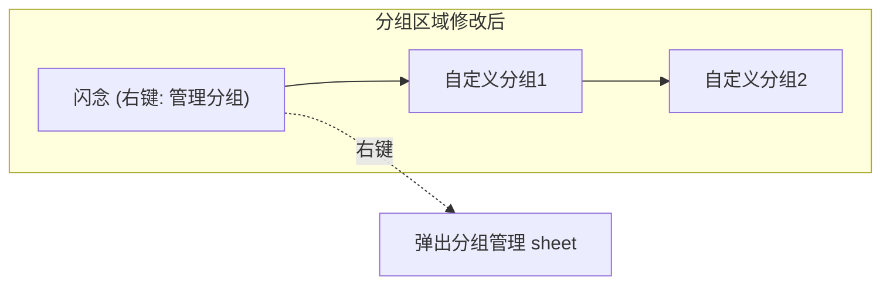

# 分组管理入口改为右键内置分组

## 概述
当前分组管理按钮是悬停在分组区域时才在末尾显示的加号图标。改为在内置分组（"闪念"或"智库"）上右键显示"管理分组"菜单项。移除原有的悬停加号按钮。

## 当前实现

### 涉及组件
- `groupSelectorView`：分组选择器，末尾 `showPlusButton` 控制加号按钮可见性
- `isGroupHovered`：分组区域悬停状态
- `isShowingGroupManager`：分组管理弹窗控制

## 测试用例
1. **右键内置分组**：右键点击"闪念"（笔记模式）或"智库"（知识模式），弹出菜单包含"管理分组"
2. **点击管理分组**：弹出分组管理 sheet
3. **左键内置分组**：正常选择分组，不受影响
4. **加号按钮消失**：悬停分组区域时不再显示加号图标

## 方案

### 🚀推荐 方案一：内置分组 contextMenu + 移除加号按钮

**优点**：
- 交互更简洁，不需要悬停才能看到入口
- 利用已有的右键交互模式（与锁定一致）

**缺点**：
- 无

**修改位置**：
[NoteListView.swift - groupSelectorView 分组按钮处添加 contextMenu](vscode://file/Volumes/Cache/X/Sources/View/NoteListView.swift:1134)
[NoteListView.swift - showPlusButton 和加号按钮移除](vscode://file/Volumes/Cache/X/Sources/View/NoteListView.swift:1122)

## 任务总结与结论

移除了悬停显示的加号按钮及 `isGroupHovered` 状态，在内置分组（闪念/智库）上添加了 `contextMenu` 右键菜单提供“管理分组”入口。简化了布局计算逻辑，交互更简洁。

## 任务耗时
- 任务开始时间：21:19
- 任务结束时间：21:30
- 任务总耗时：11 分钟
