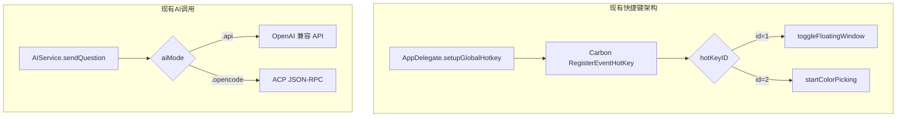
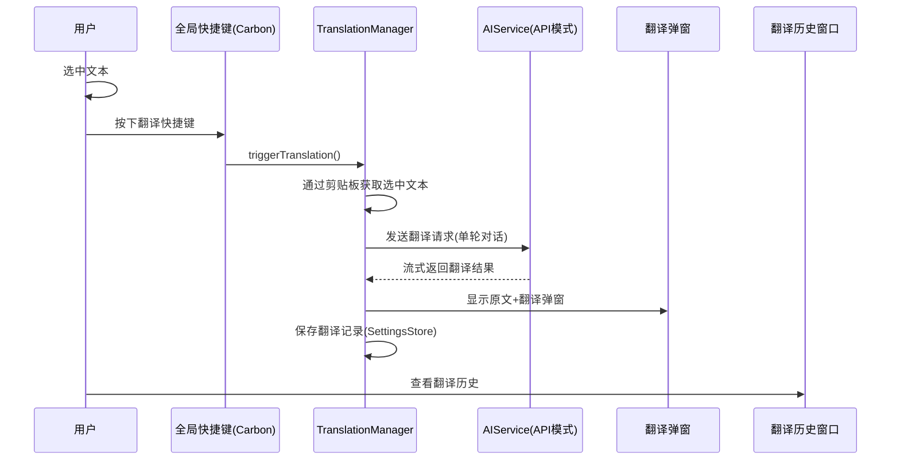
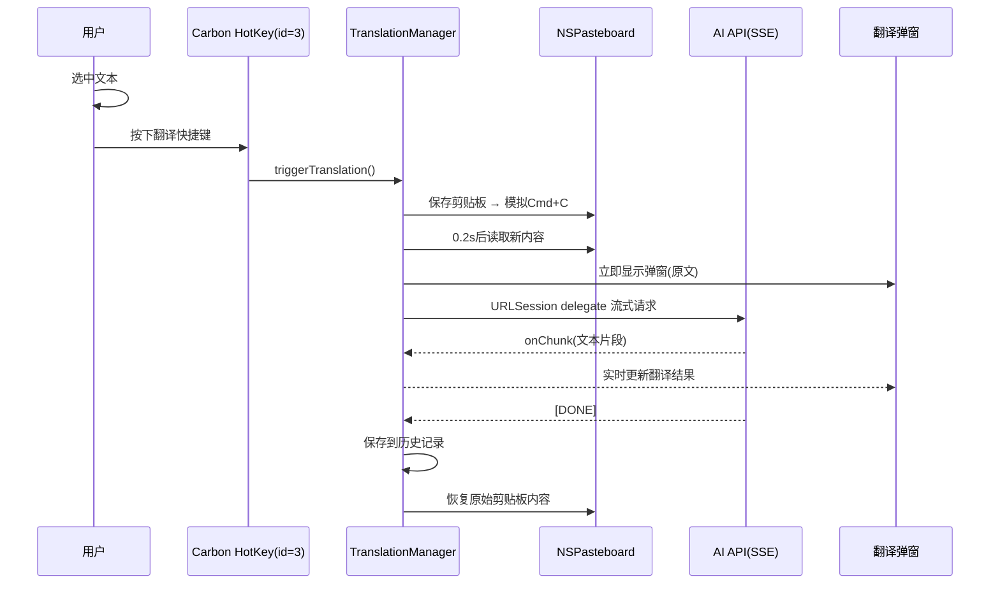

# 翻译功能开发 + Demo 改为默认

## 概述
1. 将菜单栏菜单项 "Demo" 改为 "默认"
2. 开发翻译功能：用户在偏好设置中设置快捷键，选中文本后按下快捷键，通过 AI 翻译，弹窗显示原文和翻译结果，并记录翻译历史

## 当前实现

## 测试用例
1. 菜单栏点击打开菜单，确认"Demo"已变为"默认"
2. 在偏好设置中设置翻译快捷键（如 Cmd+Shift+T）
3. 在任意应用中选中一段英文，按下快捷键
4. 弹出翻译弹窗，显示原文和中文翻译
5. 翻译记录出现在"翻译历史"窗口中
6. 菜单栏中出现"翻译历史"菜单项

## 方案

### 🚀推荐 方案一：复用 AIService + 新增翻译管理器

**优点**：
- 复用现有 AI 调用架构和配置
- 使用 Carbon 热键模式，与现有快捷键一致
- 翻译记录持久化存储

**缺点**：
- 无

**新增文件**：
- `Sources/Model/TranslationManager.swift` — 翻译管理器（获取选中文本、调AI、管理历史）
- `Sources/View/TranslationPopupWindow.swift` — 翻译结果弹窗
- `Sources/View/TranslationHistoryWindow.swift` — 翻译历史窗口

**修改文件**：
[AppDelegate.swift - "Demo" 改为 "默认"](vscode://file/Volumes/Cache/X/Sources/App/AppDelegate.swift:998)
[AppDelegate.swift - setupGlobalHotkey 添加翻译热键注册](vscode://file/Volumes/Cache/X/Sources/App/AppDelegate.swift:258)
[AppDelegate.swift - 添加翻译窗口声明和 toggle 方法](vscode://file/Volumes/Cache/X/Sources/App/AppDelegate.swift:14)
[FloatingButtonConfig.swift - 添加 translationHotkey 配置字段](vscode://file/Volumes/Cache/X/Sources/Model/FloatingButtonConfig.swift:32)
[SettingsView.swift - 添加翻译快捷键设置 UI](vscode://file/Volumes/Cache/X/Sources/View/SettingsView.swift:1775)
[Package.swift - sources 列表添加新文件](vscode://file/Volumes/Cache/X/Package.swift:99)

## 任务总结与结论

已完成所有功能开发和调试：

1. **菜单栏"Demo" → "默认"**：使用国际化字段 `menu.officialInit`（中文"默认"、英文"Default"），同步修改 `menu.floatingButtonActions` 为"悬浮球"
2. **翻译功能完整实现**：
   - `TranslationManager`：模拟 Cmd+C → 读剪贴板 → SSE 流式 AI 翻译
   - `TranslationPopupWindow`：无标题栏浮动窗口，毛玻璃背景，原文可编辑并重新翻译
   - `TranslationHistoryWindow`：翻译历史管理（搜索、删除、复制、清空）
   - Carbon 热键注册（id=3），设置界面支持配置
   - 菜单栏新增"翻译历史"菜单项

## 任务耗时
- 任务开始时间：08:29
- 任务结束时间：09:54
- 任务总耗时：85 分钟
