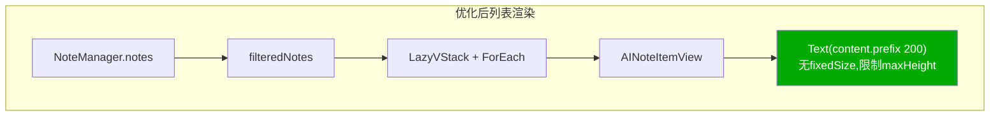
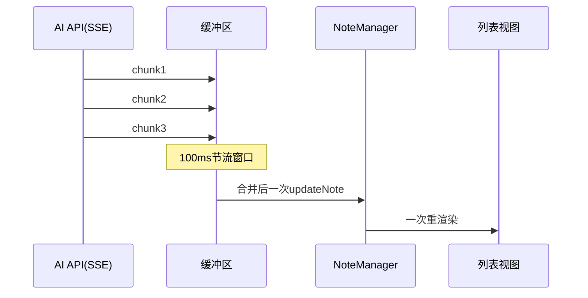
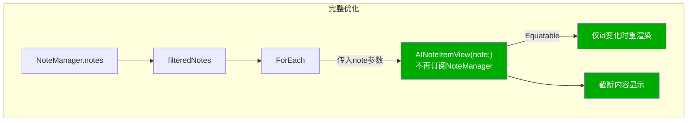
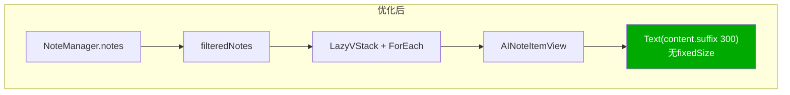

# AI列表卡顿优化

## 概述
AI笔记列表打开时有明显卡顿，需要排查原因并优化渲染性能。

## 当前实现

```mermaid
graph TD
    subgraph 数据加载
    A[NoteStore.getAllNotes] -->|全量SQL查询含content| B[NoteManager.notes]
    end

    subgraph 列表渲染
    B -->|@Published变更| C[NoteListView.filteredNotes<br/>计算属性,每次重算]
    C --> D[LazyVStack + ForEach]
    D --> E[AINoteItemView]
    E -->|每个item订阅NoteManager| F[currentNote<br/>O_n线性查找]
    F --> G["Text(完整content)<br/>+ .fixedSize强制布局"]
    end

    subgraph AI流式输出
    H["onChunk回调<br/>每秒数十次"] -->|updateNote| B
    B -.->|触发全列表重渲染| C
    end

    style G fill:#f55,color:#fff
    style H fill:#f55,color:#fff
    style F fill:#f90,color:#fff
```

## 测试用例
1. 打开AI笔记列表，确认无明显卡顿
2. 发起AI对话，流式输出时列表滚动流畅
3. 有大量AI笔记（50+）时列表操作依然流畅
4. 搜索功能正常工作

## 方案

### 🚀推荐 方案一：列表项内容截断 + 去除 fixedSize

最小改动、最大效果。



**优点**：
- 改动最小，只修改 AINoteItemView 的渲染代码
- 效果显著：避免 SwiftUI 计算数千字文本的自然高度
- 风险最低

**缺点**：
- 未解决流式输出时高频重渲染问题

**代码修改位置**：
[NoteListView.swift - conversationContentView 截断内容](vscode://file/Volumes/Cache/X/Sources/View/NoteListView.swift:329)

### 方案二：截断内容 + 节流流式更新

在方案一基础上，增加 AI 流式输出的节流，减少重渲染频率。



**优点**：
- 流式输出时重渲染从每秒数十次降低到约10次
- 配合方案一效果更佳

**缺点**：
- 需要修改 AINoteItemView 和 NoteListView 的 sendMessage 逻辑

**代码修改位置**：
[NoteListView.swift - conversationContentView 截断内容](vscode://file/Volumes/Cache/X/Sources/View/NoteListView.swift:329)
[NoteListView.swift - sendMessage onChunk 回调添加节流](vscode://file/Volumes/Cache/X/Sources/View/NoteListView.swift:461)

### 方案三：完整重构（截断 + 节流 + 数据传入 + Equatable）



**优点**：
- 最彻底的优化
- 未变化的 item 完全跳过重渲染

**缺点**：
- 改动大，需要重构 AINoteItemView 的数据流
- 影响面广，可能引入 Bug

**代码修改位置**：
[NoteListView.swift - AINoteItemView 重构数据流](vscode://file/Volumes/Cache/X/Sources/View/NoteListView.swift:202)
[NoteListView.swift - ForEach 传入 note](vscode://file/Volumes/Cache/X/Sources/View/NoteListView.swift:1197)
[NoteListView.swift - sendMessage 节流](vscode://file/Volumes/Cache/X/Sources/View/NoteListView.swift:461)
[NoteListView.swift - conversationContentView 截断](vscode://file/Volumes/Cache/X/Sources/View/NoteListView.swift:329)

## 任务总结与结论

使用推荐方案一完成优化，修改了两个关键点：

1. **去除 `.fixedSize(horizontal: false, vertical: true)`**：不再强制 SwiftUI 计算完整文本的自然高度
2. **内容截断为最后 300 字符**：`currentNote.content.suffix(300)`，完整内容通过双击在大窗口查看

附带修改：将悬停提示文案从"双击试试！"改为"双击查看全部"，更准确地引导用户操作。



## 任务耗时
- 任务开始时间：10:03
- 任务结束时间：10:21
- 任务总耗时：18 分钟
