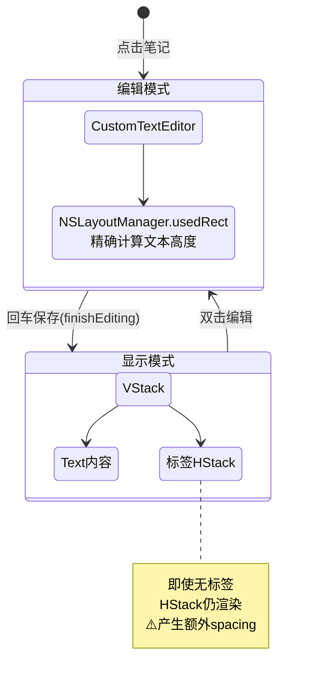
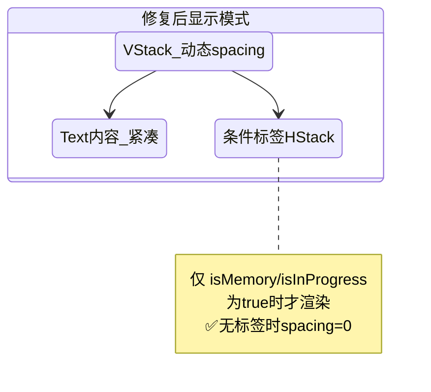

# 普通笔记保存后高度异常

## 概述
普通笔记在输入时高度和文字居中正确，但回车保存后高度变高、文字偏上。

## 当前实现

## 测试用例
1. 输入一行文字后回车保存，高度应与输入时一致
2. 输入多行文字后回车保存，高度不应明显增大
3. 有"记忆"或"进行中"标签的笔记，标签下方正常显示
4. 无标签的笔记，高度紧凑无多余空白

## 方案

### 🚀推荐 方案：消除空 HStack 和多余 spacing

**优点**：
- 精确解决高度差异根因
- 无标签时完全消除多余空间

**缺点**：
- 无

**代码修改位置**：
[NoteListView.swift - VStack spacing 动态化 + 条件渲染 HStack](vscode://file/Volumes/Cache/X/Sources/View/NoteListView.swift:551)

## 任务总结与结论

修复了两处代码：
1. `VStack(spacing:)` 动态化：`note.isMemory || note.isInProgress ? 6 : 0`
2. 标签 HStack 用 `if` 条件包裹，无标签时不渲染

## 任务耗时
- 任务开始时间：10:27
- 任务结束时间：10:36
- 任务总耗时：9 分钟
