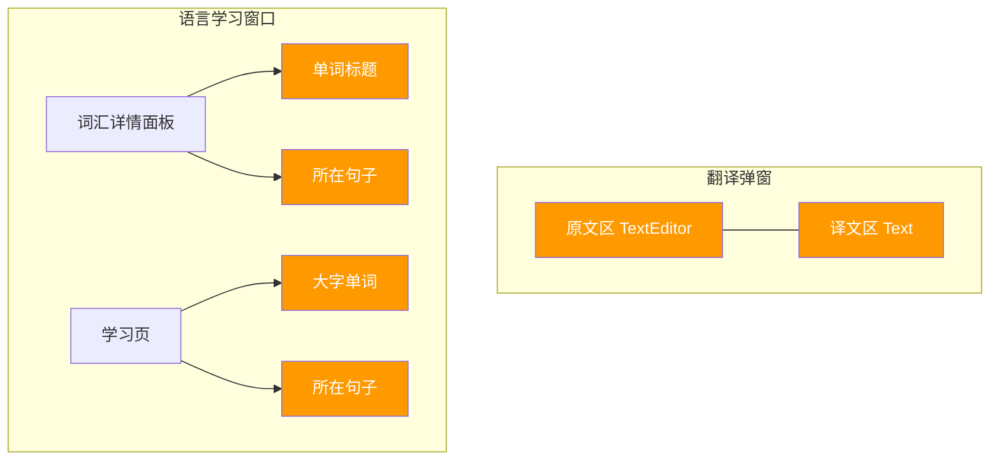
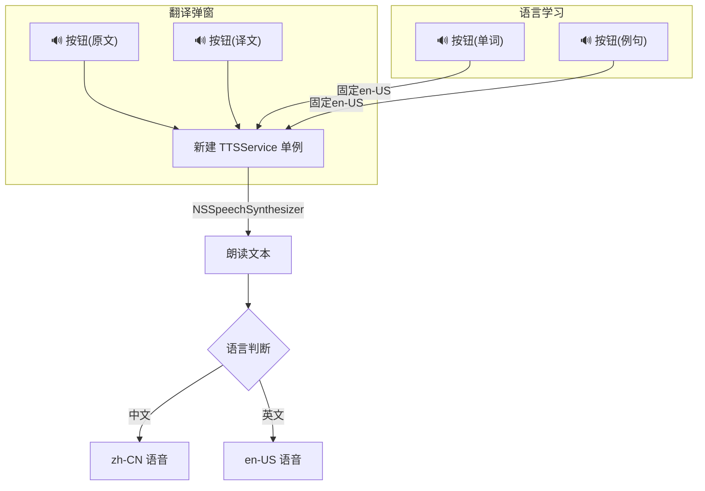
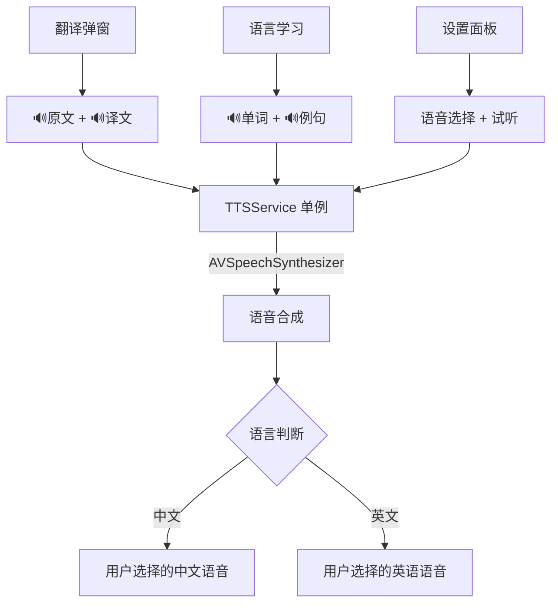

# macOS TTS 语音播放功能

## 概述
利用 macOS 内置 TTS 能力，为翻译弹窗的原文/译文、语言学习的单词/例句添加语音朗读功能。

## 当前实现

标橙色的位置均需添加 🔊 语音播放按钮。项目中目前无任何 TTS 代码。

## 测试用例
1. 翻译弹窗：点击原文旁的 🔊 按钮，朗读原文（自动识别语言）
2. 翻译弹窗：点击译文旁的 🔊 按钮，朗读译文
3. 语言学习词汇详情：点击单词旁的 🔊 按钮，英语朗读单词
4. 语言学习词汇详情：点击例句旁的 🔊 按钮，英语朗读例句
5. 语言学习学习页：同上功能
6. 播放中再次点击，停止播放
7. 播放自然结束后按钮状态恢复

## 方案

### 🚀推荐 方案一：NSSpeechSynthesizer 轻量实现

**优点**：
- API 简单（`NSSpeechSynthesizer`），macOS 10.0 起即支持
- 同步 API，无需 async/await
- 自动利用系统已下载的语音包

**缺点**：
- 语音质量依赖系统已下载的语音

**新增文件**：
[Sources/Utility/TTSService.swift — TTS 服务单例](vscode://file/Volumes/Cache/X/Sources/Utility:1)

**修改文件**：
[TranslationWindows.swift - 原文区和译文区添加播放按钮](vscode://file/Volumes/Cache/X/Sources/View/TranslationWindows.swift:78)
[LanguageLearningWindow.swift - 词汇详情和学习页添加播放按钮](vscode://file/Volumes/Cache/X/Sources/View/LanguageLearningWindow.swift:181)
[Package.swift - sources 列表添加 TTSService.swift](vscode://file/Volumes/Cache/X/Package.swift:99)

### 方案二：AVSpeechSynthesizer 现代实现

与方案一相同架构，但使用 `AVSpeechSynthesizer`。

**优点**：
- 更现代的 API，更多语音选项
- 支持语速/音调等细粒度控制

**缺点**：
- 需要引入 AVFoundation 框架
- API 稍复杂（delegate 模式）
- macOS 上 AVSpeechSynthesizer 某些语音可能不如 NSSpeechSynthesizer 稳定

## 任务总结与结论

使用 `AVSpeechSynthesizer` 实现了 macOS TTS 功能：

**关键修复**：每个 `TTSSpeakButton` 使用 `@State` 的唯一 buttonId，通过 `TTSService.currentSpeakingId` 独立追踪播放状态。

**涉及文件**：
- 新增 `TTSService.swift`（AVSpeechSynthesizer + TTSSpeakButton 组件）
- 修改 `TranslationWindows.swift`（原文/译文旁加 🔊）
- 修改 `LanguageLearningWindow.swift`（单词/例句旁加 🔊，新增 detailSectionWithTTS）
- 修改 `FloatingButtonConfig.swift`（ttsEnglishVoice/ttsChineseVoice 字段）
- 修改 `SettingsView.swift`（TTSVoiceSettingsSection 设置界面）
- 修改 `Package.swift`（sources 列表）

## 任务耗时
- 任务开始时间：10:54
- 任务结束时间：11:37
- 任务总耗时：43 分钟
