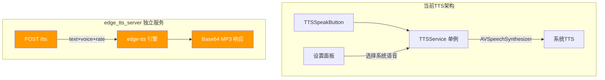
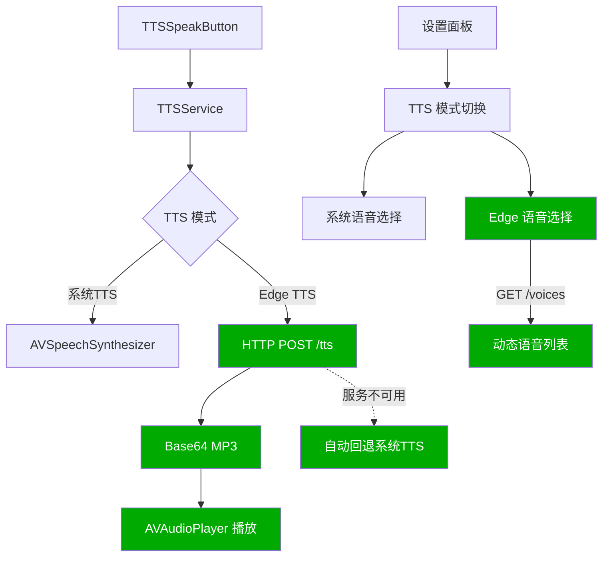
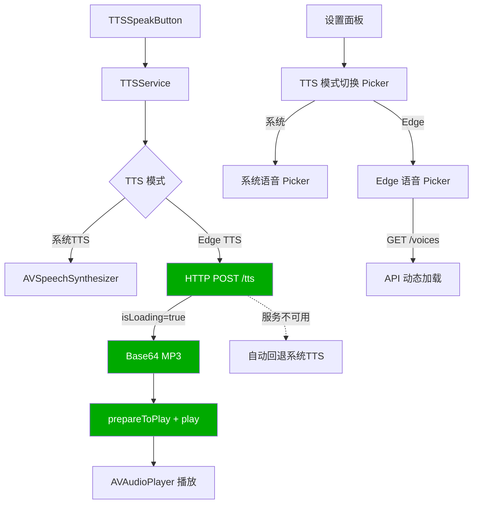

# Edge TTS 集成

## 概述
将 chrome-extension 项目中的 edge_tts_server（端口 9881，FastAPI + edge-tts）集成到 X 项目的 TTS 系统中，作为系统 AVSpeechSynthesizer 之外的高质量语音选项。

## 当前实现

edge_tts_server 运行在 `http://127.0.0.1:9881`，接口：
- `POST /tts`：JSON body `{text, voice, rate, volume, pitch}` → 返回 `{success, audioBase64}`
- `GET /voices?language=zh`：获取可用语音列表
- `GET /health`：健康检查

## 测试用例
1. 设置中选择"Edge TTS"模式，选择中文语音（如晓晓）
2. 翻译弹窗点击 🔊 按钮，使用 Edge TTS 朗读（音质应显著优于系统 TTS）
3. Edge TTS 服务未启动时，自动回退到系统 TTS
4. 语言学习页点击 🔊 使用 Edge TTS 播放英语单词/例句
5. 设置中可试听选中的语音

## 方案

### 🚀推荐 方案一：TTSService 内集成双引擎

**优点**：
- 对外接口不变（TTSSpeakButton 无需修改）
- 自动回退保证可用性
- Edge TTS 音质远优于系统 TTS

**缺点**：
- 依赖本地 edge_tts_server 服务运行
- 网络请求有延迟（约 200-500ms）

**修改文件**：
[TTSService.swift - 添加 Edge TTS 引擎和 AVAudioPlayer 播放](vscode://file/Volumes/Cache/X/Sources/Utility/TTSService.swift:1)
[FloatingButtonConfig.swift - 添加 ttsMode/edgeVoice 配置字段](vscode://file/Volumes/Cache/X/Sources/Model/FloatingButtonConfig.swift:33)
[SettingsView.swift - TTSVoiceSettingsSection 改为双模式切换](vscode://file/Volumes/Cache/X/Sources/View/SettingsView.swift:2262)

### 方案二：独立 EdgeTTSService 类

新建独立的 EdgeTTSService 类，TTSService 中通过策略模式切换。

**优点**：
- 代码分离清晰

**缺点**：
- 多一个文件，Package.swift 多一项
- 两个 Service 共享 isSpeaking 状态需额外协调

## 任务总结与结论

采用方案一（TTSService 内集成双引擎），成功实现：

**完成的改动**：
1. **FloatingButtonConfig**：新增 `ttsMode`(system/edge)、`edgeTtsEnglishVoice`、`edgeTtsChineseVoice` 字段
2. **TTSService**：双引擎支持、Edge TTS HTTP 请求 + AVAudioPlayer 播放、自动回退、加载状态（isLoading）、prepareToPlay 避免首次播放不完整
3. **SettingsView**：TTSVoiceSettingsSection 改为条件渲染，支持系统/Edge 模式切换和各自语音选择
4. **TTSSpeakButton**：加载状态显示 ProgressView 旋转动画

**解决的额外问题**：
- 首次播放只播放后半段 → 添加 `prepareToPlay()` + `isLoading` 状态
- API 字段大小写不匹配 → `EdgeVoiceInfo` 字段改为小写

## 任务耗时
- 任务开始时间：11:45
- 任务结束时间：12:14
- 任务总耗时：29 分钟
