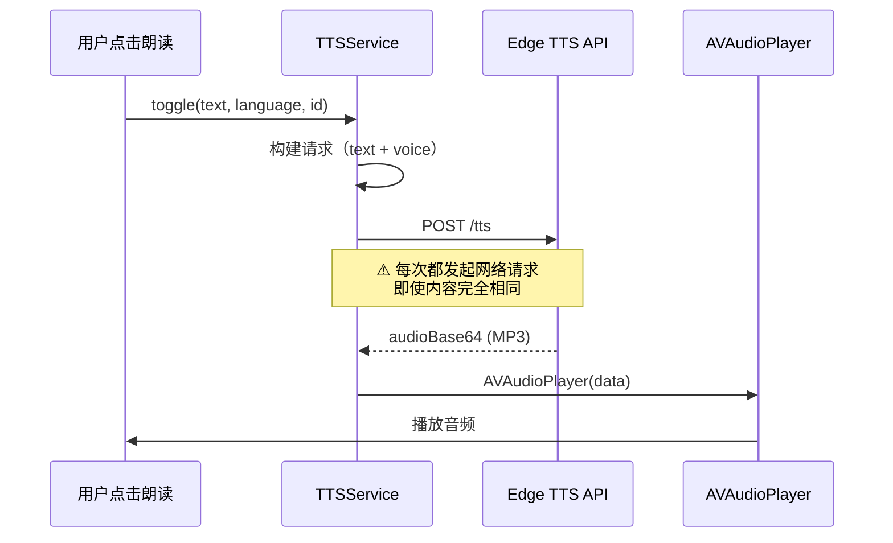
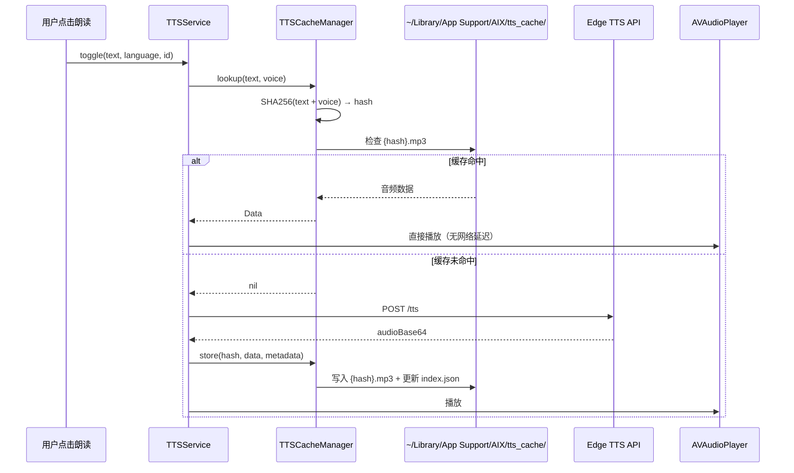
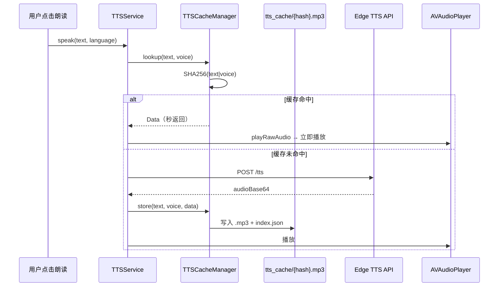

# Edge TTS 语音缓存及管理

## 概述
为 Edge TTS 合成的语音添加持久化磁盘缓存。当相同文本+语音组合再次请求时直接使用缓存音频，避免重复网络请求。同时在设置中提供缓存管理界面，用户可查看缓存列表、删除指定条目或清空全部缓存。

## 当前实现

## 测试用例

1. **缓存命中验证**
   - 在翻译窗口或语言学习窗口，对同一段文字连续点击两次朗读
   - 第二次应立即播放（无加载指示器），控制台输出 `[TTSService] 缓存命中`

2. **缓存未命中验证**
   - 朗读一段新文字，应正常请求 API 并播放
   - 控制台输出 `[TTSService] 缓存未命中，请求 API`

3. **缓存管理界面**
   - 设置 → TTS 语音设置 → 管理缓存，弹出缓存列表窗口
   - 列表显示每条缓存的文本摘要、语音名称、文件大小、创建时间
   - 可删除单条 / 清空所有

4. **持久化验证**
   - 朗读一段文字后退出应用
   - 重新打开应用，朗读同一段文字，应直接命中缓存

## 方案

### 🚀推荐方案一：基于内容哈希的文件缓存

**缓存结构：**
- 音频文件：`~/Library/Application Support/AIX/tts_cache/{sha256}.mp3`
- 索引文件：`~/Library/Application Support/AIX/tts_cache/index.json`
  - 记录每条缓存的 text 摘要、voice、文件大小、创建时间

**优点：**
- 内容寻址，天然去重
- 文件级操作，简单可靠
- 索引 JSON 方便管理界面读取
- 与项目中剪贴板缓存（ClipboardItem）使用相同的 Application Support 目录模式

**缺点：**
- 无自动过期机制（可后续添加 LRU）

**修改位置：**
- 新建文件 `Sources/Utility/TTSCacheManager.swift` — 缓存管理器
- 新建文件 `Sources/View/TTSCacheManagerWindow.swift` — 缓存管理窗口
- [TTSService.swift](vscode://file/Volumes/Cache/X/Sources/Utility/TTSService.swift:97) — `speakWithEdgeTTS` 方法添加缓存查找/存储
- [SettingsView.swift](vscode://file/Volumes/Cache/X/Sources/View/SettingsView.swift:3316) — `TTSVoiceSettingsSection` 添加"管理缓存"按钮
- [Package.swift](vscode://file/Volumes/Cache/X/Package.swift:55) — sources 列表添加新文件

### 方案二：SQLite 数据库缓存

将音频数据以 BLOB 存入 SQLite 数据库。

**优点：**
- 单文件存储，事务保证一致性
- 天然支持查询/排序/分页

**缺点：**
- 引入 SQLite 依赖（项目目前未使用）
- 数据库体积膨胀快，音频 BLOB 不便调试
- 实现复杂度高

### 方案三：内存缓存 + UserDefaults 索引

仅在内存中缓存音频 Data，UserDefaults 记录哈希映射。

**优点：**
- 无磁盘 I/O
- 实现最简单

**缺点：**
- 退出应用即丢失缓存
- UserDefaults 不适合存储大量数据
- 不满足"持久化"需求

## 任务总结与结论

实现了 Edge TTS 语音持久化缓存系统：

**新增文件：**
- `TTSCacheManager.swift` — 缓存管理器（SHA256 哈希、文件存储、JSON 索引）
- `TTSCacheManagerWindow.swift` — 缓存管理窗口（列表展示、试听、删除、清空）

**修改文件：**
- `TTSService.swift` — speakWithEdgeTTS 集成缓存查找/存储，新增 playRawAudio 公共方法
- `SettingsView.swift` — TTS 设置添加"管理缓存"按钮
- `Package.swift` — sources 列表添加新文件

**修复的问题：**
1. JSON 日期编解码策略不匹配（iso8601）
2. 缓存窗口 AVAudioPlayer 局部变量被释放
3. 缓存窗口层级低于设置窗口

## 任务耗时
- 任务开始时间：12:20
- 任务结束时间：17:54
- 任务总耗时：334 分钟
