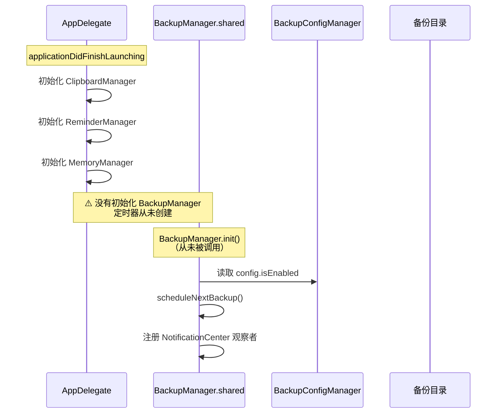
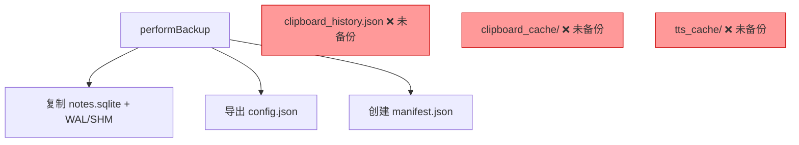
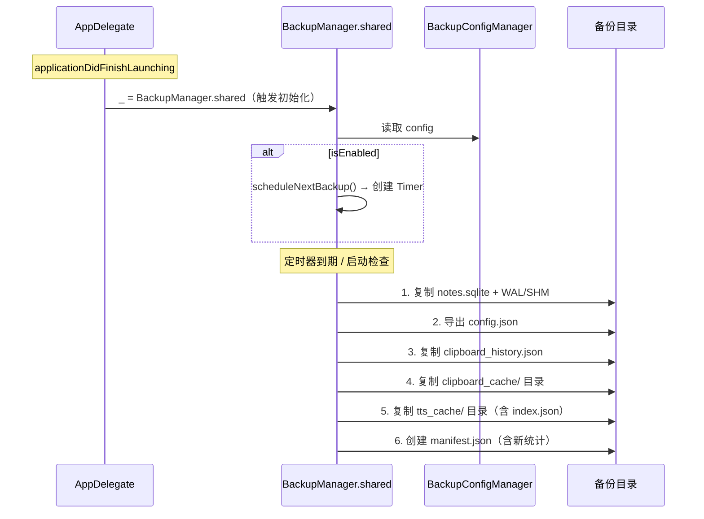
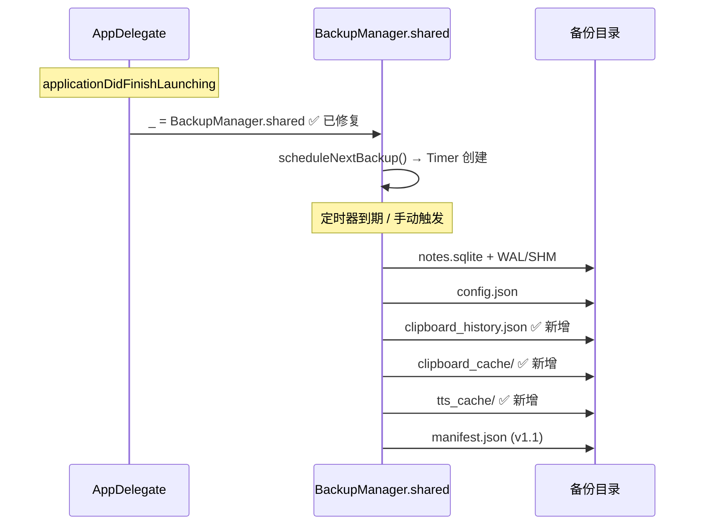

# 完善备份功能及修复自动备份

## 概述
当前备份功能存在两个问题：
1. **自动备份不执行**：`BackupManager` 是懒惰单例，但应用启动时没有任何代码触发其初始化，导致定时器从未被创建
2. **数据覆盖不全**：备份只包含数据库文件和配置 JSON，缺少剪贴板历史、剪贴板图片缓存、TTS 语音缓存等新增数据

## 当前实现

备份时只复制以下数据：

## 测试用例

1. **自动备份验证**
   - 设置 → 备份 → 开启自动备份，设置频率为"每天"
   - 重启应用，检查控制台是否输出 `下次备份时间: xxx`
   - 将备份时间设为当前时间之后 1 分钟，等待自动备份触发

2. **完整备份验证**
   - 手动执行备份
   - 打开备份目录，检查是否包含：
     - `notes.sqlite`（及 WAL/SHM）
     - `config.json`
     - `manifest.json`
     - `clipboard_history.json`
     - `clipboard_cache/`（如有图片）
     - `tts_cache/`（如有 Edge TTS 缓存）

3. **恢复验证**
   - 从一个包含剪贴板和 TTS 缓存的备份恢复
   - 验证剪贴板历史和 TTS 缓存是否正常恢复

## 方案

### 🚀推荐方案：启动时初始化 + 扩展备份数据范围

**修改内容：**

1. **修复自动备份不执行**
   - [AppDelegate.swift](vscode://file/Volumes/Cache/X/Sources/App/AppDelegate.swift:60) — `applicationDidFinishLaunching` 中添加 `_ = BackupManager.shared`

2. **扩展备份数据范围**
   - [BackupManager.swift](vscode://file/Volumes/Cache/X/Sources/Model/BackupManager.swift:52) — `performBackup()` 中添加剪贴板和 TTS 缓存的备份逻辑

3. **扩展恢复逻辑**
   - [BackupManager.swift](vscode://file/Volumes/Cache/X/Sources/Model/BackupManager.swift:340) — `restore()` 中添加剪贴板和 TTS 缓存的恢复逻辑

4. **更新备份清单**
   - [BackupConfig.swift](vscode://file/Volumes/Cache/X/Sources/Model/BackupConfig.swift:101) — `BackupManifest` 添加剪贴板条目数和 TTS 缓存条目数字段

**优点：**
- 最小改动修复自动备份 BUG
- 备份恢复完整覆盖所有应用数据
- manifest 清单包含所有数据统计

**缺点：**
- TTS 缓存和剪贴板图片缓存体积可能较大，增加备份时间

## 任务总结与结论

**修改文件：**
- `AppDelegate.swift` — 启动时初始化 BackupManager.shared
- `BackupManager.swift` — performBackup 和 restore 扩展剪贴板/TTS缓存
- `BackupConfig.swift` — BackupManifest v1.1 新增 clipboardCount/ttsCacheCount（向后兼容）
- `ClipboardManager.swift` — clipboardHistoryFileURL 属性公开

## 任务耗时
- 任务开始时间：18:02
- 任务结束时间：18:30
- 任务总耗时：28 分钟
