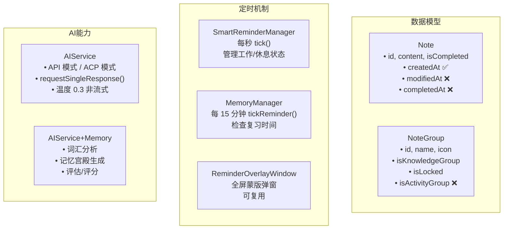
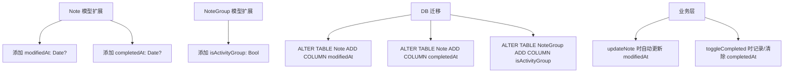
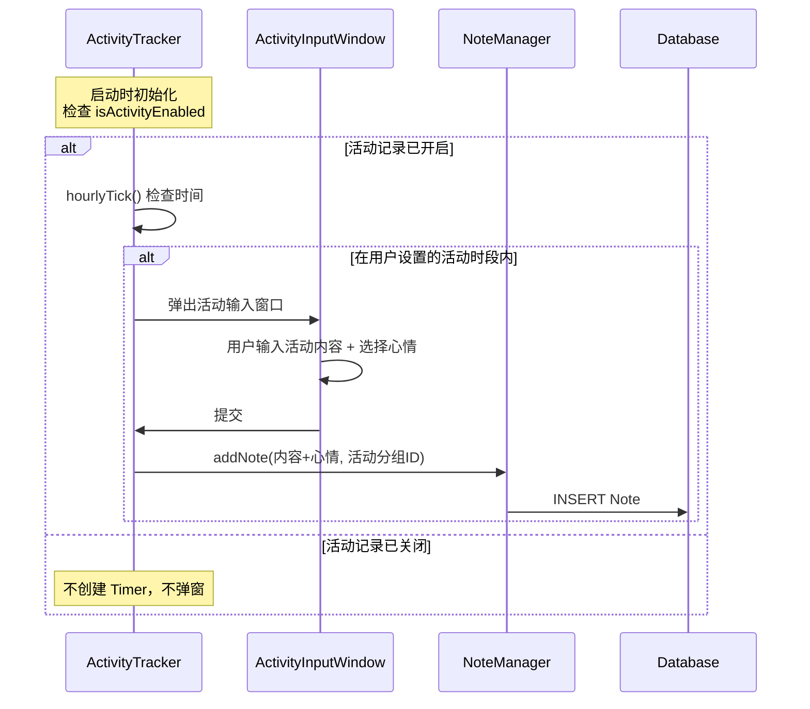
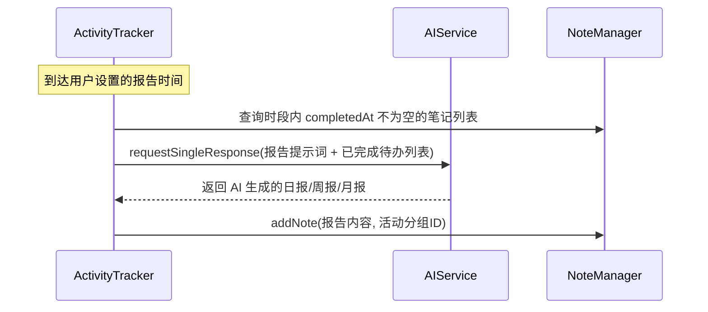
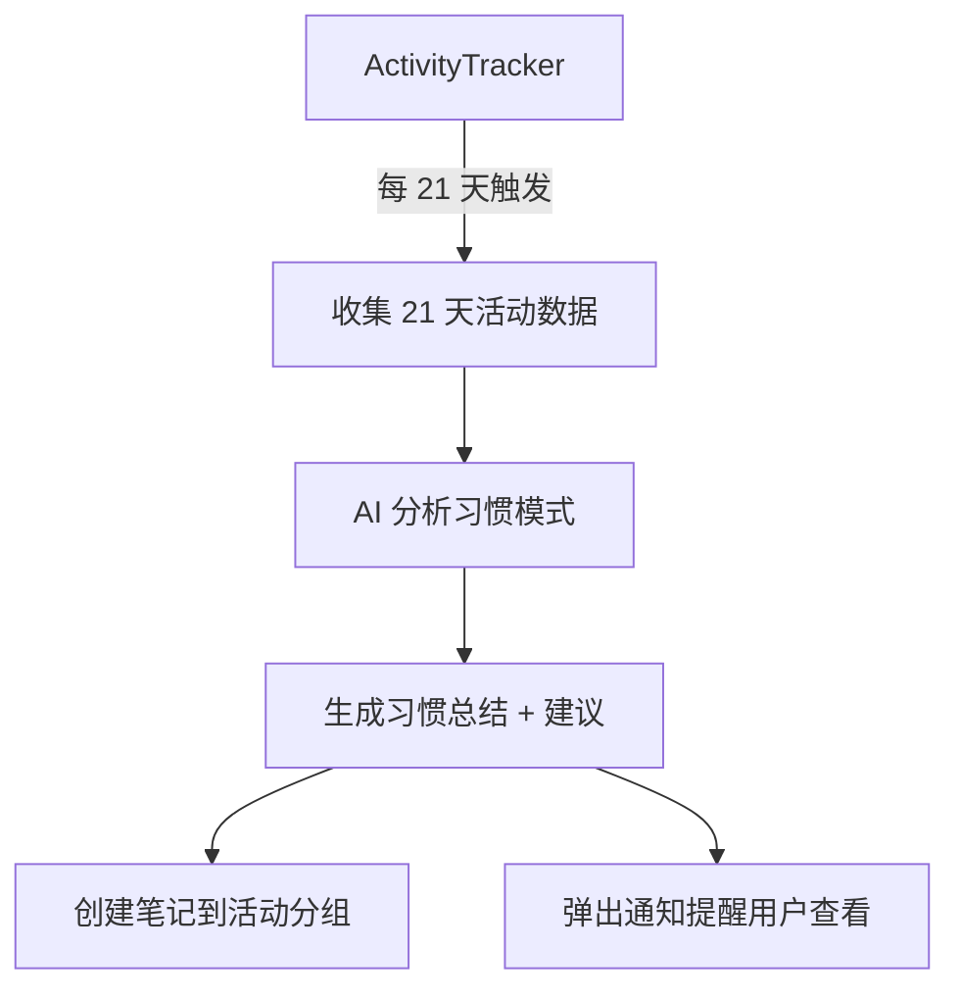
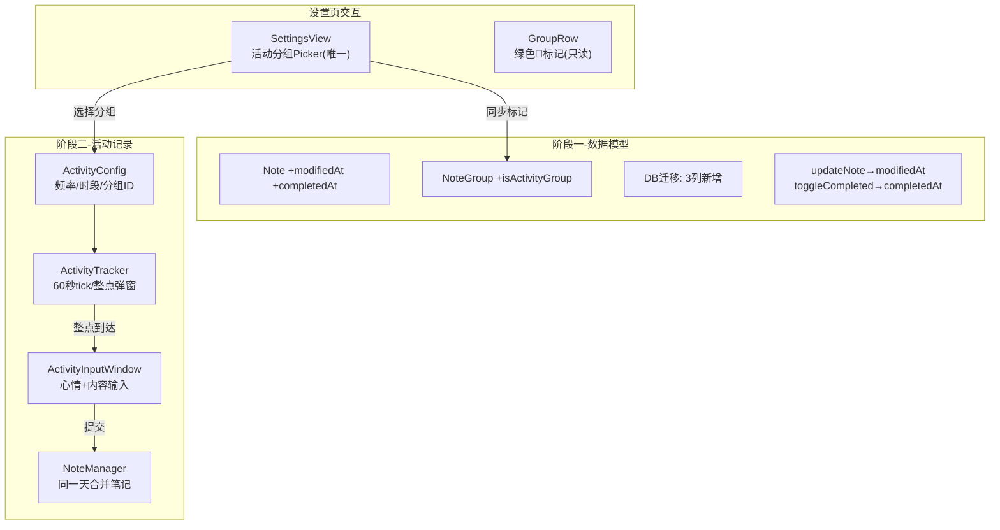

# 活动分析功能

## 概述
为应用添加活动分析系统：追踪笔记生命周期时间（修改/完成时间）、每小时记录用户活动与心情、基于完成的待办项用 AI 生成日报/周报/月报、每 21 天进行习惯总结分析。

## 当前实现

## 测试用例

### 阶段一：数据模型扩展
1. 编辑一条笔记，检查 `modifiedAt` 是否更新
2. 标记笔记完成，检查 `completedAt` 是否记录
3. 取消完成标记，确认 `completedAt` 被清除

### 阶段二：活动分组与每小时记录
1. 设置 → 活动分析 → 创建日常活动分组
2. 开启每小时活动记录
3. 等待（或手动触发）弹出活动输入窗口
4. 输入内容和选择心情，确认笔记已创建到活动分组

### 阶段三：AI 报告
1. 完成若干待办项并记录若干活动条目
2. 设置日报时间，等待或手动触发 AI 日报生成
3. 检查日报笔记是否自动创建到活动分组

### 阶段四：21 天习惯分析
1. 积累足够活动数据后，触发 21 天习惯分析
2. 检查 AI 是否生成习惯总结与建议笔记

## 方案

由于功能较大，建议分阶段推进，本次文档只规划全部阶段的架构，先实现阶段一和阶段二。

### 🚀推荐方案：分阶段渐进实现

#### 阶段一：数据模型扩展

**代码修改位置：**
- [Note.swift](vscode://file/Volumes/Cache/X/Sources/Model/Note.swift:56) — Note 结构体添加 modifiedAt, completedAt 字段
- [Note.swift](vscode://file/Volumes/Cache/X/Sources/Model/Note.swift:4) — NoteGroup 结构体添加 isActivityGroup 字段
- [NoteStore.swift](vscode://file/Volumes/Cache/X/Sources/Model/NoteStore.swift:131) — 建表 SQL 和迁移
- [NoteStore.swift](vscode://file/Volumes/Cache/X/Sources/Model/NoteStore.swift:250) — insertNote 更新 SQL
- [Note.swift](vscode://file/Volumes/Cache/X/Sources/Model/Note.swift:413) — updateNote 中自动设 modifiedAt
- [Note.swift](vscode://file/Volumes/Cache/X/Sources/Model/Note.swift:430) — toggleCompleted 中设 completedAt

#### 阶段二：活动记录系统

> **注意**：活动记录由用户在偏好设置中「开启/关闭」。关闭后不弹窗、不记录。

**新增文件：**
- `Sources/Model/ActivityTracker.swift` — 活动追踪管理器（Timer + 配置）
- `Sources/Model/ActivityConfig.swift` — 活动功能配置（频率、活动时段、活动分组ID、报告类型）
- `Sources/View/ActivityInputWindow.swift` — 每小时弹出的活动输入窗口（心情选择 + 内容输入）

**修改文件：**
- [AppDelegate.swift](vscode://file/Volumes/Cache/X/Sources/App/AppDelegate.swift:60) — 启动时初始化 ActivityTracker
- [SettingsView.swift](vscode://file/Volumes/Cache/X/Sources/View/SettingsView.swift:1) — 添加活动分析设置面板
- [Package.swift](vscode://file/Volumes/Cache/X/Package.swift:1) — sources 列表添加新文件

#### 阶段三：AI 日报/周报/月报（后续实现）

> **重要区分**：AI 日报 ≠ 活动记录。日报数据来源是「当天/本周/本月已完成（isCompleted + completedAt）的待办笔记」，与用户的每小时活动记录无关。两者独立。

**代码修改位置：**
- `Sources/Model/AIService+Memory.swift` — 添加报告生成方法
- `Sources/Model/ActivityTracker.swift` — 添加报告定时触发

#### 阶段四：21 天习惯分析（后续实现）

**优点：**
- 分阶段推进，每阶段独立可测
- 复用现有 Timer 模式和 AI 接口
- 活动数据全部以 Note 存储，与现有系统无缝集成
- 数据库迁移无感，向下兼容

**缺点：**
- 完整功能需要多次迭代
- 每小时弹窗可能打扰用户（需提供灵活的时段控制）

## 任务总结与结论

本次完成了阶段一（数据模型扩展）和阶段二（活动记录系统）的实现：

**关键设计决策：**
1. 活动分组通过设置页 Picker 唯一选择，分组管理中仅显示绿色标记（不可点击切换）
2. 同一天的活动记录合并到一条笔记，格式为 `📋 yyyy-MM-dd` 开头
3. ActivityInputWindow 使用 `DispatchQueue.main.async` 延迟关闭，避免 SwiftUI 视图释放崩溃
4. 窗口级别设为 `.floating` 确保在其他窗口之上

## 任务耗时
- 任务开始时间：09:25
- 任务结束时间：10:46
- 任务总耗时：81 分钟
