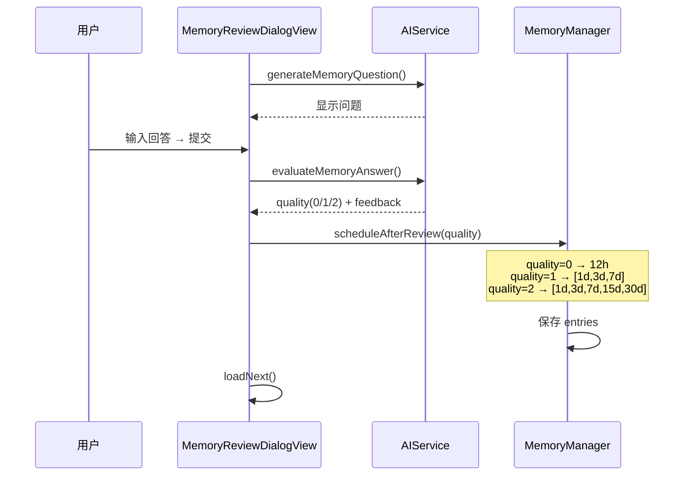
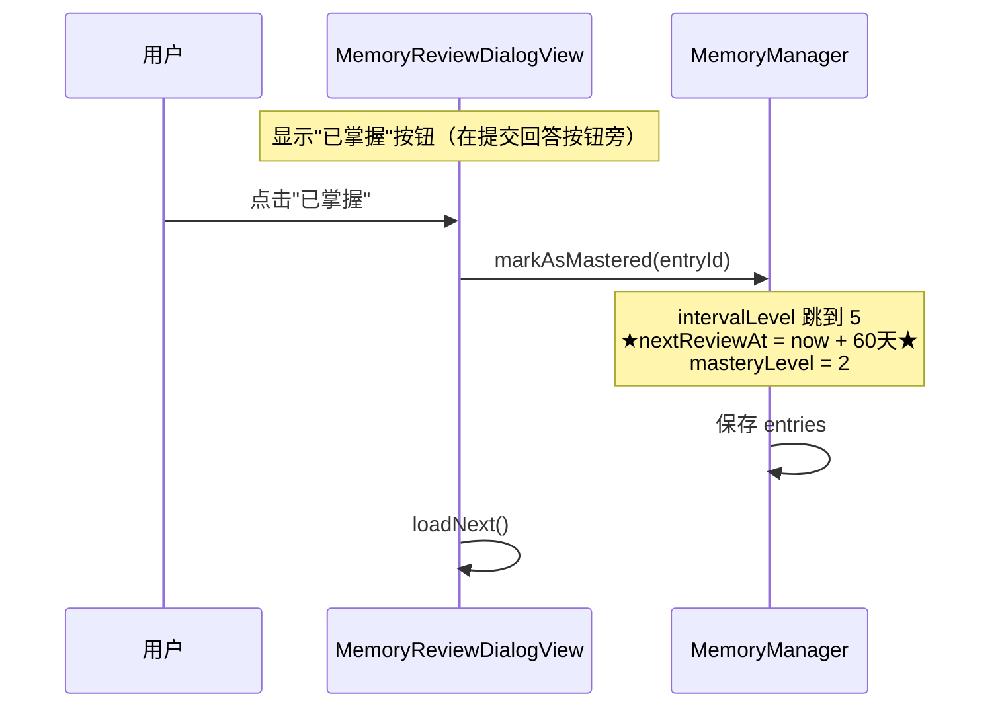
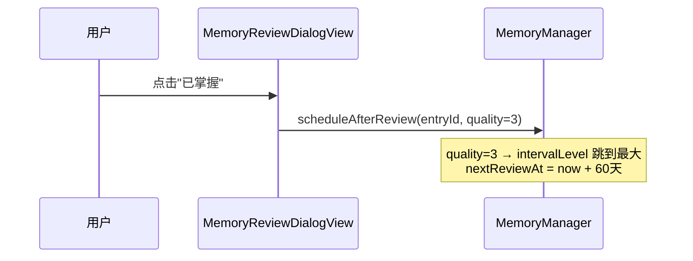
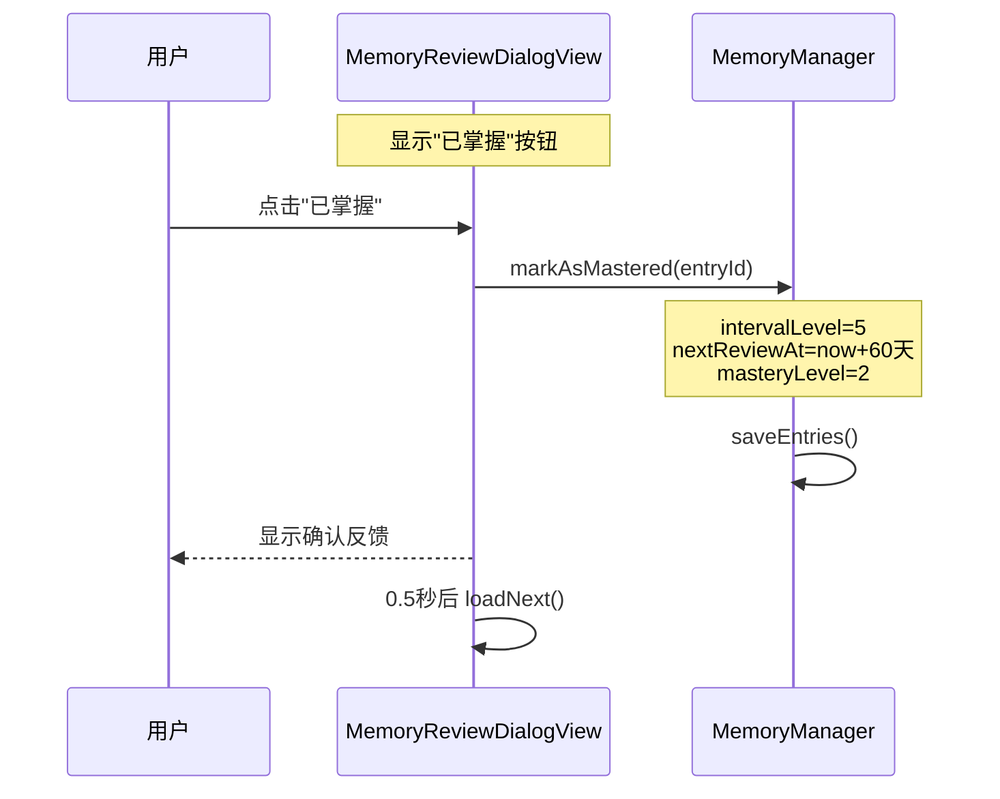

# 复习窗口掌握按钮

## 概述
在记忆复习窗口中添加"已掌握"按钮，让用户可以跳过 AI 语义评估，直接标记知识点为已掌握并大幅延长下次复习间隔。

## 当前实现

当前流程：必须输入回答 → AI 评估 → 根据质量调度间隔。没有快捷方式跳过评估。

## 测试用例
1. 打开复习窗口 → 显示复习条目
2. 点击"已掌握"按钮 → 不需要输入回答
3. 该条目的 intervalLevel 应跳到最高值（4），下次复习间隔至少 30 天
4. 自动加载下一条复习条目
5. "已掌握"按钮在无复习条目时不可见

## 方案

### 🚀 推荐方案一：新增 markAsMastered 方法 + UI 按钮

**优点：**
- 逻辑清晰，一个专门的方法处理掌握逻辑
- 间隔直接跳到 60 天，明显区别于 quality=2 的渐进式
- 不影响现有 AI 评估流程

**缺点：**
- 用户可能滥用跳过复习

**代码修改位置：**
[MemoryManager.swift](vscode://file/Volumes/Cache/X/Sources/Model/MemoryManager.swift:176) — 新增 `markAsMastered` 方法
[MemoryReviewWindows.swift](vscode://file/Volumes/Cache/X/Sources/View/MemoryReviewWindows.swift:149) — 添加"已掌握"按钮到 HStack

### 方案二：复用 scheduleAfterReview 传入 quality=3

**优点：**
- 代码改动最少，复用已有方法
- 统一的调度入口

**缺点：**
- 原方法设计为 quality 0-2，扩展到 3 语义不明确
- 未来维护者不容易理解 quality=3 的含义

**代码修改位置：**
[MemoryManager.swift](vscode://file/Volumes/Cache/X/Sources/Model/MemoryManager.swift:176) — 扩展 scheduleAfterReview 支持 quality=3
[MemoryReviewWindows.swift](vscode://file/Volumes/Cache/X/Sources/View/MemoryReviewWindows.swift:149) — 添加按钮

## 任务总结与结论

修改 2 个文件：
- MemoryManager.swift：新增 `markAsMastered` 方法
- MemoryReviewWindows.swift：添加"已掌握"按钮和 `markAsMastered` 视图方法

## 任务耗时
- 任务开始时间：12:57
- 任务结束时间：13:17
- 任务总耗时：20 分钟
