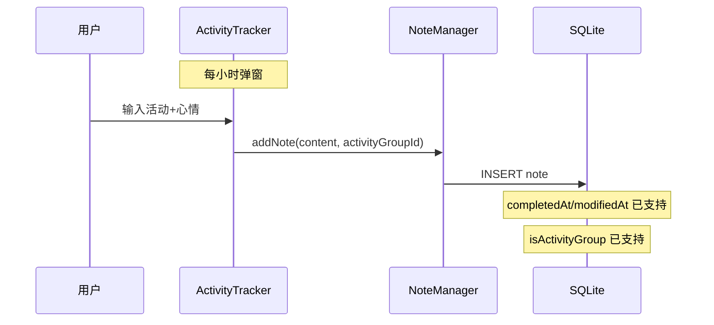
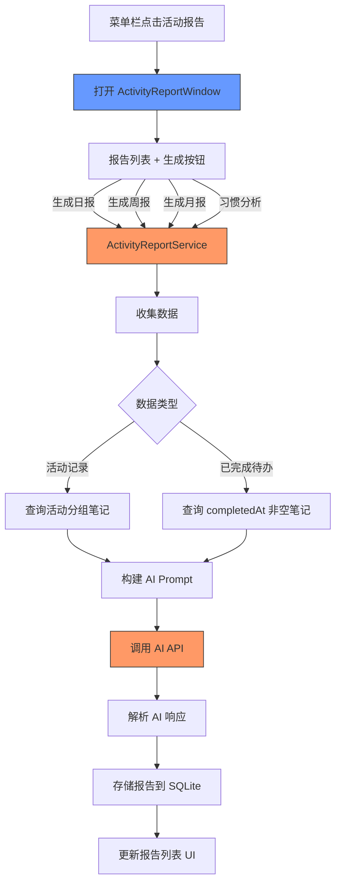
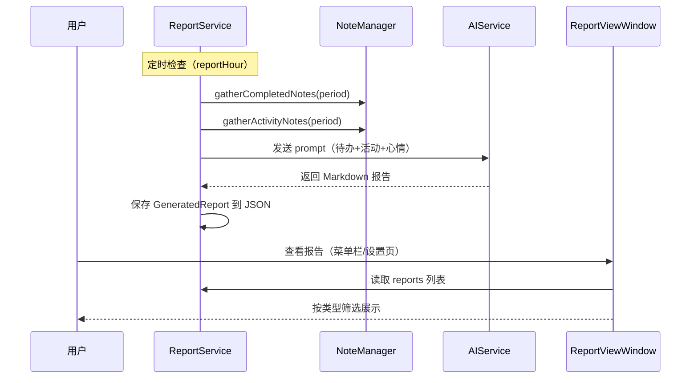

# AI 活动报告与习惯分析

## 概述
基于阶段二已完成的「活动记录系统」，实现 AI 日报/周报/月报自动生成和 21 天习惯分析功能。报告入口放在菜单栏菜单项中，打开专用的报告查看窗口。

## 当前实现

活动记录和笔记待办的完成时间已在阶段二中持久化，为 AI 报告提供了数据基础。目前缺少：
- AI 报告生成逻辑
- 报告查看窗口
- 菜单栏入口
- 21 天周期分析

## 测试用例

### 日报生成
1. 确保活动分组中有当天的活动记录若干条
2. 确保有当天完成的待办笔记若干条
3. 点击菜单栏「活动报告」→ 打开报告窗口
4. 点击「生成日报」→ 验证 AI 生成了当天的日报内容
5. 日报应包含：活动概要、完成的任务、时间分布、心情趋势

### 周报生成
1. 确保有一周内的活动记录和完成的待办
2. 点击「生成周报」→ 验证 AI 生成了周报
3. 周报应包含：一周总结、效率趋势、建议

### 月报生成
1. 确保有一个月内的数据
2. 点击「生成月报」→ 验证 AI 生成了月报

### 21 天习惯分析
1. 确保有 21 天以上的活动记录
2. 系统自动或手动触发习惯分析
3. 验证 AI 输出了习惯模式识别和改进建议

### 菜单栏入口
1. 点击菜单栏图标 → 看到「活动报告」菜单项
2. 点击后打开报告查看窗口
3. 窗口可以查看历史报告列表和生成新报告

## 方案

### 🚀 推荐方案：AI 报告服务 + 专用报告窗口

**优点：**
- 复用现有 AI API 调用模式（参考 AIService+Memory.swift）
- 报告存入 SQLite 便于查询和备份
- 菜单栏入口直观，与其他窗口入口一致

**缺点：**
- 需要新增 SQLite 表存储报告
- AI 生成质量依赖 prompt 设计

**代码修改位置：**

新建文件：
- ActivityReportService.swift — AI 报告生成服务
- ActivityReportWindow.swift — 报告查看窗口

修改文件：
[NoteStore.swift](vscode://file/Volumes/Cache/X/Sources/Model/NoteStore.swift:1) — 新增 reports 表和 CRUD
[AppDelegate.swift](vscode://file/Volumes/Cache/X/Sources/App/AppDelegate.swift:1098) — 添加菜单项和窗口管理
[Package.swift](vscode://file/Volumes/Cache/X/Package.swift:1) — 添加新文件到 sources

## 任务总结与结论

已完成 AI 报告系统的全部功能实现：

核心改动:
1. **ReportService.swift** — AI 报告生成服务，支持日报/周报/月报/21天习惯分析，报告保存为 JSON 文件
2. **ReportViewWindow.swift** — 报告查看窗口，左侧按类型筛选列表，右侧 Markdown 滚动展示
3. **ActivityConfig.swift** — 扩展配置：日报/周报/月报独立开关、reportHour、habitAnalysisEnabled
4. **SettingsView.swift** — AI 报告设置 UI：各类型报告开关、生成时间、查看/立即生成按钮
5. **AppDelegate.swift** — 菜单栏"AI 报告"入口、窗口管理、通知监听
6. **ActivityInputWindow.swift** — 修复点击"记录"按钮闪退（先关闭窗口再异步写入数据）、修复窗口居中

## 任务耗时
- 任务开始时间：13:05
- 任务结束时间：12:51（次日 2/24）
- 任务总耗时：跨日实现，约 120 分钟有效编码时间
