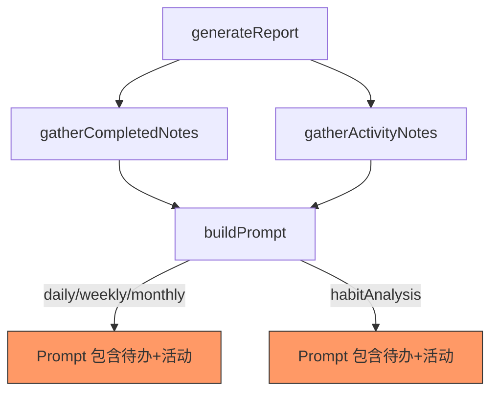
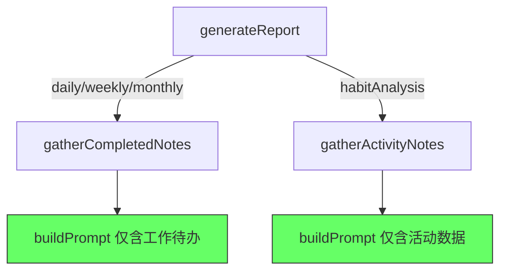
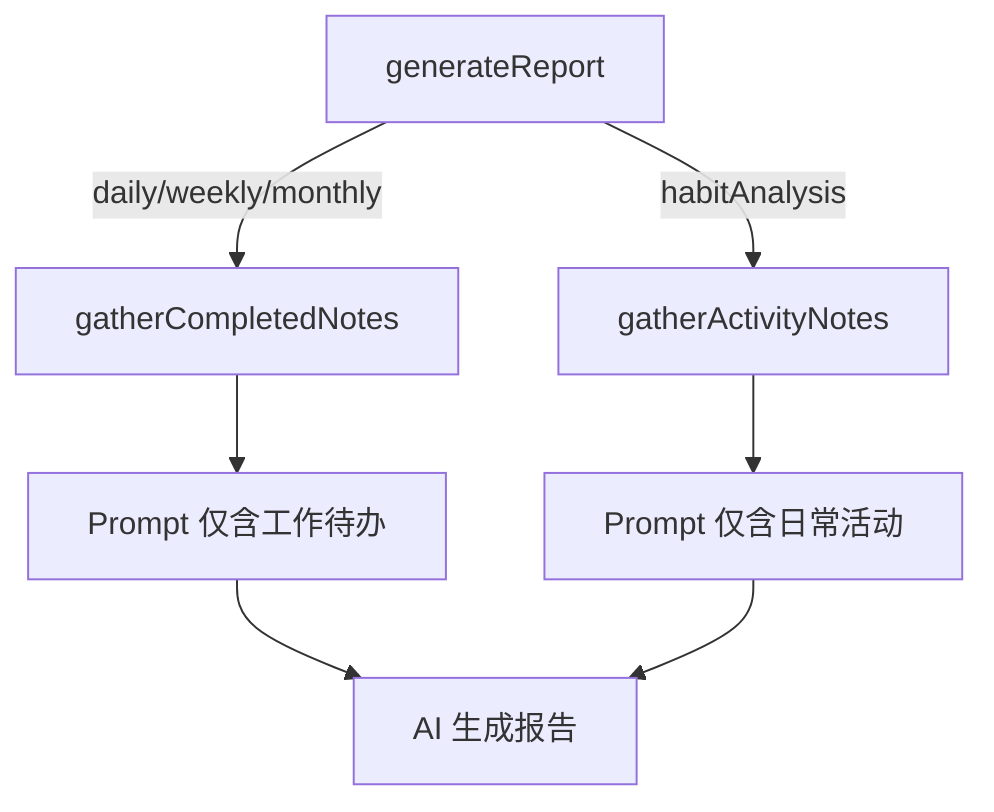

# 报告数据源分离

## 概述
区分报告类型的数据来源：日报/周报/月报仅使用已完成的工作待办，习惯分析仅使用日常活动分组的活动数据。

## 当前实现

问题：所有报告类型的 prompt 都混合了「已完成待办」和「活动记录」两种数据。

## 测试用例
1. 点击"立即生成日报" → 报告内容仅包含工作待办总结，不应出现活动记录相关内容
2. 点击生成习惯分析 → 报告仅分析日常活动分组数据，不应出现工作待办内容
3. 无数据时两种报告都应正确提示数据不足

## 方案

### 🚀 推荐方案：按报告类型选择性收集数据 + 调整 Prompt

**优点：**
- 数据收集精准，不浪费 token
- Prompt 更聚焦，AI 生成质量更高
- 改动集中在 ReportService.swift 一个文件

**缺点：**
- 无明显缺点

**代码修改位置：**
[ReportService.swift](vscode://file/Volumes/Cache/X/Sources/Model/ReportService.swift:76) — generateReport 方法：按类型选择收集数据
[ReportService.swift](vscode://file/Volumes/Cache/X/Sources/Model/ReportService.swift:155) — buildPrompt 方法：日报/周报/月报移除活动记录部分，习惯分析移除待办部分

## 任务总结与结论

修改 ReportService.swift：
1. `generateReport` 按类型选择性收集数据（工作报告不收集活动，习惯分析不收集待办）
2. 日报/周报/月报 Prompt 移除「活动记录」字段，习惯分析 Prompt 移除「已完成待办」字段并改标题为「日常活动记录」

## 任务耗时
- 任务开始时间：13:40
- 任务结束时间：13:59
- 任务总耗时：19 分钟
