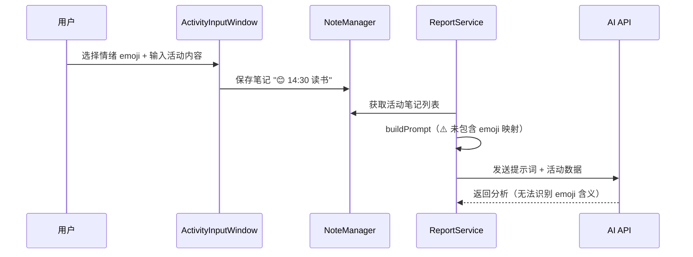
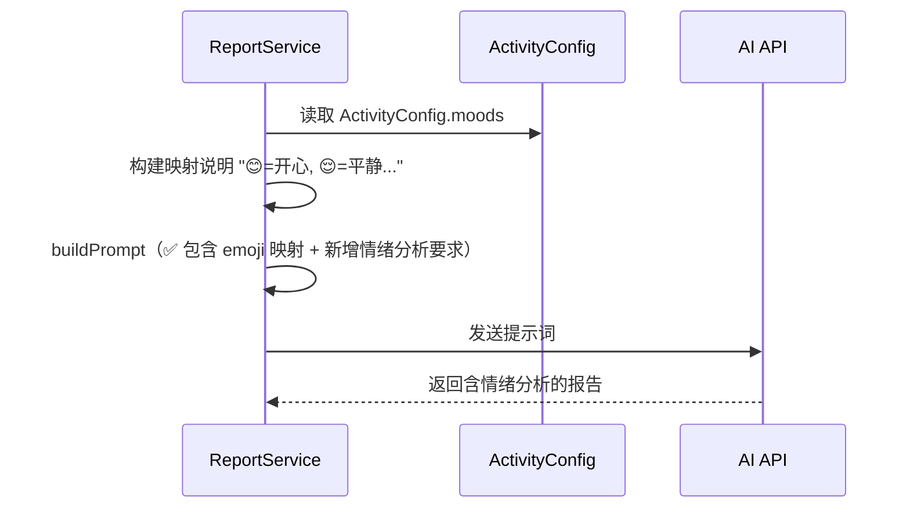
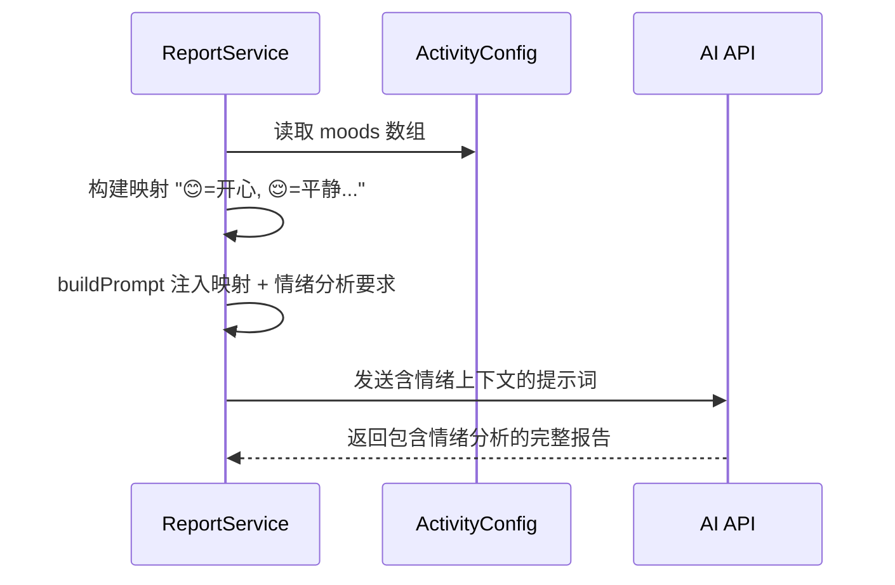

# AI活动分析添加emoji情绪映射

## 概述
活动记录的每条笔记以 emoji 开头表示当时的情绪状态（如 😊=开心、😤=烦躁），但 AI 分析的提示词中缺少 emoji→情绪的映射说明，导致 AI 无法正确理解用户的情绪数据，也无法进行情绪维度的分析。

## 当前实现

## 测试用例
1. 确保有几条带不同情绪 emoji 的活动记录
2. 在设置页触发"立即生成习惯分析"
3. 查看生成的报告，确认包含情绪分析内容（如"用户在下午时段情绪较为焦虑"等）

## 方案

### 🚀 推荐方案：在 habitAnalysis 提示词中注入 emoji 映射表

**优点：**
- 简单直接，只需修改 prompt 模板
- AI 能精确理解每个 emoji 的含义
- 可在分析要求中新增"情绪分析"维度

**缺点：**
- 映射表硬编码在 prompt 中，若 moods 数组变化需同步更新

**修改位置：**
[ReportService.swift](vscode://file/Volumes/Cache/X/Sources/Model/ReportService.swift:243) — habitAnalysis case 中注入 emoji 映射和情绪分析要求

## 任务总结与结论
在 ReportService.swift 的 habitAnalysis prompt 中注入了 ActivityConfig.moods 的完整 emoji→情绪映射表，并将分析维度从 5 个扩展到 6 个（新增"情绪分析"），包含情绪频率统计、活动关联分析、波动规律识别和触发因素分析。

## 任务耗时
- 任务开始时间：20:08
- 任务结束时间：20:20
- 任务总耗时：12 分钟
