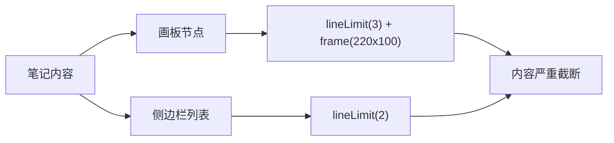
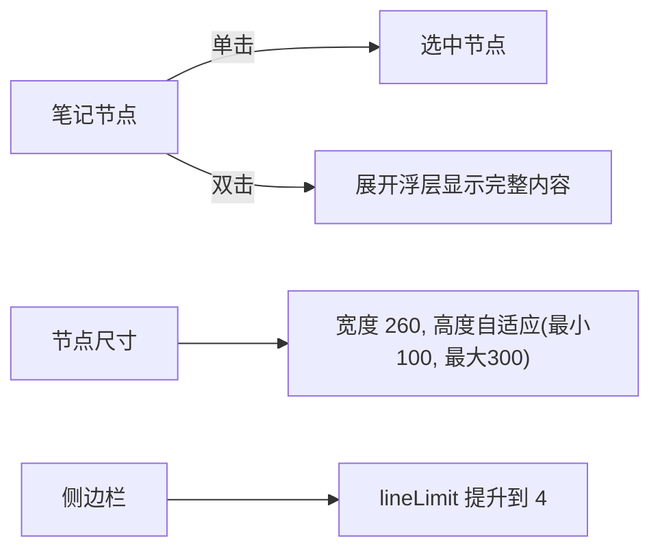
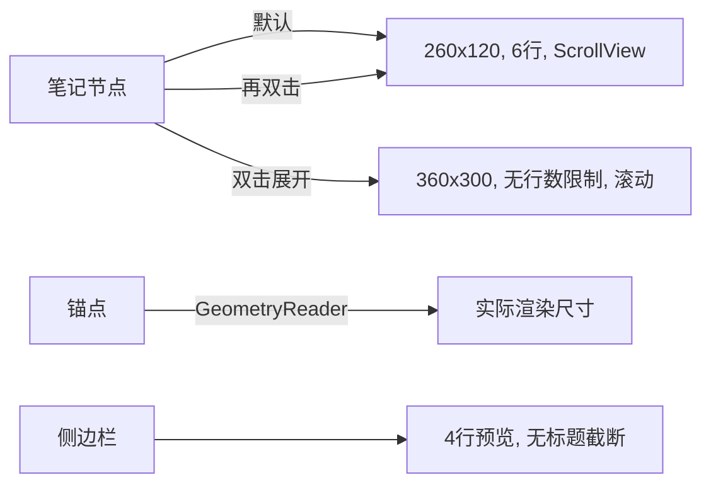

# 画板笔记内容显示不完整优化

## 概述
画板（CanvasBoardView）中的笔记节点和侧边栏笔记列表内容被严重截断，用户无法完整查看笔记内容。节点内容限制 3 行且固定 220x100 尺寸，侧边栏限制 2 行。

## 当前实现

## 测试用例
1. 打开画板，添加一条较长的笔记（超过 3 行）
2. 确认画板节点上能看到更多内容
3. 双击节点，确认能看到完整内容
4. 确认侧边栏笔记列表能展示更多预览行数

## 方案

### 🚀 推荐方案：双击展开 + 节点自适应高度

**优点：**
- 默认状态下展示更多内容（5-6 行代替 3 行）
- 双击可查看完整内容，无需离开画板
- 侧边栏预览更充分

**缺点：**
- 自适应高度可能导致节点间布局不太整齐

**修改位置：**
- [CanvasBoardView.swift boardNodeView](vscode://file/Volumes/Cache/X/Sources/View/CanvasBoardView.swift:329) — 节点视图增大尺寸、添加双击展开
- [CanvasBoardView.swift knowledgeSidebar](vscode://file/Volumes/Cache/X/Sources/View/CanvasBoardView.swift:488) — 侧边栏行数提升

## 任务总结与结论
画板笔记节点完成了三轮优化：

1. **第一轮**：增大节点尺寸(260x120)，行数提升到 6 行，添加双击展开功能，侧边栏行数提升到 4 行
2. **第二轮**：移除 shortTitle 标题截断（节点和侧边栏），减小间距优化紧凑度，锚点改为 GeometryReader 动态跟随节点实际尺寸
3. **第三轮**：内容区域添加 ScrollView 滚动支持，设置固定高度（折叠 120px/展开 300px）防止溢出

## 任务耗时
- 任务开始时间：20:29
- 任务结束时间：21:14
- 任务总耗时：45 分钟
